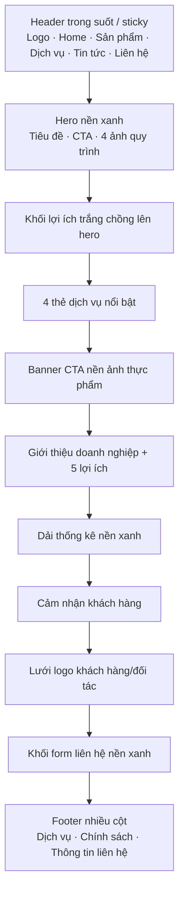
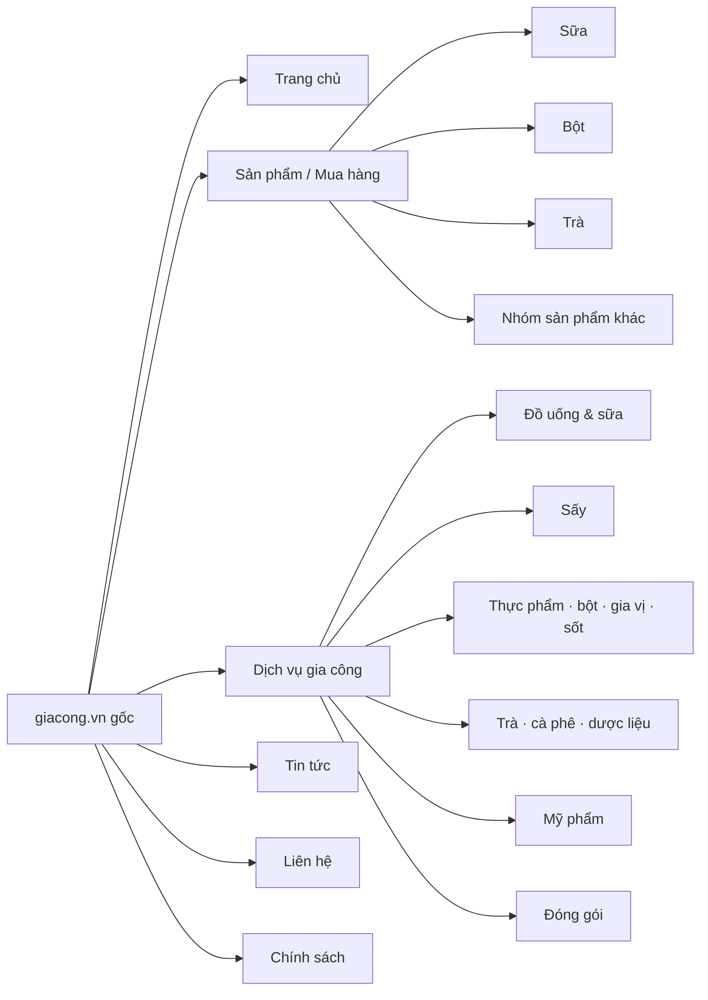

# Sơ đồ giao diện Giacong.vn gốc

> Bản đồ này mô tả website **giacong.vn nguyên bản trước khi được clone sang dự án Next.js**. Nó được dựng từ HTML/ảnh capture gốc trong dự án, không mô tả route hay component của code hiện tại.

## 1. Trang chủ gốc

## 2. Sitemap gốc ở mức nhóm nội dung

## 3. Các dạng trang gốc

| Dạng trang | Ví dụ URL gốc đã capture | Nội dung chính |
|---|---|---|
| Trang chủ | `/` | Hero, dịch vụ, lợi ích, thống kê, testimonial, logo khách hàng, form |
| Landing nhóm dịch vụ | `/gia-cong-do-uong/`, `/gia-cong-bot/`, `/dich-vu-say/` | Giới thiệu nhóm, danh sách bài/trang con, CTA |
| Chi tiết dịch vụ | `/gia-cong-sua-hat/`, `/say-lanh/`, `/gia-cong-sot-hummus/` | Nội dung dịch vụ chuyên biệt, ảnh, CTA liên hệ |
| Phân trang archive | `/gia-cong-do-uong/page/2/`, `/dich-vu-say/page/3/` | Trang tiếp theo của danh sách nội dung |
| Danh mục/bài sản phẩm | `/san-pham/`, `/sua-hat-dieu/`, `/tra-xanh-nguyen-chat/` | Nội dung sản phẩm/danh mục kiểu WordPress/WooCommerce |
| Tin tức | `/tin-tuc/` | Danh sách bài viết |
| Thông tin doanh nghiệp | `/gioi-thieu-ve-gia-cong/`, `/lien-he/` | Giới thiệu hoặc form liên hệ |
| Chính sách | `/chinh-sach-bao-mat/` | Nội dung pháp lý/chính sách |

## 4. Quy mô capture gốc trong dự án

| Nhóm URL | Dấu hiệu trong bản capture |
|---|---|
| Archive có phân trang | `gia-cong-do-uong`, `gia-cong-bot`, `dich-vu-say`, `gia-cong-dong-goi`, `gia-cong-my-pham`, `gia-cong-ruou`, `gia-cong-sot-cham` |
| Dịch vụ sấy chi tiết | Sấy nóng, sấy lạnh, sấy chân không, sấy hồng ngoại, sấy thăng hoa và nhiều nguyên liệu cụ thể |
| Gia công bột | Nhiều trang nguyên liệu/sản phẩm như cacao, collagen, gạo, protein, trà, gia vị |
| Gia công đồ uống/sữa | Đồ uống, sữa, sữa hạt, sữa bột, đồ uống đóng chai, nước ép, rượu |
| Trà/cà phê | Trà, trà túi lọc, trà thảo mộc, cà phê, cà phê hòa tan |
| Mỹ phẩm/đóng gói | Mỹ phẩm, gel, kem, dầu gội; bao jumbo, bột, gói nhỏ, stick, viên nang |

## 5. Ghi chú quan trọng

- Đây là **sitemap và bố cục của site nguồn**, không phải quyết định phạm vi sản phẩm hiện tại.
- Bản capture trong dự án ghi nhận khoảng **237 URL** từ site gốc.
- Header/footer gốc liên kết chéo nhiều nhóm dịch vụ, sản phẩm, tin tức và trang chính sách; vì vậy khách có thể đi sâu vào các URL này từ menu, footer, Google hoặc link trực tiếp.
