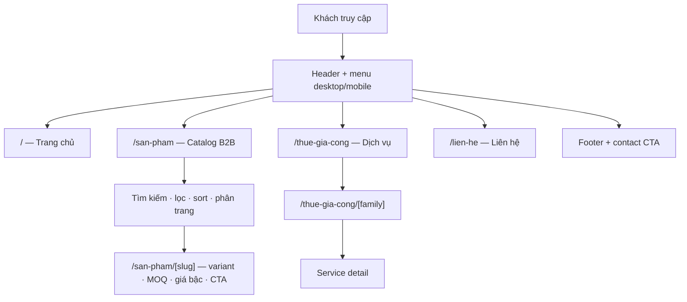

# UI hiện trạng và Admin UI roadmap

**Cập nhật:** 2026-08-15

Tài liệu này mô tả storefront hiện tại và ranh giới UI/admin hiện hành. Đây không phải nơi quyết định kiến trúc; xem `CLOUDFLARE_NATIVE_V1_PLAN.md`.

## 1. Storefront hiện tại



### Runtime data boundary

```text
Browser
  ↓
Next.js/OpenNext on Cloudflare Worker
  ├── catalog API → D1
  ├── cart revalidation → D1 canonical resolver
  ├── service content → D1/static fallback
  └── /media/* → R2
```

Browser không truy cập D1/R2 trực tiếp.

## 2. Route map hiện hành

| Route | Trạng thái | Nguồn |
|---|---|---|
| `/` | active | storefront/captured content |
| `/san-pham` | active | Cloudflare D1 |
| `/san-pham/[slug]` | active | Cloudflare D1 |
| `/gui-yeu-cau` | active | canonical cart + request intake |
| `/thue-gia-cong` | active | service directory |
| `/thue-gia-cong/[family]` | active | service content |
| `/lien-he` | active | contact intake |
| `/(storefront)/[...slug]` | legacy/captured pages | static capture data |
| `/api/admin/**` | staging-only server boundary | Cloudflare Access → Worker → D1/R2 |

Bagisto API không còn là catalog source cho các route active.

## 3. Admin UI — chưa triển khai

**Không có Admin UI hoàn chỉnh trong codebase hiện tại.** Đây là trạng thái có chủ ý: server write contract phải xanh trước khi dựng UI.

Admin target:

```text
admin-staging.kienhieu.id.vn
        ↓
Cloudflare Access
        ↓
Next.js Admin UI
        ↓
/api/admin/**
        ↓
Cloudflare Worker
   ┌────┴────┐
   ↓         ↓
  D1         R2
```

Browser không nhận D1/R2 credentials.

## 4. Admin UI roadmap

UI chỉ bắt đầu sau khi Tier-price, R2 media và service write contracts đạt automated/staging gate.

### 4.1 Categories

- danh sách có search/filter cơ bản;
- tạo/sửa;
- active/deactivate;
- sort order;
- optimistic concurrency/stale-write state;
- loading/empty/error/success state.

### 4.2 Products

- danh sách;
- tạo/sửa;
- category;
- nội dung;
- active/deactivate;
- image reference;
- hiển thị revision/stale state khi có conflict.

### 4.3 Variants

- SKU;
- option label/unit;
- MOQ;
- quantity step;
- contact threshold;
- availability;
- sort order;
- image reference;
- validation inline theo canonical D1 rules.

### 4.4 Tier prices

UI phải gửi **complete replacement** cùng parent variant `version`, không cập nhật row-by-row.

- tier boundary;
- VND price;
- sort canonical;
- validation MOQ/step/contact;
- stale-write conflict;
- atomic success/error feedback.

### 4.5 Product media

- upload một file/request;
- JPEG/PNG/WebP;
- tối đa 8 MiB;
- preview;
- gắn media vào product/variant;
- xóa chỉ khi không còn D1 reference;
- hiển thị lỗi `MEDIA_IN_USE`/unsupported/oversize an toàn.

### 4.6 Services

Initial V1 UI có thể edit-only cho managed rows hiện hữu. Không tự mở service taxonomy creation khi chưa có quyết định data model.

## 5. UI quality gate

Admin UI phải:

- chạy qua Cloudflare Access;
- không chứa D1/R2 credential;
- không tính canonical price ở browser;
- keyboard accessible;
- visible focus;
- label/control association rõ;
- field errors có thể đọc bằng assistive technology;
- không dùng màu đơn độc để biểu đạt trạng thái;
- touch target đủ dùng;
- responsive mobile/tablet/desktop;
- có loading/empty/error/success/stale states;
- destructive action phải yêu cầu intent rõ ràng.

## 6. Những thứ không xây trong Admin V1

- Bagisto Admin;
- `/quan-tri/*` legacy route;
- customer account/RBAC granular;
- order/checkout/payment UI;
- request inbox admin;
- browser-to-D1/R2 direct access;
- server cart/session management;
- Vercel-specific admin/deployment UI.

## 7. Cleanup note

Các mô tả cũ trong tài liệu này về `Bagisto API` hoặc `Bagisto Admin` được xem là **legacy** nếu xuất hiện trong capture/history. Không dùng chúng để thiết kế UI mới.
