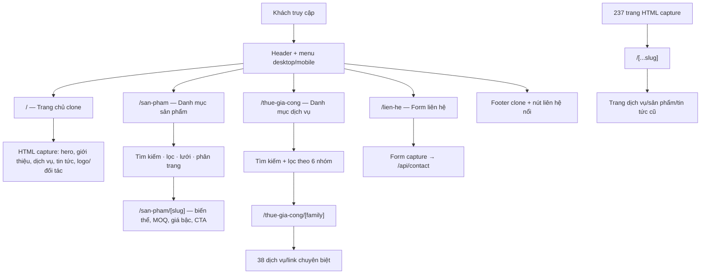

# Bản đồ giao diện hiện trạng

Tài liệu này mô tả giao diện của bản gốc tại thời điểm rà soát; không phải đề xuất thay đổi.



| Khu vực | Số lượng / phạm vi | Thành phần chính |
|---|---:|---|
| Trang clone tĩnh | 237 URL | `src/data/pages/*.json` và route `/(storefront)/[...slug]` |
| Danh mục sản phẩm | `/san-pham` và trang chi tiết | Tìm kiếm, lọc, lưới, phân trang, biến thể, MOQ, giá bậc |
| Nhóm dịch vụ | 6 nhóm | Đồ uống & sữa; Sấy; Thực phẩm/bột/gia vị; Trà/cà phê/dược liệu; Mỹ phẩm; Đóng gói |
| Link dịch vụ | 38 link | Danh sách/lọc ở `/thue-gia-cong` và trang nhóm |
| Trang liên hệ | `/lien-he` | Form capture; JavaScript gửi tới `/api/contact` |
| Khung dùng chung | Toàn storefront | Header, mobile menu, sticky header, footer, nút liên hệ nổi |
| Quản trị nội bộ | `/quan-tri/*` | Đăng nhập, dashboard, danh sách/chi tiết sản phẩm |

## Cấu trúc thư mục giao diện

```text
src/app/(storefront)/
├── page.tsx                       Trang chủ
├── [...slug]/page.tsx             237 trang clone cũ
├── san-pham/
│   ├── page.tsx                   Danh mục sản phẩm
│   └── [slug]/page.tsx            Chi tiết sản phẩm
└── thue-gia-cong/
    ├── page.tsx                   Danh mục dịch vụ
    └── [family]/page.tsx          Trang theo nhóm dịch vụ

src/components/
├── CapturedPage.tsx               Render HTML clone
├── GiacongInteractions.tsx        Menu, slider, sticky header, form
├── catalog/                       UI danh mục/sản phẩm
└── services/                      UI danh mục/nhóm dịch vụ
```

## Bản đồ route theo mã gốc

Đây là thứ tự logic của App Router trong mã gốc. Các route cụ thể được ưu tiên trước; route `/(storefront)/[...slug]` chỉ nhận những URL công khai còn lại.

```mermaid
flowchart TD
  Request["Khách mở URL"] --> IsAdmin{"/quan-tri/*?"}
  IsAdmin -->|Có| AdminProxy["proxy.ts thêm x-pathname"]
  AdminProxy --> Login{"Đã đăng nhập?"}
  Login -->|Không| AdminLogin["/quan-tri/dang-nhap"]
  Login -->|Có| AdminPages["Dashboard / danh mục / chi tiết sản phẩm"]

  IsAdmin -->|Không| Storefront["(storefront) layout: CSS clone chung"]
  Storefront --> Exact{"URL có route cụ thể?"}
  Exact -->|/| Home["page.tsx → home.json → CapturedPage"]
  Exact -->|/san-pham| ProductList["CatalogList → Bagisto API"]
  Exact -->|/san-pham/[slug]| ProductDetail["CatalogDetail → Bagisto API"]
  Exact -->|/san-pham/a/b| Product404["[...path] → 404"]
  Exact -->|/thue-gia-cong| ServiceDirectory["ServiceLanding + ServiceDirectory"]
  Exact -->|/thue-gia-cong/[family]| ServiceFamily["ServiceFamilyDetail"]
  Exact -->|Không| CatchAll["/[...slug]"]
  CatchAll --> Manifest["manifest.json tìm file tương ứng"]
  Manifest --> Captured["CapturedPage render HTML capture"]
  Captured --> Legacy["237 URL dịch vụ / sản phẩm / tin tức cũ"]
```

| Route gốc | Khi khách truy cập | Thành phần UI | Nguồn dữ liệu |
|---|---|---|---|
| `/` | Hiển thị trang chủ clone | `CapturedPage` | `pages/home.json` |
| `/san-pham` | Hiển thị catalog B2B | `CatalogList` | Bagisto API |
| `/san-pham/[slug]` | Hiển thị chi tiết một sản phẩm | `CatalogDetail` | Bagisto API; slug legacy có thể redirect vĩnh viễn |
| `/san-pham/[...path]` | URL catalog nhiều cấp | 404 | Không có UI fallback |
| `/thue-gia-cong` | Hiển thị directory dịch vụ | `ServiceLanding`, `ServiceDirectory` | `service-families.ts` |
| `/thue-gia-cong/[family]` | Hiển thị một trong 6 nhóm | `ServiceFamilyDetail` | `service-families.ts` |
| `/lien-he` | Không có route riêng | Rơi vào `[...slug]` | `pages/lien-he.json` |
| `/gia-cong-sua-hat`, `/dich-vu-say`, `/tin-tuc`, … | Không có route riêng | Rơi vào `[...slug]` | 237 file trong `pages/` |
| `/quan-tri/*` | UI quản trị nội bộ | `AdminShell` | BFF/Bagisto |
