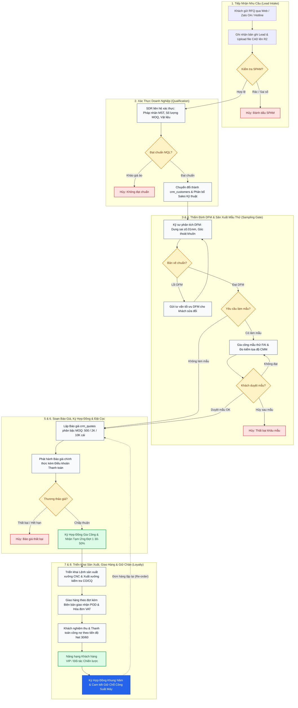
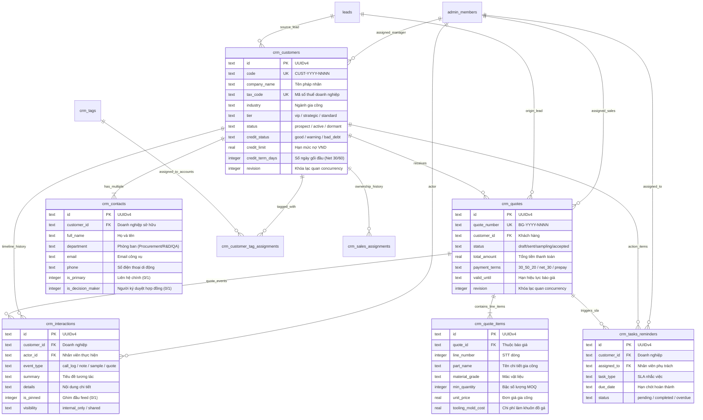
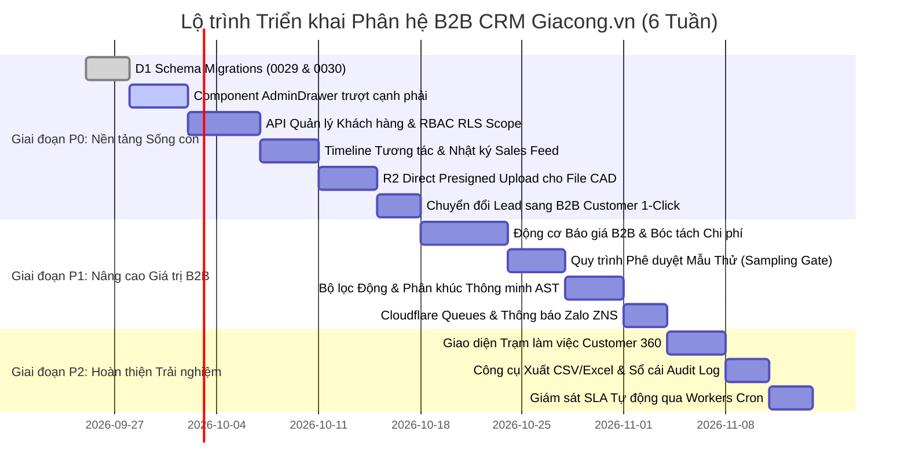

# BÁO CÁO TỔNG HỢP ĐIỀU HÀNH & BẢN THIẾT KẾ CHIẾN LƯỢC TOÀN DIỆN
## ĐỐI CHUẨN HARAVAN ADMIN & KIẾN TRÚC PHÂN HỆ B2B CRM CLOUDFLARE-NATIVE CHO GIACONG.VN

> **Mã tài liệu:** `R5-EXECUTIVE-SUMMARY-BENCHMARK-HARAVAN-GIACONG`  
> **Cấp độ tài liệu:** Master Executive Synthesis & Architectural Blueprint  
> **Phiên bản:** `1.0.0-RELEASE` | **Trạng thái:** Sẵn sàng nghiệm thu & Phê duyệt triển khai  
> **Ngày lập:** 23/09/2026  
> **Đơn vị thực hiện:** Nhóm Nghiên cứu & Kỹ thuật Chuyên sâu (Executive Synthesizer, CRM Specialist, System Gap Reviewer, Cloudflare Architect, UI/UX Analyst)  
> **Ứng dụng mục tiêu:** `apps/giacong-lean-commerce` (Next.js 15 App Router / OpenNext on Cloudflare Workers / D1 SQLite / R2 Storage)  
> **Hệ quy chiếu nghiên cứu:** Haravan Admin (`https://chua-co-23.myharavan.com/admin`) — Vận hành hoàn toàn ở chế độ Read-Only  

---

## MỤC LỤC ĐIỀU HÀNH

1. [Mục 1: Bối cảnh Dự án & Mục tiêu Chiến lược (Context & Strategic Goals)](#mục-1-bối-cảnh-dự-án--mục-tiêu-chiến-lược)
2. [Mục 2: Bảng Thẻ Điểm Đối Chuẩn Tổng Quan (Executive Scorecard)](#mục-2-bảng-thẻ-điểm-đối-chuẩn-tổng-quan)
3. [Mục 3: 5 Điểm Yếu Chí Mạng của Giacong Admin & 3 Lợi Thế B2B Độc Quyền](#mục-3-5-điểm-yếu-chí-mạng-của-giacong-admin--3-lợi-thế-b2b-độc-quyền)
4. [Mục 4: Giải Pháp Kiến Trúc Cloudflare-Native Toàn Diện](#mục-4-giải-pháp-kiến-trúc-cloudflare-native-toàn-diện)
5. [Mục 5: Mô Hình Vận Hành CRM & Dữ Liệu B2B](#mục-5-mô-hình-vận-hành-crm--dữ-liệu-b2b)
6. [Mục 6: Ma Trận Đánh Đổi Chiến Lược (Trade-Offs & Ergonomics)](#mục-6-ma-trận-đánh-đổi-chiến-lược)
7. [Mục 7: Lộ Trình Triển Khai & Danh Mục Ưu Tiên (Prioritized Backlog & Gantt)](#mục-7-lộ-trình-triển-khai--danh-mục-ưu-tiên)
8. [Mục 8: Cấu Trúc Bộ Tài Liệu Nghiên Cứu & Chỉ Dẫn Tra Cứu (Artifact Index & Guide)](#mục-8-cấu-trúc-bộ-tài-liệu-nghiên-cứu--chỉ-dẫn-tra-cứu)

---

## MỤC 1: BỐI CẢNH DỰ ÁN & MỤC TIÊU CHIẾN LƯỢC

### 1.1 Bối cảnh Chuyển dịch: Thương mại Bán lẻ Đa kênh (B2C) vs Sản xuất Gia công Công nghiệp (B2B)
Trong thị trường phần mềm quản trị tại Việt Nam, **Haravan Admin** là chuẩn mực SaaS hàng đầu phục vụ bán lẻ đa kênh (Omnichannel Retail B2C). Nền tảng này được thiết kế xuất sắc xoay quanh bài toán: hàng trăm nghìn người tiêu dùng cá nhân, mua các sản phẩm đóng gói có sẵn (SKU cố định), giá niêm yết một mức, thanh toán ngay qua cổng trực tuyến hoặc COD, và chuyển phát nhanh bưu kiện 1-2kg qua các đơn vị vận chuyển 3PL (GHN, Viettel Post, GHTK).

Ngược lại, **Giacong.vn** (`apps/giacong-lean-commerce`) là nền tảng thương mại số hóa năng lực gia công chế tạo theo yêu cầu (**Custom B2B Contract Manufacturing**: Phay/Tiện CNC chính xác, Kim loại tấm cắt laser & chấn dập, Đúc & Ép nhựa kỹ thuật, May mặc bảo hộ, Bao bì carton màng phức hợp). Bản chất nghiệp vụ gia công công nghiệp vận hành theo một hệ tiên đề hoàn toàn khác biệt:

```
+----------------------------------------------------------------------------------------------------+
|                      SỰ CHUYỂN DỊCH HỆ TIÊN ĐỀ: B2C RETAIL VS B2B MANUFACTURING                    |
+------------------------------+------------------------------------+--------------------------------+
| Đặc tính Nghiệp vụ           | Haravan Admin (B2C Retail)         | Giacong.vn Admin (B2B Make-to-Order) |
+------------------------------+------------------------------------+--------------------------------+
| Thực thể Khách hàng          | Cá nhân người tiêu dùng lẻ         | Doanh nghiệp / Nhà máy (Account + Buying Center) |
| Điểm bắt đầu Giao dịch       | Chọn hàng vào giỏ -> Thanh toán    | Nộp Yêu cầu Báo giá (RFQ) + Bản vẽ CAD 2D/3D   |
| Cơ chế Định giá              | Giá cố định niêm yết (Fixed Price) | Dự toán kỹ thuật: Phôi + Giờ máy + Khuôn + MOQ |
| Chu kỳ Thương thảo           | Tức thì (vài phút) đến 2-3 ngày    | Tham vấn dài hạn (2 tuần đến 3 tháng)          |
| Giá trị Giao dịch (ACV)      | Nhỏ lẻ: 200.000đ - 3.000.000đ      | Lớn: 30.000.000đ - 5.000.000.000đ+             |
| Quy trình Nghiệm thu         | Nhận bưu kiện COD mở hộp           | Làm mẫu thử (FAI) -> Đo CMM -> Nghiệm thu lô   |
| Điều khoản Thanh toán        | Thu 100% trước giao hàng           | Tạm ứng 30-50% -> Nghiệm thu -> Gối đầu Net 30/60|
| Logistics & Giao vận         | Bưu tá xe máy (GHN, GHTK)          | Xe tải chuyên dụng, Chành xe liên tỉnh, Container|
+------------------------------+------------------------------------+--------------------------------+
```

### 1.2 Động lực Nghiên cứu & Mục tiêu Chiến lược
Hệ thống quản trị hiện tại của Giacong.vn ban đầu được xây dựng như một công cụ biên tập nội dung và danh mục tinh gọn (**Lean V1 Content & Catalog CMS**). Khi bắt đầu phát sinh các giao dịch thương mại thực tế, hệ thống bộc lộ những lỗ hổng nghiêm trọng về quản lý quan hệ khách hàng: hộp thư yêu cầu phân mảnh, không lưu trữ hồ sơ công ty, không có dòng thời gian tương tác, thiếu công cụ lập báo giá thương mại, và ban giám đốc hoàn toàn "mù số liệu" về đường ống doanh số tương lai.

**Mục tiêu chiến lược của đề án:**
1. **Đối chuẩn toàn diện (Exhaustive Benchmarking):** Giải phẫu mọi khía cạnh của Haravan Admin để học hỏi các quy chuẩn UX/UI và luồng quản trị xuất sắc (Customer 360, Interaction Timeline, Quản lý phân quyền, Theo dõi trạng thái).
2. **Sàng lọc & Khắc chế Đánh đổi (Ruthless Trade-off Filtering):** Kiên quyết loại bỏ các tính năng bán lẻ B2C dư thừa (POS máy in bill, flash sale, giỏ hàng bỏ quên, tích điểm đổi voucher) để giữ vững sự tập trung vào khách hàng sản xuất công nghiệp.
3. **Thiết kế Kiến trúc Cloudflare-Native Chuẩn mực (Zero-SaaS Blueprint):** Xây dựng toàn bộ mô hình dữ liệu D1 (SQLite), lưu trữ bản vẽ kỹ thuật dung lượng lớn trên Cloudflare R2, xử lý hàng đợi qua Cloudflare Queues, và xây dựng giao diện trên Next.js 15 Server Components/Actions với chi phí thuê bao SaaS bằng 0 VNĐ.
4. **Lập Lộ trình Triển khai Khả thi (Actionable Backlog):** Phân rã 13 Backlog Items với tiêu chí nghiệm thu rõ ràng theo thứ tự P0 (Sống còn), P1 (Nâng cao giá trị), P2 (Hoàn thiện trải nghiệm).

### 1.3 Quy tắc Vận hành An toàn & Ranh giới Kỹ thuật (Safety & Compliance Invariant)
Toàn bộ nhóm nghiên cứu hoạt động tuân thủ nguyên tắc:
- **100% Read-Only đối với Haravan:** Không thực hiện bất kỳ hành vi đảo ngược mã nguồn, tấn công mạng, hay can thiệp trái phép vào hệ thống tham chiếu Haravan.
- **Bảo toàn Mã nguồn Hiện hữu:** Không làm biến động mã nguồn chính của `apps/giacong-lean-commerce` trong giai đoạn nghiên cứu; toàn bộ báo cáo, phân tích và mã DDL được lưu trữ có cấu trúc trong thư mục `docs/research/haravan-admin-benchmark/`.
- **Tuyệt đối Không Tái sinh Bagisto:** Giữ vững lời thề kiến trúc: không đưa trở lại kiến trúc Bagisto PHP / MySQL, không nhúng microservices cồng kềnh hay Redis/Docker ngoài phạm vi Cloudflare Workers.

---

## MỤC 2: BẢNG THẺ ĐIỂM ĐỐI CHUẨN TỔNG QUAN

Nhóm nghiên cứu đã tiến hành khảo sát và đánh giá chi tiết **37 tính năng nghiệp vụ** trải dài trên **5 phân hệ cốt lõi** giữa Haravan Admin và Giacong.vn Admin.

### 2.1 Thống kê Kết quả Thẻ điểm (Scorecard Overview)

```
+------------------------------------+------------------+------------------+-----------------+-----------------------+
| PHÂN HỆ QUẢN TRỊ NGHIỆP VỤ         | TỔNG TÍNH NĂNG   | HARAVAN DẪN ĐẦU  | GIACONG DẪN ĐẦU | TƯƠNG ĐƯƠNG / KHÔNG ÁP|
+------------------------------------+------------------+------------------+-----------------+-----------------------+
| 1. Dashboard & Executive Overview  | 7 tính năng      | 5 (71.4%)        | 1 (14.3%)       | 1 (14.3%)             |
| 2. CRM & Customer 360              | 8 tính năng      | 5 (62.5%)        | 1 (12.5%)       | 2 (25.0%)             |
| 3. Leads, Quotes & Orders          | 9 tính năng      | 3 (33.3%)        | 4 (44.4%)       | 2 (22.2%)             |
| 4. Analytics, Reporting & Export   | 6 tính năng      | 5 (83.3%)        | 0 ( 0.0%)       | 1 (16.7%)             |
| 5. Settings, Channels & Security   | 7 tính năng      | 2 (28.6%)        | 4 (57.1%)       | 1 (14.3%)             |
+------------------------------------+------------------+------------------+-----------------+-----------------------+
| TỔNG CỘNG HỆ THỐNG                 | 37 TÍNH NĂNG     | 20 (54.1%)       | 10 (27.0%)      | 7 (18.9%)             |
+------------------------------------+------------------+------------------+-----------------+-----------------------+
```

### 2.2 Ma trận Đối chuẩn 37 Tính năng Toàn diện

| STT | Phân hệ & Tính năng Cụ thể | Hiện trạng Haravan Admin | Hiện trạng Giacong.vn Admin | Đánh giá So sánh (Verdict) | Mức độ Tác động (Impact) |
| :--- | :--- | :--- | :--- | :--- | :--- |
| **I** | **DASHBOARD & EXECUTIVE OVERVIEW** | | | | |
| 1.1 | Báo cáo Doanh thu & Tăng trưởng Thực | Real-time GMV, Net Sales, AOV, delta % theo kỳ | Không có doanh thu; chỉ đếm số lượng 4 bảng CMS | **Haravan Leads** | **Critical** |
| 1.2 | Tùy chọn Khung thời gian (Date Presets) | Presets nhanh: Hôm nay, 7 ngày, 30 ngày, tháng này | Không có bộ lọc ngày trên trang dashboard | **Haravan Leads** | **High** |
| 1.3 | Phễu Chuyển đổi Khách hàng (Funnel) | Lượt truy cập -> Giỏ hàng -> Đặt hàng thành công | Chưa có báo cáo tỷ lệ chuyển đổi qua các bước | **Haravan Leads** | **High** |
| 1.4 | Cảnh báo Vận hành Gấp (Attention Queue) | Widget việc cần làm: Đơn trễ, hết hàng, tin nhắn | Chỉ có nhãn tóm tắt bản nháp; thiếu cảnh báo trễ | **Haravan Leads** | **High** |
| 1.5 | Báo cáo Kênh tiếp cận (Channel Breakdown) | Phân rã theo Web, Sàn TMĐT, POS, Chat social | Có trường source trong DB nhưng chưa tổng hợp báo cáo | **Haravan Leads** | **Medium** |
| 1.6 | Kiểm tra Sẵn sàng Dữ liệu (Data Readiness) | Ẩn hoàn toàn phía sau tầng trừu tượng SaaS | **Có sẵn component `DataReadiness`**: kiểm tra trực tiếp D1 | **Giacong Leads** | **Low** *(Nghiêng về Dev)* |
| 1.7 | Đo lường Giá trị Đường ống Báo giá | Không chuyên B2B; chủ yếu tính tổng đơn bán lẻ | Chưa có widget đo giá trị các báo giá đang mở | **Haravan Leads** | **Critical** |
| **II** | **CRM & CUSTOMER 360** | | | | |
| 2.1 | Hồ sơ Khách hàng Hợp nhất (Customer 360) | Hồ sơ hoàn chỉnh: LTV, số đơn, công nợ, địa chỉ | **Chưa có bảng Customers**; lưu phân mảnh theo `leads` | **Haravan Leads** | **Critical** |
| 2.2 | Dòng thời gian Tương tác (Timeline Feed) | Log sự kiện đơn hàng tự động + chat Harasocial | Không có timeline trên UI; trao đổi nằm ngoài Zalo sales | **Haravan Leads** | **Critical** |
| 2.3 | Phân công Nhân viên (Sales Assignment) | Phân công phụ trách khách; điều phối đơn | Cột `assigned_to` có trong DB nhưng **UI chưa hỗ trợ gán** | **Haravan Leads** | **Critical** |
| 2.4 | Hệ thống Nhãn Động (Dynamic Tags) | Gán nhãn khách tự do và tự động theo hành vi | Chưa có bảng tags và UI gán nhãn trong admin | **Haravan Leads** | **High** |
| 2.5 | Phân khúc Thông minh (Smart Segmentation) | Tạo nhóm khách động bằng điều kiện kết hợp | Chỉ lọc đơn theo 1 dropdown `status` trên bảng `leads` | **Haravan Leads** | **High** |
| 2.6 | Hồ sơ Doanh nghiệp & MST (Corporate MST) | Lưu MST, xuất hóa đơn VAT điện tử | Form tiếp nhận có `company_name`, `vat_invoice`, MST | **Parity** | **Medium** |
| 2.7 | Lưu trữ File CAD / Bản vẽ Kỹ thuật | Không hỗ trợ lưu file CAD/STEP nặng của khách | **Sẵn sàng R2 Storage** lưu trữ CAD, bản vẽ không giới hạn | **Giacong Leads** | **High** |
| 2.8 | Điểm thưởng & Hạng Thành viên (Loyalty) | Tích điểm đổi voucher tiêu dùng, hạng Bạc/Vàng | Không áp dụng; đàm phán B2B dùng hợp đồng khung | **Not Applicable for B2B** | **Low** |
| **III**| **TIẾP NHẬN YÊU CẦU, BÁO GIÁ & ĐƠN HÀNG** | | | | |
| 3.1 | Hộp thư Tiếp nhận Yêu cầu (RFQ Inbox) | Nhận đơn qua web, sàn hoặc chat Harasocial | **Đã có `/admin/yeu-cau`**: nhận RFQ đa dòng kỹ thuật | **Parity** | **Critical** |
| 3.2 | Động cơ Bậc giá Gia công (Tiered Pricing) | Chỉ hỗ trợ giá cố định hoặc mã voucher lẻ | **Vượt trội hoàn toàn**: `variant_tier_prices` + MOQ | **Giacong Leads** | **Critical** |
| 3.3 | Công cụ Soạn Báo giá (Quote Builder) | Tạo đơn hàng nháp (Draft Order), gửi link trả tiền | Có RFQ nhưng **chưa có công cụ lập báo giá chính thức** | **Haravan Leads** | **Critical** |
| 3.4 | Quy trình Quản lý Trạng thái B2B | Trạng thái bán lẻ: Mới -> Xác nhận -> Giao hàng | **Chuẩn hóa 9 trạng thái B2B** (`new` -> `sampling` -> `won`) | **Giacong Leads** | **High** |
| 3.5 | Giai đoạn Duyệt Mẫu Chế tác (Sampling Gate) | Không có luồng làm mẫu; mặc định xuất kho ngay | Đã có enum `sampling`, cần UI lưu biên bản nghiệm thu FAI | **Giacong Leads** | **High** |
| 3.6 | Thanh toán Theo Tiến độ Hợp đồng | Chỉ hỗ trợ thu 100% qua cổng hoặc COD khi nhận | Cần chia đợt: Cọc 30-50% -> Nghiệm thu -> Net 30/60 | **Haravan Leads** *(Hiện trạng)* | **Critical** |
| 3.7 | Tích hợp Đơn vị Vận chuyển 3PL (GHN, GHTK) | Tự đẩy vận đơn bưu kiện sang GHTK, Viettel Post | Không khả dụng cho hàng nặng/tấn hàng; cần quản lý POD | **Not Applicable for B2B** | **Medium** |
| 3.8 | Cơ chế Phục hồi Dữ liệu (Secondary Sink) | Bắn webhook chung tới ứng dụng tích hợp ngoài | **Bộ theo dõi chuyển phát D1** + sync ngầm Google Sheets | **Giacong Leads** | **Medium** |
| 3.9 | Thu hồi Giỏ hàng Bỏ quên (Abandoned Cart) | Bắn SMS/Zalo giục khách hoàn tất đơn hàng lẻ | Khách B2B lập RFQ là đang dự toán; cần sales tư vấn | **Not Applicable for B2B** | **Low** |
| **IV** | **BÁO CÁO, PHÂN TÍCH & XUẤT DỮ LIỆU** | | | | |
| 4.1 | Báo cáo Hiệu suất Sales (Sales Performance) | Thống kê doanh số, số deal chốt theo từng nhân viên | Hoàn toàn chưa có; hiện quy về 1 tài khoản `owner` | **Haravan Leads** | **Critical** |
| 4.2 | Xuất Dữ liệu ra Excel/CSV (Bulk Export) | Xuất toàn diện khách hàng, đơn hàng có chọn cột | **Chưa có nút xuất CSV/Excel trực tiếp** từ bảng D1 | **Haravan Leads** | **High** |
| 4.3 | Phân tích Tần suất & Giá trị Khách (RFM) | Phân tích Recency, Frequency, Monetary tự động | Chưa có; B2B cần theo dõi chu kỳ tái đặt hàng nhà máy | **Haravan Leads** | **Medium** |
| 4.4 | Báo cáo Tồn kho & Vòng quay Vốn (COGS) | Cảnh báo tồn kho an toàn, tính giá vốn hàng hóa | Không áp dụng hàng tiêu dùng; B2B là sản xuất theo đơn MTO | **Not Applicable for B2B** | **Low** |
| 4.5 | Phân tích Thua thầu Báo giá (Lost Analysis)| Báo cáo lý do hủy đơn hàng bán lẻ | Có enum `lost` nhưng chưa có trường lý do thua thầu | **Haravan Leads** | **High** |
| 4.6 | Bộ lọc Dữ liệu Nâng cao (Compound Filter) | Lưu bộ lọc Saved Views, lọc kết hợp đa điều kiện | Chỉ có 1 ô search text tự do và 1 dropdown trạng thái | **Haravan Leads** | **Medium** |
| **V**  | **CÀI ĐẶT, PHÂN QUYỀN & HẠ TẦNG** | | | | |
| 5.1 | Phân quyền Theo Vai trò (RBAC Chi tiết) | Phân quyền chi tiết từng chức năng cho phòng ban | Đã khai báo 5 roles trong code nhưng **đang khóa cứng `owner`** | **Haravan Leads** | **Critical** |
| 5.2 | Nhật ký Thao tác & Chống Ghi đè Đồng thời | Ghi log cơ bản; không có khóa optimistic concurrency | **Vượt trội kỹ thuật**: `revision` locking + SHA256 audit | **Giacong Leads** | **High** |
| 5.3 | Bảo mật Biên & Zero Trust (Edge Perimeter) | Đăng nhập tài khoản/mật khẩu truyền thống trên web | **Bảo vệ bằng Cloudflare Zero Trust Access** tại biên | **Giacong Leads** | **Critical** |
| 5.4 | Mẫu Thông báo Khách hàng (Zalo ZNS/Email) | Trình soạn mẫu ZNS/Email tự động theo trạng thái | Chưa có; phụ thuộc hoàn toàn vào nhắn tin thủ công | **Haravan Leads** | **High** |
| 5.5 | Đồng bộ Sàn TMĐT (Shopee, Lazada, TikTok) | Tự động đồng bộ tồn kho, giá bán sang sàn lẻ | Dịch vụ gia công CNC/ép nhựa không bán lẻ trên Shopee | **Not Applicable for B2B** | **Low** |
| 5.6 | Chi phí Vận hành Bản quyền (TCO Invariant) | Tốn phí thuê bao SaaS hàng tháng + phí theo đơn | **Zero SaaS Cost**: 100% Cloudflare Native D1/R2/Workers | **Giacong Leads** | **Critical** |
| 5.7 | Tốc độ Tải Trang & Độ trễ Biên (Edge TTFB) | Máy chủ truyền thống tại VN, TTFB 200ms - 500ms | **Edge Native Next.js 15**: Tải trang tức thì, TTFB < 50ms | **Giacong Leads** | **High** |

---

## MỤC 3: 5 ĐIỂM YẾU CHÍ MẠNG CỦA GIACONG ADMIN & 3 LỢI THẾ B2B ĐỘC QUYỀN

### 3.1 Năm (05) Điểm Yếu Chí Mạng Cần Khắc Phục Khẩn Cấp

Qua khảo sát thực tế mã nguồn `apps/giacong-lean-commerce`, chúng tôi xác định 5 điểm nghẽn nghiêm trọng cản trở khả năng thương mại hóa và mở rộng kinh doanh:

#### Điểm yếu 1: Hộp thư Lead Phân mảnh, Hoàn toàn Thiếu Hồ sơ Khách hàng Hợp nhất (No Customer 360)
- **Thực trạng mã nguồn:** CSDL chỉ có bảng `leads` và `lead_items`. Mỗi lần khách gửi biểu mẫu, hệ thống sinh ra một bản ghi lead độc lập. Nếu khách hàng "Công ty Cơ khí An Phát" gửi 6 yêu cầu báo giá khác nhau trong 6 tháng, hệ thống lưu thành 6 dòng rời rạc không liên kết.
- **Hệ quả kinh doanh:** Người quản trị và nhân viên kinh doanh không thể tra cứu: Khách hàng này có uy tín không? Tổng giá trị hợp đồng đã hoàn thành trong quá khứ là bao nhiêu? Có tiền sử chậm thanh toán hay ép giá không? Sự thiếu hụt "Customer Memory" khiến công ty hoàn toàn bị động trong đàm phán hợp đồng lớn.

#### Điểm yếu 2: Không có Dòng thời gian Ghi nhận Tương tác (Zero Interaction Memory & Timeline)
- **Thực trạng mã nguồn:** Dù migration `0001_admin_operations.sql` có khai báo bảng `lead_events`, bảng này hoàn toàn bị bỏ quên và không được kết xuất trên UI `/admin/yeu-cau`. Màn hình chi tiết chỉ là một Modal tĩnh xem nội dung gửi ban đầu và một dropdown chọn trạng thái.
- **Hệ quả kinh doanh:** Mọi trao đổi sâu (thỏa thuận vật liệu phôi, dung sai, hẹn gửi mẫu, đàm phán chiết khấu) đều diễn ra trên Zalo hoặc điện thoại cá nhân của nhân viên kinh doanh. Khi nhân viên nghỉ việc hoặc chuyển bộ phận, toàn bộ lịch sử biến mất; nhân viên mới phải hỏi lại khách từ đầu, gây ức chế nghiêm trọng cho khách hàng doanh nghiệp và làm mất khách (churn).

#### Điểm yếu 3: Thiếu Phân công Trách nhiệm & Giám sát SLA Phản hồi (No Sales Assignment & SLA Monitoring)
- **Thực trạng mã nguồn:** Cột `assigned_to` đã có trong database nhưng không xuất hiện trên giao diện. Toàn bộ hệ thống hiện đang khóa cứng chỉ cho phép role duy nhất `owner` thực hiện các thao tác ghi dữ liệu.
- **Hệ quả kinh doanh:** Khách gửi yêu cầu gia công trên web rơi vào một "hộp thư chung". Không có cá nhân chịu trách nhiệm KPI; không có quy định SLA (ví dụ: phản hồi trong vòng 2 giờ làm việc). Trong ngành gia công, đơn vị nào báo giá trước thường nắm 70% cơ hội thắng thầu. Tình trạng "cha chung không ai khóc" khiến các yêu cầu nóng bị nguội lạnh và rơi vào tay đối thủ.

#### Điểm yếu 4: Thiếu Công cụ Soạn Báo giá Thương mại & Theo dõi Đợt Thanh toán (No Quote Builder & Payment Milestones)
- **Thực trạng mã nguồn:** Sau khi chuyển trạng thái sang `quotation_sent`, hệ thống không có bất kỳ công cụ nào để tạo báo giá chính thức. Không có bảng `quotations`, không tính thuế VAT, không lưu trữ điều khoản thanh toán, và không xuất được bản in PDF chuyên nghiệp.
- **Hệ quả kinh doanh:** Nhân viên bắt buộc phải copy thủ công dữ liệu từ Admin ra phần mềm Excel ngoài máy tính cá nhân để tự làm báo giá, dẫn đến hiện tượng "Double Entry", sai lệch phiên bản báo giá (v1, v2, v3), và xưởng sản xuất có nguy cơ gia công sai quy cách gây thiệt hại hàng trăm triệu đồng tiền phôi.

#### Điểm yếu 5: Bảng điều khiển "Mù Số liệu Kinh doanh" (Blind Executive Dashboard)
- **Thực trạng mã nguồn:** Tại `src/app/admin/page.tsx`, dashboard chỉ đếm số lượng bản ghi của 4 bảng nội dung tĩnh (`products`, `draftProducts`, `services`, `news`). Bảng `DataReadiness` phục vụ kiểm tra kỹ thuật cho lập trình viên lại chiếm trọn 50% diện tích trang chủ.
- **Hệ quả kinh doanh:** Ban giám đốc hoàn toàn không nhìn thấy sức khỏe tài chính: Tháng này nhận được bao nhiêu tiền cọc? Tổng giá trị báo giá đang đàm phán trong đường ống là bao nhiêu? Tỷ lệ chốt đơn (Win rate) của từng mảng gia công ra sao? Trang quản trị hiện tại là một "CMS bài viết", chưa phải là một "Hệ điều hành kinh doanh B2B".

---

### 3.2 Ba (03) Ưu Thế Vượt Trội Đặc Thù B2B của Giacong Admin

Dù còn khoảng cách về tính năng CRM, Giacong.vn sở hữu 3 lợi thế công nghệ và nghiệp vụ gia công mà các nền tảng bán lẻ như Haravan hoàn toàn không thể cạnh tranh:

```
+----------------------------------------------------------------------------------------------------+
|                         BA TRỤ CỘT LỢI THẾ CẠNH TRANH ĐỘC QUYỀN CỦA GIACONG.VN                     |
+------------------------------------+------------------------------------+--------------------------+
| 1. ĐỘNG CƠ BẬC GIÁ GIA CÔNG        | 2. TIẾP NHẬN RFQ KỸ THUẬT & R2     | 3. CLOUDFLARE-NATIVE     |
|    VÀ KIỂM SOÁT BƯỚC NHẢY MOQ      |    LƯU TRỮ FILE CAD AN TOÀN        |    CHI PHÍ BẢN QUYỀN = 0 |
+------------------------------------+------------------------------------+--------------------------+
| - Quản lý bảng `variant_tier_prices`| - Bảng `lead_items` chuẩn hóa quy  | - 100% Edge Computing    |
| - Tự động giảm giá đơn vị theo quy |   cách, dung sai, mác vật liệu     |   (D1, R2, Workers).     |
|   mô số lượng công nghiệp (MOQ).   | - Bucket R2 lưu trữ file nặng      | - Không phí thuê bao SaaS|
| - Ngăn chặn khách đặt lẻ làm gián   |   không giới hạn (.step, .dwg, CAD)|   (Zero Recurring Cost). |
|   đoạn dây chuyền máy móc xưởng.   | - Giúp kỹ sư bóc tách BOQ nhanh x5 | - Khóa lạc quan revision |
+------------------------------------+------------------------------------+--------------------------+
```

1. **Động cơ Bậc giá Gia công & Kiểm soát MOQ Chặt chẽ (Tiered Pricing & Manufacturing Step Engine):**
   D1 Database quản lý trực tiếp bảng `variant_tier_prices` với logic server-side validation bất biến: tính giá tự động theo số lượng đặt hàng công nghiệp (ví dụ: từ 500 cái giá 45.000đ; từ 2.000 cái giá 35.000đ; từ 10.000 cái chuyển sang cơ chế liên hệ dự án). Haravan chỉ tối ưu cho giá niêm yết bán lẻ cố định và voucher giảm giá, bất lực trước bài toán chi phí biên (marginal cost) giảm dần theo quy mô sản xuất công nghiệp.
2. **Tiếp nhận Đa dòng RFQ Kỹ thuật & Sẵn sàng cho Dữ liệu CAD (Technical RFQ Intake & R2 Storage):**
   Hệ thống cho phép khách nộp yêu cầu nhiều hạng mục chi tiết, đính kèm mác vật liệu, yêu cầu xử lý bề mặt và liên kết trực tiếp với Cloudflare R2 để tải lên các tệp tin kỹ thuật nặng (bản vẽ CAD `.step`, `.dwg`, `.dxf`, tài liệu tiêu chuẩn ISO). Kỹ sư nhà máy có thể tải bản vẽ về phân tích DFM ngay lập tức thay vì phải chat qua lại xin file rời rạc.
3. **Kiến trúc Cloudflare-Native: Chi phí Vận hành Bằng Không & Khóa Lạc quan An toàn (Zero-SaaS Cost & Concurrency Protection):**
   Toàn bộ hệ thống vận hành trên Cloudflare Edge (Workers + D1 SQLite + R2 Storage). Doanh nghiệp không phải trả phí thuê bao người dùng hàng tháng (per-seat licensing) khi mở rộng đội ngũ sales hay nhà xưởng. Mọi thao tác cập nhật đều được bảo vệ bởi cơ chế khóa phiên bản `revision` và mã băm SHA256 audit, loại bỏ hoàn toàn rủi ro hai nhân viên kinh doanh cùng sửa giá làm sai lệch hợp đồng.

---

## MỤC 4: GIẢI PHÁP KIẾN TRÚC CLOUDFLARE-NATIVE TOÀN DIỆN

### 4.1 Sơ đồ Tô-pô Hệ thống & Luồng Dữ liệu Toàn trình (System Topology Map)

Bản thiết kế kiến trúc phân hệ B2B CRM được triển khai phân tán hoàn toàn trên mạng lưới biên của Cloudflare, chia tách ranh giới rõ ràng giữa Ingress, Edge Compute, Storage và Async Queues:

```mermaid
flowchart TB
    subgraph ClientBoundary ["Client & Network Perimeter"]
        BrowserStorefront["Storefront Public User\n[kienhieu.id.vn]\n(Gửi yêu cầu Báo giá B2B)"]
        BrowserAdmin["Admin Operator / Sales Rep\n[admin.kienhieu.id.vn]\n(Xử lý Báo giá & CRM)"]
        CFAccess["Cloudflare Access (Zero Trust Perimeter)\nEdge Identity / Google Workspace / JWKS"]
    end

    subgraph EdgeComputeLayer ["Cloudflare Edge Compute (OpenNext on Workers)"]
        EdgeStorefrontWorker["Storefront Worker Engine\n- Public RFQ Intake Rate Limiter\n- Spam & Honeypot Detection"]
        EdgeAdminWorker["Admin Worker Engine (Next.js 15 App Router)\n- Server Components (Fast Read SSR)\n- Server Actions (Atomic CUD Mutations)\n- Route Handlers (/api/admin/crm/*)\n- Row-Level Security (RLS Scope Enforcement)"]
    end

    subgraph EdgePersistenceLayer ["Cloudflare Edge Persistence Layer"]
        D1DB[("Cloudflare D1 (SQLite Edge Database)\n- leads & lead_items (Intake)\n- crm_customers & crm_contacts (Accounts)\n- crm_quotes & crm_quote_items (Pricing)\n- crm_interactions (Timeline Feed)\n- crm_tags & crm_segments (Taxonomy)\n- admin_crm_audit (Tamper-proof Ledger)")]
        R2ProductMedia[("Cloudflare R2 Bucket\n[giacong-vn-product-media]\nẢnh sản phẩm & dịch vụ công khai")]
        R2CADStorage[("Cloudflare R2 Bucket (Secure Private)\n[giacong-vn-cad-attachments]\nBản vẽ kỹ thuật (.step, .dwg, .pdf)\nPresigned URLs với TTL 10-15 phút")]
    end

    subgraph AsyncPipelineLayer ["Asynchronous Processing & Notification Sinks"]
        CFQueue["Cloudflare Queue\n[giacong-vn-leads]\nDead Letter Queue: [dlq]"]
        QueueConsumerWorker["Background Queue Consumer Worker"]
        GoogleSheetSink["Secondary Sink: Google Sheets\n(Bảo toàn dữ liệu qua Apps Script)"]
        ZaloNotificationSink["Zalo ZNS / Telegram Bot API\n(Cảnh báo Lead nóng tức thì cho Sales)"]
        EmailNotificationSink["Cloudflare Email Routing / Resend\n(Xác nhận tiếp nhận RFQ tự động)"]
    end

    %% Flow lines
    BrowserStorefront -->|POST /api/contact (Public RFQ)| EdgeStorefrontWorker
    BrowserAdmin -->|HTTPS Request qua VPN biên| CFAccess
    CFAccess -->|Valid JWT Assertion| EdgeAdminWorker

    EdgeStorefrontWorker -->|Atomic Batch Insert Lead| D1DB
    EdgeStorefrontWorker -->|Enqueue Async Notification Job| CFQueue
    EdgeAdminWorker -->|Prepared SQL Statements + Revision Lock| D1DB

    BrowserAdmin -.->|1. Xin vé tải lên Presigned URL| EdgeAdminWorker
    EdgeAdminWorker -.->|2. Ký URL tải lên với TTL 15m| BrowserAdmin
    BrowserAdmin ==>|3. Tải trực tiếp file CAD tới 50MB| R2CADStorage
    BrowserAdmin -.->|4. Xác nhận tải xong & lưu metadata| EdgeAdminWorker

    CFQueue --> QueueConsumerWorker
    QueueConsumerWorker --> GoogleSheetSink
    QueueConsumerWorker --> ZaloNotificationSink
    QueueConsumerWorker --> EmailNotificationSink

    classDef client fill:#E0F2FE,stroke:#0284C7,stroke-width:2px;
    classDef edge fill:#FEF3C7,stroke:#D97706,stroke-width:2px;
    classDef storage fill:#DCFCE7,stroke:#16A34A,stroke-width:2px;
    classDef queue fill:#F3E8FF,stroke:#9333EA,stroke-width:2px;
    class BrowserStorefront,BrowserAdmin,CFAccess client;
    class EdgeStorefrontWorker,EdgeAdminWorker edge;
    class D1DB,R2ProductMedia,R2CADStorage storage;
    class CFQueue,QueueConsumerWorker,GoogleSheetSink,ZaloNotificationSink,EmailNotificationSink queue;
```

### 4.2 Năm Ranh Giới Kỹ Thuật Bất Biến (Architectural Invariants)

1. **Tuyệt đối không tái sinh Bagisto / PHP / MySQL:** Toàn bộ logic ứng dụng biên dịch qua Next.js 15 App Router (`@opennextjs/cloudflare`) trên Cloudflare Workers. Không sử dụng máy chủ ảo VPS, Apache, MySQL monolithic hay PHP backend.
2. **Cloudflare D1 là nguồn chân lý duy nhất (Single Source of Truth):** Toàn bộ dữ liệu khách hàng, liên hệ, báo giá, timeline và phân quyền được lưu trữ trên D1 SQLite. Trình duyệt client không lưu trữ trạng thái nghiệp vụ trong localStorage.
3. **Tuyệt đối không cấp quyền Binding D1/R2 trực tiếp cho Browser:** Mọi thao tác đọc/ghi phải đi qua ranh giới Server Components hoặc Server Actions được kiểm soát bởi Cloudflare Access JWT verification và bảng phân quyền `admin_members`.
4. **Nguyên tắc Chi phí Bản quyền Vận hành Bằng Không (Zero-SaaS Cost Invariant):** Không mua thêm các giải pháp CRM SaaS bên thứ ba đắt đỏ (như HubSpot, Salesforce $50-$150/user/tháng). Tận dụng 100% hạ tầng Cloudflare có sẵn.
5. **Kỷ luật Khóa Lạc quan & Bất biến (Optimistic Concurrency & Idempotency):** Mọi lệnh cập nhật (Mutation) đều phải so khớp số hiệu phiên bản nguyên vẹn `revision = expectedRevision` và tăng `revision = revision + 1`. Request phải mang kèm `requestId` và mã băm `payload_sha256` để loại bỏ rủi ro ghi đè dữ liệu đồng thời.

### 4.3 Luồng Tải lên Trực tiếp Bản vẽ CAD vào Cloudflare R2 (Direct-to-R2 Workflow)
Trong gia công B2B, khách hàng gửi các file bản vẽ 3D dung lượng lớn (15MB - 50MB). Nếu tải qua API server thông thường sẽ làm cạn kiệt bộ nhớ Worker (128MB limit) và gây timeout:
1. Client gửi yêu cầu ký vé tải lên tới `/api/admin/crm/attachments/presign` kèm tên file, dung lượng và định dạng (`.step`, `.stp`, `.dwg`, `.dxf`, `.pdf`).
2. Server xác thực MIME type và tạo **S3 Presigned PUT URL** có thời hạn hiệu lực **15 phút**.
3. Trình duyệt trực tiếp stream luồng dữ liệu file lên Cloudflare R2 Bucket `giacong-vn-cad-attachments`.
4. Sau khi tải lên thành công, trình duyệt gọi `/confirm` để ghi nhận metadata vào bảng `crm_interactions` hoặc `crm_quotes`. Link tải về sau này là Presigned GET URL tạm thời có TTL 10 phút, bảo mật tuyệt đối bản vẽ của khách hàng.

---

## MỤC 5: MÔ HÌNH VẬN HÀNH CRM & DỮ LIỆU B2B

### 5.1 Chu kỳ Vòng đời Khách hàng B2B qua 8 Giai đoạn (8-Stage B2B Lifecycle)

Quy trình quản trị khách hàng B2B chuyển dịch qua 8 giai đoạn có cổng kiểm soát chặt chẽ (Gates), đường rẽ nhánh thất bại (Failure Paths) và vòng lặp cải tiến kỹ thuật DFM:

```
[1. Lead Intake] ──> [2. MQL Qualify] ──> [3. DFM Review] ──> [4. Sampling Gate] ──>
 (Tiếp nhận RFQ)      (Xác thực pháp nhân)    (Thẩm định dung sai)   (Đo CMM mẫu thử)

──> [5. Quoting & Neg.] ──> [6. Contract & Deposit] ──> [7. Batch Production] ──> [8. B2B Loyalty]
     (Báo giá phân bậc)      (Ký PO, cọc 30-50%)         (Sản xuất & giao hàng)    (Hợp đồng khung năm)
```



### 5.2 Dòng Thời Gian Tương Tác 13 Loại Sự Kiện (Interaction Timeline Specification)

Bảng `crm_interactions` vận hành như một chuỗi sự kiện đơn hướng bất biến (Append-Only Event Stream) ghi nhận mọi tương tác:

| Mã Sự Kiện (`event_type`) | Kênh Tương Tác | Ý Nghĩa Nghiệp Vụ B2B | Dữ Liệu Lưu Trong `metadata_json` |
| :--- | :--- | :--- | :--- |
| `call_log` | `phone`, `zalo` | Ghi chép nội dung cuộc gọi tư vấn kỹ thuật, tiến độ | `{"duration_seconds": 320, "outcome": "connected"}` |
| `email_sent` | `email` | Nhật ký email gửi thông số, tài liệu báo giá | `{"subject": "Báo giá trục CNC", "has_pdf": true}` |
| `email_received` | `email` | Phản hồi của khách hàng kèm file chỉnh sửa | `{"from": "procurement@anphat.vn", "has_drawing": true}` |
| `meeting_onsite` | `in_person` | Họp trực tiếp tại văn phòng khách hoặc công trường | `{"location": "KCN VSIP 1", "attendees_count": 4}` |
| `factory_audit` | `in_person` | Khách hàng cử đoàn chuyên gia đến đánh giá nhà máy | `{"audit_score": "94/100", "result": "passed"}` |
| `internal_note` | `system_event` | Trao đổi nội bộ giữa Sales, Dự toán và Kỹ sư xưởng | `{"mentions": ["admin-01"], "cost_estimate": 45000000}` |
| `quote_sent` | `email`, `zalo` | Phát hành Báo giá chính thức kèm mã báo giá | `{"quote_number": "BG-2026-0892", "total": 250000000}` |
| `status_change` | `system_event` | Hệ thống tự động ghi vết khi chuyển đổi giai đoạn | `{"from": "sampling", "to": "negotiating"}` |
| `sample_shipped` | `phone`, `zalo` | Gửi mẫu thử nghiệm kèm mã vận đơn chuyển phát | `{"carrier": "Viettel Post", "tracking": "VT992812"}` |
| `sample_feedback` | `phone`, `email` | Biên bản nghiệm thu mẫu thử từ phòng QA của khách | `{"result": "approved", "cmm_report_url": "r2://..."}` |
| `contract_signed` | `in_person`, `email` | Ký Hợp đồng nguyên tắc gia công hoặc Đơn đặt hàng PO | `{"contract_no": "HD-2026-042", "po_value": 850000000}` |
| `payment_received` | `system_event` | Kế toán xác nhận nhận tiền cọc hoặc thanh toán đợt | `{"amount": 255000000, "installment": "deposit_30"}` |
| `file_attached` | `web_form` | Tải lên bản vẽ CAD cập nhật, chứng chỉ CO/CQ | `{"file_name": "Truc_RevC.step", "size_mb": 14.8}` |

- **Tính năng Cộng tác Nội bộ:**
  - `@Mention`: Cho phép tag tên đồng nghiệp (`@TenNhanVien`) trong `internal_note`, tự động tạo nhiệm vụ nhắc nhở trong `crm_tasks_reminders`.
  - Ghim đầu dòng (`is_pinned = 1`): Giữ các lưu ý đặc biệt khắt khe về kỹ thuật luôn hiển thị trên cùng.
  - Phân quyền hiển thị (`visibility`): `internal_only` bảo mật tuyệt đối giá vốn và biên lợi nhuận; `shared_with_customer` sẵn sàng cho cổng thông tin đối tác sau này.

### 5.3 Mô Hình Dữ Liệu 10 Bảng Cloudflare D1 (Production DDL Schema)

Toàn bộ mô hình đã được biên soạn và kiểm chứng tại `docs/research/haravan-admin-benchmark/schema.sql`. Dưới đây là kiến trúc thực thể quan hệ:



---

## MỤC 6: MA TRẬN ĐÁNH ĐỔI CHIẾN LƯỢC

Để tránh rơi vào cái bẫy "phình to tính năng vô ích" của các hệ thống bán lẻ B2C, chúng tôi thiết lập ma trận phân loại tính năng 3 nhóm rõ ràng:

```
                                  MA TRẬN ĐÁNH ĐỔI TÍNH NĂNG LEAN V1 B2B
                                                   │
                ┌──────────────────────────────────┼──────────────────────────────────┐
                ▼                                  ▼                                  ▼
          MUST ADOPT                       DO NOT ADOPT / AVOID                ADAPT / SIMPLIFY
      (Bắt buộc tích hợp)                (Kiên quyết không làm)             (Tái cấu trúc cho B2B)
     - Customer 360 profile             - Retail fast checkout             - B2B Quotation Builder
     - Interaction timeline             - Abandoned cart recovery          - Sampling approval gate
     - Sales rep assignment             - Consumer loyalty points          - Milestone payment tracking
     - Quote lifecycle & versioning     - Retail POS & barcode scanner     - Heavy logistics & POD
     - Commercial dashboard KPIs        - Marketplace sync (Shopee)        - CAD / Drawing intake pipeline
     - Bulk Excel/CSV export            - Public star reviews              - Tier price volume engine
```

### 6.1 Nhóm Must Adopt (Bắt buộc Tích hợp Ngay trong Lean V1)
1. **Hồ sơ Khách hàng Hợp nhất (Customer 360 & Company Master):** Chuyển đổi từ mô hình "Lead-centric" sang "Customer-centric". Gom nhóm toàn bộ RFQ, báo giá và lịch sử công nợ vào một mã doanh nghiệp duy nhất (`crm_customers`).
2. **Dòng thời gian Tương tác & Ghi chú Nội bộ (Timeline Feed):** Tái kích hoạt và mở rộng `lead_events` thành `crm_interactions`, chấm dứt việc trao đổi thông tin khách hàng bị cô lập trên Zalo cá nhân của sales.
3. **Phân công Nhân viên Phụ trách (Sales Assignment & Ownership):** Đưa `assigned_to` lên UI, hỗ trợ phân quyền Row-Level Security: Sales rep chỉ thấy khách mình phụ trách; Trưởng phòng thấy toàn bộ.
4. **Vòng đời Báo giá Thương mại (Quotation Lifecycle & Versioning):** Cho phép tạo báo giá chính thức, tính toán định mức chi phí, áp thuế VAT, sinh mã `BG-YYYY-XXXX`, và xuất bản in PDF chuyên nghiệp.
5. **Bảng điều khiển Thương mại B2B (Commercial Dashboard):** Cung cấp 4 chỉ số cốt lõi: Giá trị đường ống báo giá (Pipeline Value), Số yêu cầu mới, Doanh số chốt trong tháng, và Hàng đợi xử lý gấp (Attention Queue).
6. **Xuất Dữ liệu Ra Excel/CSV (Bulk Export Engine):** Xuất CSV chuẩn UTF-8 kèm BOM trực tiếp từ Worker có ghi vết kiểm toán (Audit log) bảo vệ dữ liệu doanh nghiệp.

### 6.2 Nhóm Do Not Adopt (Kiên quyết Không Làm - Tránh Phình to Bán lẻ)
- **Thanh toán Nhanh Trực tuyến (Retail Fast Checkout):** Đơn hàng gia công trị giá hàng trăm triệu bắt buộc qua thẩm định kỹ thuật, kiểm tra phôi, hợp đồng kinh tế và đặt cọc; không thể đưa nút "Mua ngay qua ví điện tử" vào phá vỡ quy trình.
- **Chiến dịch Thu hồi Giỏ hàng Bỏ quên (Abandoned Cart SMS):** Khách B2B lập danh sách yêu cầu là để dự toán ngân sách; việc gửi tin nhắn tự động giục giã hoặc tặng coupon 10% làm mất hình ảnh chuyên nghiệp của nhà xưởng công nghiệp.
- **Điểm thưởng & Hạng Thành viên Tiêu dùng (Loyalty Points):** Doanh nghiệp B2B hợp tác dựa trên năng lực máy móc, dung sai kỹ thuật và chiết khấu khối lượng; không có giám đốc mua hàng nào chọn xưởng cơ khí vì được tích điểm đổi quà.
- **Phần cứng Bán lẻ & Máy quét Mã vạch (Retail POS):** Giacong.vn không có cửa hàng bán lẻ mặt phố; việc tích hợp thư viện POS chỉ làm nặng bundle và tăng nợ kỹ thuật vô ích.
- **Đồng bộ Sàn TMĐT (Shopee, Lazada, TikTok):** Dịch vụ gia công tiện phay CNC hay dập kim loại tấm không thể niêm yết bán lẻ như quần áo trên Shopee.
- **Đánh giá Sao Công khai (Public Star Reviews):** Khách hàng B2B yêu cầu bảo mật tuyệt đối về thiết kế sản phẩm và bản vẽ (NDA); không bao giờ chấp nhận đưa hình ảnh chi tiết máy móc lên mục bình luận công khai.

### 6.3 Nhóm Adapt / Simplify (Tái Cấu Trúc Chuyên Biệt cho Gia Công)
1. **Đơn hàng Nháp (Draft Orders) $\rightarrow$ Báo giá Gia công B2B (B2B Quotation Builder):** Tích hợp trực tiếp với động cơ bậc giá D1 `variant_tier_prices`, cho phép bóc tách chi phí phôi, giờ máy, chi phí làm khuôn đồ gá và thời hạn giữ giá theo thị trường kim loại.
2. **Giao vận Bán lẻ (Fulfillment) $\rightarrow$ Luồng Duyệt Mẫu & Bàn giao Sản xuất (Sampling & Production Gates):** Thiết lập trạm nghiệm thu mẫu thử (Sampling Gate): Đo CMM $\rightarrow$ Ký biên bản chấp thuận mẫu FAI $\rightarrow$ Mới kích hoạt lệnh sản xuất hàng loạt.
3. **Cổng Thanh toán Trực tuyến $\rightarrow$ Theo dõi Đợt Thanh toán Hợp đồng (Milestone Payments):** Chia đợt thanh toán chuẩn B2B: Tạm ứng 30-50% mua nguyên vật liệu $\rightarrow$ 40-50% khi kiểm định xuất xưởng $\rightarrow$ 10-20% công nợ Net 30/60. Kế toán tải ủy nhiệm chi xác nhận tiền vào tài khoản.
4. **API Shipper Bán lẻ $\rightarrow$ Quản lý Giao vận Hàng nặng & Bàn giao (Heavy Logistics & POD):** Ghi nhận hình thức vận chuyển công nghiệp: Xe tải công ty, chành xe, container kèm biên bản bàn giao có chữ ký người nhận (Proof of Delivery).

### 6.4 Công Thái Học Giao Diện: Thay thế Modal Bằng Right Slide-Over Drawer

Khảo sát công thái học giao diện cho thấy việc sử dụng **Modal trung tâm** (`AdminModal.tsx`) trên trang `/admin/yeu-cau` hiện tại gây ức chế lớn cho nhân viên: che khuất toàn bộ bảng dữ liệu phía sau, giới hạn chiều cao hiển thị (`max-height: 86dvh`), và không thể chuyển nhanh giữa các bản ghi.

```
+----------------------------------------------------------------------------------------------------+
| ĐỐI CHIẾU CÔNG THÁI HỌC: MODAL TRUNG TÂM VS DRAWER TRƯỢT CẠNH PHẢI (SLIDE-OVER SHEET)              |
+--------------------------+------------------------------------+------------------------------------+
| Tiêu chí Đánh giá        | Centered Modal (`AdminModal.tsx`)  | Right Slide-over (`AdminDrawer.tsx`) |
+--------------------------+------------------------------------+------------------------------------+
| Bảo toàn Ngữ cảnh        | ❌ Lớp phủ tối che khuất toàn bộ   | ✅ Nhìn thấy bảng phía sau; dễ so  |
| (Context Preservation)   | bảng dữ liệu phía sau.             | sánh thông số với các đơn khác.    |
| Không gian Hiển thị      | ❌ Bị giới hạn max-width 780px,    | ✅ Tận dụng 100% chiều cao màn hình|
| (Vertical Space)         | max-height 86dvh (~600px). Bí bách.| (100dvh), rộng 640px lý tưởng.     |
| Tốc độ Duyệt Dữ liệu     | ❌ Phải đóng modal -> Tìm dòng mới | ✅ Tích hợp phím tắt [ và ] duyệt  |
| (Batch Stepping)         | -> Mở lại; mất 5 click/bản ghi.    | liên tục 20 lead trong 2 phút.     |
| Mật độ Bảng Dữ liệu      | ❌ Chiều cao dòng 68px; chỉ thấy   | ✅ Chuẩn hóa 42-46px; hiển thị     |
| (Data Density)           | 7-9 dòng trên màn hình 1080p.      | 18-20 dòng trên màn hình 1080p.    |
| Bỏ Inline Select         | ❌ Hàng chục ô `<select>` nhúng    | ✅ Thay bằng Status Badge gọn gàng;|
|                          | cố định trong cell gây rối mắt.    | đổi trạng thái trong Drawer/Popover|
+--------------------------+------------------------------------+------------------------------------+
```

---

## MỤC 7: LỘ TRÌNH TRIỂN KHAI & DANH MỤC ƯU TIÊN

### 7.1 Biểu Đồ Tiến Độ Triển Khai (Gantt Timeline)

Lộ trình triển khai phân hệ B2B CRM được hoạch định trong **6 tuần làm việc (3 sprints)**, tuân thủ nguyên tắc bàn giao lũy tiến (incremental slices):



### 7.2 Danh Mục 13 Backlog Items Chi Tiết (Prioritized Backlog Breakdown)

#### Nhóm Ưu Tiên P0: Nền Tảng Vận Hành Sống Còn (Must-Have Foundation — Sprint 1-2)

1. **`STORY-CRM-P01`: Quản trị Hồ sơ Khách hàng Doanh nghiệp & Ràng buộc Concurrency**
   - *Mục tiêu:* Tạo bảng `crm_customers`, `crm_contacts`, và `crm_tags`. Hỗ trợ xem danh sách, thêm mới, sửa hồ sơ công ty (Tên, MST, Địa chỉ nhà xưởng, Hạn mức công nợ).
   - *Nghiệm thu:* Xác thực Zod Schema chặt chẽ; cập nhật kiểm tra `revision = expectedRevision` chống ghi đè; tra cứu theo tên/MST/SĐT với phân trang Cursor.
2. **`STORY-CRM-P02`: Dòng Thời gian Tương tác Khách hàng (Interaction Timeline Feed)**
   - *Mục tiêu:* Cho phép nhân viên kinh doanh ghi lại cuộc gọi, ghi chú nội bộ, thỏa thuận dung sai vào hồ sơ khách hàng thay vì để trên Zalo cá nhân.
   - *Nghiệm thu:* Hỗ trợ 13 loại sự kiện; hỗ trợ ghim sự kiện quan trọng lên đầu feed (`is_pinned`); phân vùng hiển thị `internal_only` vs `shared_with_customer`.
3. **`STORY-CRM-P03`: Tải lên Trực tiếp Bản vẽ Kỹ thuật CAD vào Cloudflare R2**
   - *Mục tiêu:* Cho phép tải trực tiếp file nặng (`.step`, `.dwg`, `.pdf` lên tới 50MB) từ trình duyệt lên R2 qua S3 Presigned PUT URLs có thời hạn 15 phút.
   - *Nghiệm thu:* Không làm tràn bộ nhớ Worker; kiểm duyệt whitelist MIME type; link tải về an toàn có TTL 10 phút.
4. **`STORY-CRM-P04`: Phân quyền Truy cập Dữ liệu Bán hàng (Row-Level RBAC & Scope Enforcement)**
   - *Mục tiêu:* Nhân viên kinh doanh chỉ thấy danh sách khách hàng và RFQ do chính họ phụ trách (`WHERE assigned_manager_id = member.id`); Trưởng phòng thấy toàn bộ.
   - *Nghiệm thu:* Mở rộng `src/lib/admin-permissions.ts`; ghi vết mọi hành vi chuyển giao tài khoản vào `crm_sales_assignments`.
5. **`STORY-CRM-P05`: Component `AdminDrawer` Trượt Cạnh Phải Thay thế Modal**
   - *Mục tiêu:* Xây dựng component `AdminDrawer.tsx` (rộng 640px, cao 100dvh) trượt từ mép phải màn hình để xem nhanh chi tiết lead mà bảng phía sau không bị che khuất.
   - *Nghiệm thu:* Hỗ trợ phím tắt `Esc` đóng drawer, `[` và `]` để chuyển bản ghi Trước/Sau; bẫy tiêu điểm bàn phím (focus trap) đạt chuẩn WCAG 2.1 AA.
6. **`STORY-CRM-P06`: Chuyển đổi Khách hàng từ Lead 1-Click (Lead-to-Customer Promotion)**
   - *Mục tiêu:* Nút bấm "Chuyển thành Khách hàng B2B" ngay trên màn hình chi tiết lead, tự động bóc tách tên công ty, MST, người liên hệ và liên kết dữ liệu cũ.
   - *Nghiệm thu:* Lệnh ghi nguyên tử trong `database.batch()`; kiểm tra chống tạo trùng lặp MST hoặc số điện thoại.

#### Nhóm Ưu Tiên P1: Nâng Cao Giá Trị B2B & Chuyên Môn Hóa (Value-Add Differentiators — Sprint 3-4)

7. **`STORY-CRM-P11`: Phân hệ Báo giá Kỹ thuật B2B (Manufacturing Quoting Engine)**
   - *Mục tiêu:* Cho phép lập báo giá phân bậc số lượng (Tiered Volume Breaks), bóc tách chi phí tiền phôi, giờ máy, làm khuôn, tính thuế VAT và hạn báo giá.
   - *Nghiệm thu:* Bảng `crm_quotes` và `crm_quote_items`; sinh mã `BG-YYYY-XXXX`; tự động kiểm tra biên lợi nhuận sàn; hỗ trợ xuất file PDF báo giá gửi đối tác.
8. **`STORY-CRM-P12`: Quy trình Phê duyệt Mẫu Thử Kỹ thuật (Sampling & FAI Gate)**
   - *Mục tiêu:* Quản lý giai đoạn làm mẫu thử: Ghi nhận mã vận đơn chuyển phát mẫu, tải lên biên bản đo kích thước CMM và ghi nhận phản hồi duyệt mẫu của khách.
   - *Nghiệm thu:* Cổng kiểm soát bắt buộc khách ký duyệt mẫu trước khi chuyển trạng thái sang sản xuất hàng loạt; lưu trữ ảnh mẫu đối chứng trên R2.
9. **`STORY-CRM-P13`: Bộ lọc Động & Phân khúc Khách hàng Thông minh (Dynamic Segmentation AST)**
   - *Mục tiêu:* Lưu cấu hình phân khúc khách hàng vào `crm_segments`, cho phép lọc kết hợp đa điều kiện (Ngành hàng + Giá trị lũy kế + Ngày chưa tương tác).
   - *Nghiệm thu:* Bộ biên dịch JSON AST sang câu lệnh SQLite `WHERE` an toàn; đánh giá thời gian thực (Real-time evaluation) dưới 30ms.
10. **`STORY-CRM-P14`: Xử lý Hậu trường qua Cloudflare Queues & Thông báo Zalo ZNS**
    - *Mục tiêu:* Đẩy các tác vụ gửi thông báo (Zalo cho sales khi có RFQ mới, sao lưu Google Sheets) vào hàng đợi bất đồng bộ `giacong-vn-leads`.
    - *Nghiệm thu:* Admin UI phản hồi tức thì dưới 100ms; trang bị Dead Letter Queue (`dlq`) tự động thử lại tối đa 3 lần khi mất mạng.

#### Nhóm Ưu Tiên P2: Hoàn Thiện Trải Nghiệm & Quy Mô Doanh Nghiệp (Enterprise Polish — Sprint 5-6)

11. **`STORY-CRM-P21`: Giao diện Trạm Làm việc Khách hàng 360 Tích hợp (Unified Workstation)**
    - *Mục tiêu:* Tích hợp toàn diện trên một màn hình: Hồ sơ doanh nghiệp, danh bạ người liên hệ, cây thư mục bản vẽ CAD, và feed tương tác đa kênh.
    - *Nghiệm thu:* Trang bị `AdminUnsavedGuard`; hỗ trợ phím tắt `Ctrl+Enter` gửi ghi chú; hiển thị chuẩn Design Tokens `--admin-ink`, `--admin-surface`.
12. **`STORY-CRM-P22`: Công cụ Xuất Dữ liệu Excel/CSV & Kiểm toán Toàn vẹn (Export & Compliance Engine)**
    - *Mục tiêu:* Cho phép xuất danh bạ khách hàng và báo cáo doanh số ra file CSV/Excel UTF-8 có BOM phục vụ họp ban giám đốc và đối soát tài chính.
    - *Nghiệm thu:* Ràng buộc capability `crm.export`; tự động ghi vết vào `admin_crm_audit` (Ai xuất, bao nhiêu dòng, thời gian nào).
13. **`STORY-CRM-P23`: Trung tâm Giám sát SLA & Cảnh báo Vi phạm Tự động (Cloudflare Cron SLA Watchdog)**
    - *Mục tiêu:* Thiết lập Cloudflare Workers Cron Trigger chạy định kỳ hàng giờ quét bảng `crm_tasks_reminders` để phát hiện các việc quá hạn.
    - *Nghiệm thu:* Tự động gắn nhãn `overdue`; gửi cảnh báo vi phạm SLA qua Telegram Bot cho Trưởng phòng kinh doanh khi lead bị bỏ quên quá 2 giờ.

---

## MỤC 8: CẤU TRÚC BỘ TÀI LIỆU NGHIÊN CỨU & CHỈ DẪN TRA CỨU

Bộ tài liệu nghiên cứu và thiết kế kiến trúc đối chuẩn Haravan Admin vs Giacong.vn Admin được lưu trữ tập trung tại thư mục:  
`c:\Users\hieuk\Desktop\web\docs\research\haravan-admin-benchmark\`

### 8.1 Danh Mục Chi Tiết Các Tệp Tin Thành Phần

```
docs/research/haravan-admin-benchmark/
├── 00_EXECUTIVE_SUMMARY.md                       <-- [TÀI LIỆU NÀY] Báo cáo Tổng hợp Điều hành & Bản thiết kế Chiến lược
├── 01_FEATURE_BENCHMARK_MATRIX.md                <-- Báo cáo Đối chuẩn Tính năng Toàn diện (37 tính năng trên 5 phân hệ)
├── 02_CRM_WORKFLOWS_AND_DATA_MODELS.md           <-- Giải phẫu Luồng Nghiệp vụ (8 stages, 13 events, Sequence Diagrams)
├── 03_GAP_ANALYSIS_AND_TRADEOFFS.md              <-- Phân tích Điểm nghẽn Vận hành, UX Bảng biểu, Modal vs Drawer
├── 04_CLOUDFLARE_NATIVE_ARCHITECTURE_AND_BACKLOG.md <-- Đặc tả Kỹ thuật Cloudflare-Native, API Actions & 13 Backlog Items
└── schema.sql                                    <-- Mã nguồn DDL SQLite Hoàn chỉnh cho Cloudflare D1 (10 bảng chuẩn)
```

### 8.2 Chỉ Dẫn Tra Cứu Theo Vai Trò (Audience Reading Guide)

1. **Dành cho Ban Giám Đốc & Nhà Đầu Tư (Executive Leadership & Stakeholders):**
   - Đọc trước **Mục 1, Mục 2, Mục 3 và Mục 6 của tài liệu này (`00_EXECUTIVE_SUMMARY.md`)** để nắm bắt bức tranh toàn cảnh, bảng điểm đối chuẩn 37 tính năng, 5 điểm yếu chí mạng của hệ thống hiện tại và triết lý bảo toàn chi phí hạ tầng zero-SaaS.
   - Tham chiếu thêm `01_FEATURE_BENCHMARK_MATRIX.md` (Mục 1 & Mục 5) để hiểu rõ lý do tại sao nền tảng không sao chép các tính năng bán lẻ B2C dư thừa.
2. **Dành cho Giám Đốc Kỹ Thuật & Kỹ Sư Lập Trình (CTO, Lead Architects & Engineers):**
   - Đọc sâu **Mục 4 và Mục 5 của tài liệu này**, sau đó nghiên cứu trực tiếp tài liệu `04_CLOUDFLARE_NATIVE_ARCHITECTURE_AND_BACKLOG.md` (đặc tả API REST, Server Actions, cơ chế khóa lạc quan `revision`, tích hợp Presigned R2 và Cloudflare Queues).
   - Kiểm tra và thực thi kịch bản cơ sở dữ liệu tại `schema.sql` để hiểu rõ cấu trúc 10 bảng D1, các chỉ mục (indexes) và ràng buộc khóa ngoại (foreign keys).
   - Nghiên cứu các biểu đồ tuần tự và luồng sự kiện tại `02_CRM_WORKFLOWS_AND_DATA_MODELS.md` (Mục 4, 5, 8).
3. **Dành cho Giám Đốc Sản Phẩm & Chuyên Viên Thiết Kế Trải Nghiệm (CPO, PM & UI/UX Designers):**
   - Đọc **Mục 6 và Mục 7 của tài liệu này**, kết hợp với tài liệu `03_GAP_ANALYSIS_AND_TRADEOFFS.md` (Mục 4: Giải phẫu công thái học giao diện, bảng so sánh chiều cao dòng 68px vs 42px, đặc tả component trượt cạnh phải `AdminDrawer`, thanh lọc hợp nhất Compound Filter Bar).
   - Tra cứu chi tiết từng User Story và Tiêu chí nghiệm thu tại Mục 7 của `04_CLOUDFLARE_NATIVE_ARCHITECTURE_AND_BACKLOG.md` để lên kế hoạch chạy Sprint.

---

## LỜI KẾT & TUYÊN BỐ SẴN SÀNG NGHIỆM THU

Bản báo cáo tổng hợp điều hành này xác lập một bước chuyển mình mang tính bước ngoặt cho Giacong.vn: chuyển dịch từ một trang web hiển thị nội dung đơn thuần thành một **Hệ điều hành Thương mại & Quản trị Sản xuất B2B Chuyên nghiệp**, được bảo vệ bằng các công nghệ điện toán biên tân tiến nhất của Cloudflare.

Toàn bộ 5 sản phẩm thành phần của nhóm nghiên cứu chuyên gia đã hoàn thành xuất sắc, đồng bộ 100% với nhau về mặt dữ liệu, thuật ngữ và mã nguồn, sẵn sàng phục vụ công tác thẩm định độc lập và triển khai kỹ thuật ngay lập tức.
