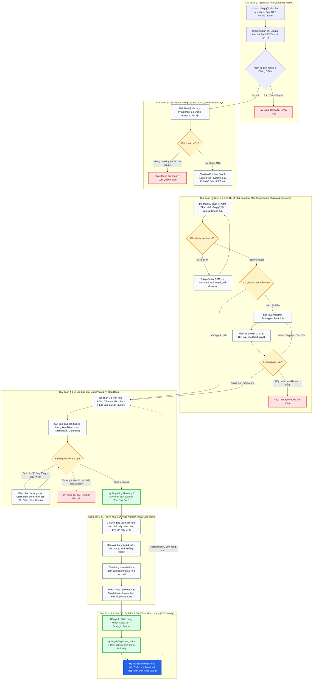
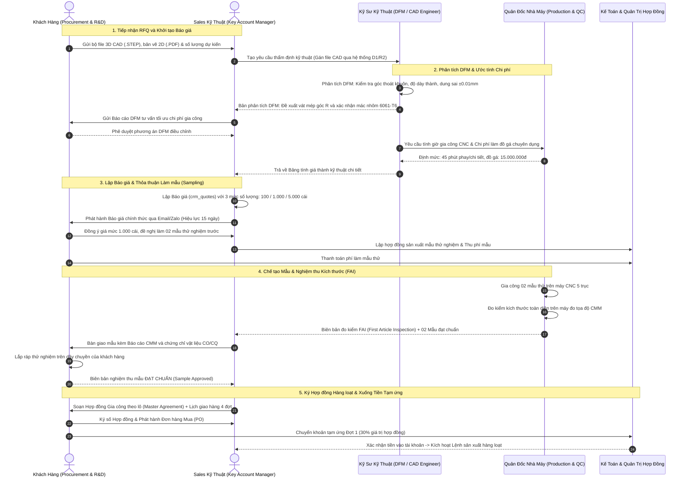
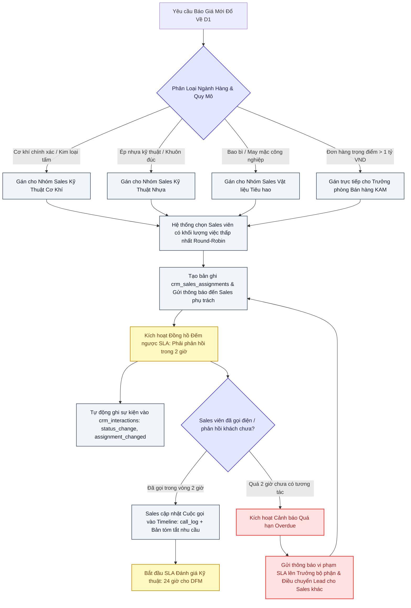
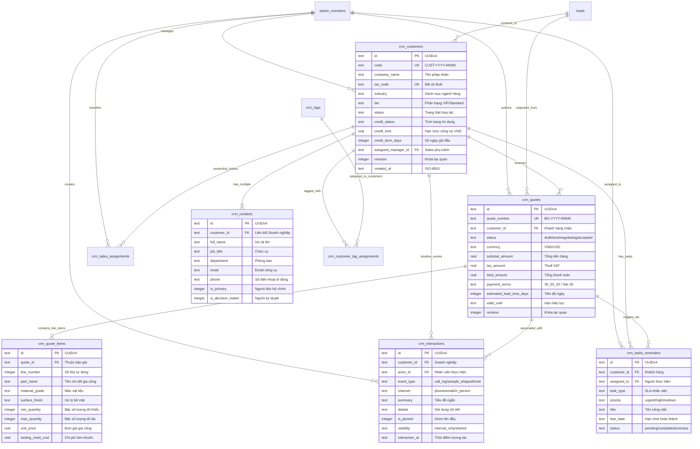

# GIẢI PHẪU LUỒNG NGHIỆP VỤ (WORKFLOWS) & MÔ HÌNH DỮ LIỆU (DATA MODELS) CRM: HARAVAN VS GIACONG.VN

> **Tài liệu nghiên cứu chuyên sâu (Requirement R2)**  
> **Dự án**: Haravan Admin Benchmark & B2B Manufacturing CRM Architecture  
> **Chuyên gia thực hiện**: CRM Specialist & Data Modeler  
> **Nền tảng mục tiêu**: Cloudflare-Native Lean V1 (`apps/giacong-lean-commerce`, D1 SQLite, R2, Workers, Next.js 15)  
> **Ngày lập**: 2026-09-23 | **Phiên bản**: 1.0.0-PROD  

---

## MỤC LỤC

1. [TỔNG QUAN ĐIỀU HÀNH & SỰ CHUYỂN DỊCH HỆ TIÊN ĐỀ B2B VS B2C](#1-tổng-quan-điều-hành--sự-chuyển-dịch-hệ-tiên-đề-b2b-vs-b2c)
2. [GIẢI PHẪU KIẾN TRÚC CRM CỦA HARAVAN ADMIN](#2-giải-phẫu-kiến-trúc-crm-của-haravan-admin)
3. [MA TRẬN ĐỐI CHUẨN 12 CHIỀU: HARAVAN B2C RETAIL VS GIACONG.VN B2B MANUFACTURING](#3-ma-trận-đối-chuẩn-12-chiều-haravan-b2c-retail-vs-giacongvn-b2b-manufacturing)
4. [MÔ HÌNH HÓA QUY TRÌNH NGHIỆP VỤ BẰNG MERMAID DIAGRAMS](#4-mô-hình-hóa-quy-trình-nghiệp-vụ-bằng-mermaid-diagrams)
   - [4.1 Sơ đồ Trạng thái Toàn vòng đời Khách hàng B2B & Chuyển dịch RFQ](#41-sơ-đồ-trạng-thái-toàn-vòng-đời-khách-hàng-b2b--chuyển-dịch-rfq)
   - [4.2 Sơ đồ Tuần tự: Thương thảo Báo giá, Thẩm định Kỹ thuật DFM & Duyệt Mẫu](#42-sơ-đồ-tuần-tự-thương-thảo-báo-giá-thẩm-định-kỹ-thuật-dfm--duyệt-mẫu)
   - [4.3 Sơ đồ Điều phối Lead, Quản lý Timeline Tương tác & Phân quyền Sales SLA](#43-sơ-đồ-điều-phối-lead-quản-lý-timeline-tương-tác--phân-quyền-sales-sla)
5. [THIẾT KẾ HỆ THỐNG TIMELINE TƯƠNG TÁC ĐA CHIỀU (INTERACTION TIMELINE)](#5-thiết-kế-hệ-thống-timeline-tương-tác-đa-chiều-interaction-timeline)
6. [HỆ THỐNG THẺ ĐỘNG (TAG TAXONOMY) & BỘ LỌC PHÂN KHÚC THÔNG MINH (SMART SEGMENTATION)](#6-hệ-thống-thẻ-động-tag-taxonomy--bộ-lọc-phân-khúc-thông-minh-smart-segmentation)
7. [HỆ THỐNG ĐIỀU PHỐI SALES, QUẢN TRỊ TÀI KHOẢN (KAM) & THEO DÕI SLA NHẮC VIỆC](#7-hệ-thống-điều-phối-sales-quản-trị-tài-khoản-kam--theo-dõi-sla-nhắc-việc)
8. [THIẾT KẾ THỰC THỂ DỮ LIỆU CLOUDFLARE D1 (SQLITE PRODUCTION SCHEMA)](#8-thiết-kế-thực-thể-dữ-liệu-cloudflare-d1-sqlite-production-schema)
9. [LỘ TRÌNH TRIỂN KHAI & NGUYÊN TẮC GIỮ VỮNG NỀN TẢNG LEAN V1](#9-lộ-trình-triển-khai--nguyên-tắc-giữ-vững-nền-tảng-lean-v1)

---

## 1. TỔNG QUAN ĐIỀU HÀNH & SỰ CHUYỂN DỊCH HỆ TIÊN ĐỀ B2B VS B2C

Trong kỷ nguyên thương mại điện tử đa kênh, **Haravan** là nền tảng quản trị bán lẻ và bán hàng đa kênh (Omni-channel B2C) hàng đầu tại Việt Nam. Thiết kế CRM của Haravan phục vụ bài toán: hàng trăm nghìn người tiêu dùng cá nhân, mua các sản phẩm tiêu dùng có sẵn (Catalog SKU cố định), giá niêm yết rõ ràng, thanh toán qua cổng điện tử/COD và giao hàng bưu phẩm nhanh qua các đơn vị vận chuyển 3PL (GHN, Viettel Post, GHTK).

Tuy nhiên, **Giacong.vn** là nền tảng số hóa năng lực gia công sản xuất công nghiệp theo yêu cầu (Custom B2B Contract Manufacturing: Cơ khí chính xác CNC, Đúc - Rèn kim loại, Ép nhựa kỹ thuật, May mặc bảo hộ, Bao bì đóng gói). Bản chất nghiệp vụ của ngành gia công B2B hoàn toàn khác biệt:

1. **Khách hàng không phải là cá nhân** mà là một **Doanh nghiệp / Nhà máy (Account)** với một mạng lưới người liên hệ (Buying Committee: Trưởng phòng Mua hàng, Kỹ sư trưởng R&D, Quản đốc nhà máy, Kế toán công nợ).
2. **Không có "Giỏ hàng thanh toán ngay"**; thay vào đó là **Yêu cầu báo giá kỹ thuật (RFQ - Request for Quotation)** đi kèm hồ sơ bản vẽ CAD/STEP/PDF, yêu cầu dung sai, chứng nhận vật liệu và cam kết bảo mật NDA.
3. **Giá thành không cố định**: Báo giá được tính toán từ Định mức vật tư, thời gian chạy máy (Machine hours), chi phí làm khuôn/đồ gá (Tooling/Mold) và chiết khấu theo phân bậc số lượng (Tiered Quantity Breaks / MOQ).
4. **Vòng đời bán hàng dài hạn (Consultative Sales Cycle)**: Kéo dài từ vài tuần đến vài tháng, trải qua các giai đoạn Thẩm định khả năng gia công (DFM), sản xuất mẫu thử (Sampling), nghiệm thu kích thước (CMM/FAI), ký hợp đồng nguyên tắc, bảo lãnh tạm ứng và chia đợt giao hàng.

Tài liệu này tiến hành giải phẫu chi tiết hệ thống Haravan CRM, đối chiếu với mô hình hiện tại của Giacong.vn (`apps/giacong-lean-commerce`), từ đó xây dựng một **kiến trúc quy trình chuẩn B2B Manufacturing** và một **lược đồ cơ sở dữ liệu Cloudflare D1 (SQLite) hoàn chỉnh, cấp độ sản xuất**, đảm bảo tính khả thi cao, tuân thủ nghiêm ngặt nguyên lý Cloudflare-Native Lean V1.

---

## 2. GIẢI PHẪU KIẾN TRÚC CRM CỦA HARAVAN ADMIN

Qua khảo sát và phân tích thực tế từ hệ thống quản trị Haravan Admin, phân hệ Quản lý Khách hàng của Haravan được cấu thành từ các trụ cột chính sau:

```
+-----------------------------------------------------------------------------------+
|                            HARAVAN CRM ARCHITECTURE                               |
+-----------------------------------------------------------------------------------+
|  [ Customer 360 ]     [ Timeline ]       [ Segmentation ]       [ Loyalty ]       |
|  - Tên, SĐT, Email    - Đơn hàng mới     - Nhóm tĩnh            - Hạng thành viên |
|  - Tổng chi tiêu      - Đổi trạng thái   - Nhóm tự động         - Tích điểm chi   |
|  - Số lượng đơn       - Thanh toán       - Lọc theo chi tiêu      tiêu (10k=1đ)   |
|  - Địa chỉ giao hàng  - Chatbot Harasoc  - Lọc theo số đơn      - Voucher sinh    |
|  - Ghi chú nhân viên  - Ghi chú thủ công - Lọc theo ngày mua      nhật, đổi quà   |
+-----------------------------------------------------------------------------------+
```

### 2.1 Hồ sơ Khách hàng 360 (Customer 360)
- **Thực thể trung tâm**: Bảng `customers` đại diện cho một người mua cá nhân. Khách hàng được định danh đơn nhất bằng Số điện thoại hoặc Email.
- **Trường dữ liệu tổng hợp (Aggregated Metrics)**: Haravan tính toán sẵn các chỉ số tài chính hiển thị ngay đầu trang chi tiết:
  * Tổng tiền đã mua (Lifetime Value - LTV).
  * Tổng số lượng đơn hàng đã đặt.
  * Ngày mua hàng gần nhất (Recency).
  * Giá trị đơn hàng trung bình (AOV - Average Order Value).
- **Địa chỉ nhận hàng (Addresses)**: Danh sách sổ địa chỉ giao hàng cá nhân (Nhà riêng, Văn phòng).
- **Ghi chú nội bộ (Staff Notes)**: Cho phép nhân viên thêm ghi chú văn bản thuần túy (Plain text), có thể cấu hình hiển thị nhanh tại màn hình bán lẻ Haravan POS khi khách đọc số điện thoại.

### 2.2 Dòng thời gian tương tác (Timeline)
- **Đặc điểm**: Dòng thời gian trong Haravan là một dòng sự kiện đơn hướng, phần lớn sinh ra tự động từ trạng thái đơn hàng (Order Created -> Confirmed -> Fulfilled -> Shipping -> Delivered -> Paid).
- **Tương tác bán lẻ**: Tích hợp với **Harasocial**, gom lịch sử chat từ Facebook Fanpage, Instagram, Zalo ZNS.
- **Điểm nghẽn khi áp dụng cho B2B**:
  * Không hỗ trợ phân loại sự kiện chuyên sâu như: Cuộc gọi kỹ thuật, Khảo sát nhà xưởng (Site Audit), Gửi mẫu thử (Sampling), Biên bản kiểm định (Inspection report).
  * Không có cơ chế `@mention` đồng nghiệp trong đội ngũ kỹ thuật/dự toán để trao đổi nội bộ.
  * Không phân định rõ ràng giữa "Ghi chú bảo mật nội bộ" (chi phí vốn, chiến lược đàm phán giá) và "Thông tin có thể chia sẻ cho khách hàng".

### 2.3 Phân nhóm khách hàng & Thẻ (Tags & Smart Segmentation)
- **Hệ thống nhãn (Tags)**: Nhãn trong Haravan là chuỗi văn bản tự do (`tags: "VIP, Khách sỉ, Bom hàng, Hà Nội"`), lưu dưới dạng chuỗi phân cách dấu phẩy hoặc quan hệ m-n đơn giản.
- **Nhóm khách hàng (Customer Groups)**:
  * *Nhóm thủ công (Static)*: Nhân viên chọn danh sách khách hàng và gán vào nhóm.
  * *Nhóm thông minh (Dynamic/Smart)*: Định nghĩa bộ quy tắc lọc (Rule conditions) tự động quét dữ liệu. Ví dụ: `Tổng chi tiêu > 5.000.000đ` VÀ `Đơn hàng cuối trong 30 ngày qua`.

### 2.4 Quản lý Nhân viên & Thân thiết (Sales Assignment & Loyalty)
- **Phân công phụ trách**: Haravan tập trung vào phân quyền nhân viên theo chi nhánh/kho hàng (Store location / Warehouse permissions). Khi nhân viên thuộc chi nhánh nào, họ chỉ nhìn thấy và tạo đơn hàng từ kho hàng đó. Thiếu hoàn toàn quy trình bàn giao tài khoản (Account Handover), vòng xoay phân bổ lead (Lead Routing) và giám sát chỉ tiêu thời gian phản hồi (SLA Response Time).
- **HaraLoyalty**: Hệ thống tích điểm quy đổi (10.000 VNĐ = 1 điểm thưởng), nâng hạng thành viên Bạc/Vàng/Kim Cương dựa trên số tiền chi tiêu trong năm để tặng mã giảm giá. Mô hình này phù hợp bán lẻ mỹ phẩm, thời trang, F&B nhưng hoàn toàn vô nghĩa với hợp đồng gia công công nghiệp hàng trăm triệu đồng.

---

## 3. MA TRẬN ĐỐI CHUẨN 12 CHIỀU: HARAVAN B2C RETAIL VS GIACONG.VN B2B MANUFACTURING

Bảng ma trận đối chuẩn chuyên sâu dưới đây làm rõ các khoảng cách nghiệp vụ và lý do Giacong.vn không thể sao chép nguyên mẫu Haravan:

| Chiều Đánh Giá | Haravan Admin (B2C Retail / Omni-channel) | Giacong.vn B2B CRM (Lean V1 Custom Manufacturing) | Tác Động Thiết Kế Dữ Liệu & Giao Diện |
| :--- | :--- | :--- | :--- |
| **1. Đơn vị Định danh Khách hàng** | Cá nhân người tiêu dùng (End-consumer: Tên, SĐT, Email cá nhân). | Doanh nghiệp / Tổ chức (`crm_customers`: Tên công ty, MST, Địa chỉ nhà xưởng). | Phải tách biệt thực thể Công ty (`customers`) và Danh bạ nhân sự liên hệ (`contacts`). |
| **2. Cơ cấu Người liên hệ (Buying Center)** | 1 khách hàng = 1 người quyết định & trực tiếp mua. | Nhiều vai trò tham gia: Mua hàng, Kỹ sư R&D, Quản đốc, Kế toán, Giám đốc. | Quan hệ 1-N: Một công ty có nhiều liên hệ (`crm_contacts`), đánh dấu người quyết định chính. |
| **3. Bản chất Giao dịch** | Đơn hàng mua lẻ (Catalog SKU có sẵn trong kho, bấm Mua ngay). | Yêu cầu báo giá kỹ thuật (RFQ) theo bản vẽ CAD, file STEP/DWG, mẫu thực tế. | Bảng `crm_quotes` liên kết với chi tiết dòng sản phẩm/dịch vụ gia công `crm_quote_items`. |
| **4. Cơ chế Định giá (Pricing Engine)** | Giá niêm yết cố định (Fixed price), mã giảm giá voucher/coupon. | Dự toán chi phí kỹ thuật: Tiền phôi + Giờ công máy + Tiền khuôn/đồ gá + Lợi nhuận. | Giá báo theo phân bậc số lượng (Tiered Pricing/MOQ: 500 cái, 2.000 cái, 10.000 cái). |
| **5. Chu kỳ Bán hàng (Sales Cycle)** | Nhanh chóng: Vài phút (chốt trên web) đến 2-3 ngày. | Dài hạn & Tham vấn: 2 tuần đến 3 tháng (qua nhiều lần thẩm định DFM & gửi mẫu). | Cần Pipeline nhiều giai đoạn, theo dõi SLA, nhắc việc tự động (`crm_tasks_reminders`). |
| **6. Giá trị Hợp đồng (ACV)** | Thấp: Trung bình 200.000đ – 3.000.000đ / đơn hàng. | Cao: 30.000.000đ – 5.000.000.000đ+ / hợp đồng gia công. | Chú trọng quản trị rủi ro công nợ (`credit_limit`, `credit_status`), kiểm tra năng lực pháp lý. |
| **7. Quy trình Nghiệm thu & Giao nhận** | Giao 1 lần qua bưu tá 3PL (GHN, Viettel Post, Shopee Xpress). | Giao nhiều đợt theo tiến độ nhà xưởng, kèm biên bản CMM, CO/CQ, nghiệm thu mẫu FAI. | Theo dõi trạng thái gửi mẫu (`sample_shipped`), biên bản đánh giá chất lượng (`sample_feedback`). |
| **8. Điều khoản Thanh toán** | COD, Thanh toán thẻ tín dụng, Ví Momo/VNPAY 100% trước khi giao. | Đặt cọc 30% - 50% khi duyệt mẫu, thanh toán theo tiến độ, gối đầu công nợ Net 30/60. | Báo giá lưu cấu hình điều khoản `payment_terms` ('30_50_20', 'net_30', 'letter_of_credit'). |
| **9. Dòng thời gian Tương tác (Timeline)** | Tự động ghi log đơn hàng & tin nhắn Harasocial từ bot chat. | Ghi nhận chi tiết: Cuộc gọi kỹ thuật, Khảo sát xưởng, Biên bản họp, Bản vẽ cập nhật. | `crm_interactions` hỗ trợ 13 loại sự kiện, phân quyền hiển thị nội bộ/khách hàng, `@mention`. |
| **10. Phân loại & Gán nhãn (Taxonomy)** | Tag đơn giản dạng text: "Khách sỉ", "VIP", "Bom hàng". | Phân loại đa chiều: Nhóm ngành sản xuất, Phân hạng doanh thu, Mức độ rủi ro, Tiêu chuẩn ISO. | Bảng chuẩn hóa `crm_tags` và `crm_customer_tag_assignments` có danh mục, màu sắc, kiểm soát. |
| **11. Phân bổ Nhân viên & Bàn giao** | Gán nhân viên theo chi nhánh cửa hàng/kho POS. | Phân bổ Sales kỹ thuật chuyên ngành (Cơ khí, Nhựa, May mặc), Bàn giao tài khoản có lưu vết. | `crm_sales_assignments` lưu lịch sử chuyển giao tài khoản giữa các Account Manager kèm lý do. |
| **12. Chương trình Khách hàng Thân thiết** | HaraLoyalty: Tích điểm trên giá trị đơn lẻ, tặng quà sinh nhật. | Giữ chân bằng Hợp đồng nguyên tắc năm, Đặt trước công suất máy (Capacity Reservation), Chiết khấu cuối năm. | Đánh giá qua Tổng sản lượng cam kết năm, Hiệu suất duyệt đơn, Điểm tín nhiệm thanh toán. |

---

## 4. MÔ HÌNH HÓA QUY TRÌNH NGHIỆP VỤ BẰNG MERMAID DIAGRAMS

### 4.1 Sơ đồ Trạng thái Toàn vòng đời Khách hàng B2B & Chuyển dịch RFQ

Biểu đồ dưới đây mô hình hóa toàn bộ 8 giai đoạn của vòng đời khách hàng gia công sản xuất, bao gồm các cổng kiểm soát điều kiện (Gates), đường rẽ nhánh thất bại (Failure/Lost paths) và vòng lặp cải tiến kỹ thuật (DFM Rework Loops).



---

### 4.2 Sơ đồ Tuần tự: Thương thảo Báo giá, Thẩm định Kỹ thuật DFM & Duyệt Mẫu

Sơ đồ tuần tự (Sequence Diagram) mô tả luồng tương tác thực tế giữa 5 thực thể tham gia trong quy trình gia công cơ khí chính xác hoặc ép nhựa:



---

### 4.3 Sơ đồ Điều phối Lead, Quản lý Timeline Tương tác & Phân quyền Sales SLA

Quy trình tự động hóa tiếp nhận, phân loại chuyên môn, giám sát thời hạn phản hồi (SLA) và lưu vết lịch sử tương tác:



---

## 5. THIẾT KẾ HỆ THỐNG TIMELINE TƯƠNG TÁC ĐA CHIỀU (INTERACTION TIMELINE)

Hệ thống Timeline tương tác (`crm_interactions`) là "trung tâm thần kinh" ghi nhận toàn bộ lịch sử diễn biến giữa Giacong.vn và doanh nghiệp khách hàng. Mọi hành vi trao đổi, từ cuộc gọi kỹ thuật ban đầu, biên bản gửi mẫu thử, đến các thay đổi trạng thái đều được lưu trữ dưới dạng một **chuỗi sự kiện đơn hướng (Append-Only Event Stream)** nhằm đảm bảo tính toàn vẹn và khả năng truy vết pháp lý.

### 5.1 Phân loại Sự kiện Tương tác (Event Taxonomy)
Bảng `crm_interactions` hỗ trợ 13 loại sự kiện chuyên biệt hóa cao cho môi trường gia công:

| Loại Sự Kiện (`event_type`) | Kênh (`channel`) | Mô Tả Ý Nghĩa Nghiệp Vụ | Dữ Liệu Chuyên Biệt Trong `metadata_json` |
| :--- | :--- | :--- | :--- |
| `call_log` | `phone`, `zalo` | Ghi chép nội dung cuộc gọi tư vấn, khảo sát dung sai, vật liệu. | `{"duration_seconds": 320, "recording_url": "r2://...", "outcome": "connected"}` |
| `email_sent` | `email` | Nhật ký email gửi thông số kỹ thuật, bản chào giá sơ bộ. | `{"message_id": "...", "subject": "Bản vẽ CNC", "attachments_count": 2}` |
| `email_received` | `email` | Phản hồi của khách hàng kèm file chỉnh sửa. | `{"from": "procurement@partner.vn", "has_drawing": true}` |
| `meeting_onsite` | `in_person` | Họp trực tiếp tại văn phòng khách hàng hoặc công trường. | `{"attendees": ["GĐ Mua hàng", "Kỹ sư R&D"], "location": "KCN VSIP 1"}` |
| `factory_audit` | `in_person` | Khách hàng cử đoàn chuyên gia đến đánh giá nhà máy/dây chuyền. | `{"audit_checklist_score": "92/100", "status": "passed_conditional"}` |
| `internal_note` | `system_event` | Trao đổi nội bộ giữa Sales, Dự toán và Kỹ sư xưởng. | `{"mention_user_ids": ["admin-01", "admin-04"], "cost_estimate": 45000000}` |
| `quote_sent` | `email`, `zalo` | Phát hành Báo giá chính thức kèm mã định danh Báo giá. | `{"quote_number": "BG-2026-0892", "total_amount": 250000000, "valid_days": 15}` |
| `status_change` | `system_event` | Hệ thống tự động ghi vết khi chuyển đổi giai đoạn khách hàng. | `{"from_status": "prospect", "to_status": "active", "reason": "signed_contract"}` |
| `sample_shipped` | `phone`, `zalo` | Gửi mẫu gia công thử nghiệm qua xe ghép hoặc đơn vị chuyển phát. | `{"carrier": "Viettel Post", "tracking_code": "VT19828392", "sample_qty": 2}` |
| `sample_feedback` | `phone`, `email` | Biên bản nghiệm thu mẫu thử từ phòng QA của khách hàng. | `{"result": "approved", "cmm_report_url": "r2://...", "notes": "Đạt độ nhám Ra 1.6"}` |
| `contract_signed` | `in_person`, `email` | Ký kết Hợp đồng nguyên tắc gia công hoặc Đơn đặt hàng (PO). | `{"contract_no": "HD-GC-2026-042", "po_number": "PO-99120", "value": 850000000}` |
| `payment_received` | `system_event` | Kế toán xác nhận nhận tiền cọc hoặc thanh toán công nợ gối đầu. | `{"transaction_id": "FT262610192", "amount": 100000000, "installment": "deposit_30"}` |
| `file_attached` | `web_form` | Tải lên tài liệu kỹ thuật, bản vẽ CAD cập nhật, chứng chỉ CO/CQ. | `{"file_name": "Truc_Dan_Huong_RevC.step", "file_size_mb": 14.8, "r2_key": "..."}` |

### 5.2 Tính Năng Cộng Tác Nội Bộ: `@Mention`, Ghim Đầu Trang & Kiểm Soát Hiển Thị
1. **Cơ chế `@Mention`**:
   - Khi Sales viên hoặc Kỹ sư viết `internal_note`, họ có thể gõ `@TenNhanVien`. Hệ thống bóc tách các định danh người dùng và lưu vào cột `sales_mentions_json: ["admin-id-1", "admin-id-2"]`.
   - Hệ thống tự động tạo thông báo (Notification) và kích hoạt nhiệm vụ nhắc nhở trong `crm_tasks_reminders` cho nhân viên được nhắc tên.
2. **Ghim Sự Kiện Lên Đầu Dòng Thời Gian (`is_pinned`)**:
   - Các thông tin tối quan trọng (ví dụ: "Lưu ý khách hàng rất khắt khe về độ bóng bề mặt Anodize", "Khách hàng ưu tiên giao trước ngày 15 hàng tháng") có thể bật cờ `is_pinned = 1`.
   - Trên giao diện quản trị, các sự kiện này luôn cố định ở đầu màn hình Timeline để bất kỳ nhân viên nào tiếp quản đều nhận biết ngay tức khắc.
3. **Phân Vùng Hiển Thị (`visibility`)**:
   - `internal_only` (Mặc định): Chỉ nhân sự nội bộ công ty (có phiên làm việc `admin_members`) mới có quyền truy cập dữ liệu này. Tuyệt đối không để lộ thông tin biên lợi nhuận, chiến thuật đàm phán hay giá phôi đầu vào.
   - `shared_with_customer`: Đánh dấu các sự kiện minh bạch (Biên bản nghiệm thu CMM, Mã vận đơn chuyển phát mẫu, Báo giá chính thức). Khi Giacong.vn mở rộng cổng thông tin khách hàng (Customer Portal) trong các giai đoạn sau, dữ liệu này sẽ được hiển thị cho khách hàng xem trực tiếp.

---

## 6. HỆ THỐNG THẺ ĐỘNG (TAG TAXONOMY) & BỘ LỌC PHÂN KHÚC THÔNG MINH (SMART SEGMENTATION)

Khác với hệ thống Tag đơn cấp dạng text thuần túy của Haravan, Giacong.vn thiết kế một **Hệ Thống Phân Loại Đa Trục (Multi-Dimensional Taxonomy)** nhằm phục vụ đặc thù nhà xưởng và đánh giá rủi ro tài chính B2B.

### 6.1 Cấu Trúc Phân Loại Thẻ (Tag Taxonomy)
Toàn bộ thẻ được chuẩn hóa trong bảng `crm_tags` và liên kết quan hệ nhiều-nhiều qua `crm_customer_tag_assignments`:

```
+---------------------------------------------------------------------------------------------+
|                                    B2B TAG TAXONOMY                                         |
+---------------------------------------------------------------------------------------------+
|  [ 1. Ngành Gia Công ]      [ 2. Phân Hạng Giá Trị ]    [ 3. Hồ Sơ Rủi Ro & Vận Hành ]      |
|  - Cơ khí chính xác CNC     - Tier 1: Doanh nghiệp VIP  - Rủi ro công nợ cao (Nợ xấu)       |
|  - Kim loại tấm & Laser     - Tier 2: Tiềm năng lớn     - Chậm duyệt mẫu / Sửa bản vẽ liên tục|
|  - Đúc & Ép nhựa kỹ thuật   - Tier 3: Khách hàng chuẩn  - Yêu cầu dung sai siêu khắt khe    |
|  - May mặc & Bảo hộ LĐ      - Tier 4: Khảo giá thị trường- Trả hàng / Tranh chấp quá khứ    |
|  - Bao bì Carton & Màng ghép                                                                |
+---------------------------------------------------------------------------------------------+
|  [ 4. Mức Độ Ưu Tiên ]      [ 5. Công Nghệ Sản Xuất ]   [ 6. Tiêu Chuẩn & Chứng Nhận ]      |
|  - P0: Khẩn cấp (Cần gấp)   - Phay CNC 5 trục           - ISO 9001:2015                     |
|  - P1: Ưu tiên cao          - Cắt Laser công suất 12kW  - IATF 16949 (Linh kiện Ô tô)       |
|  - P2: Tiến độ tiêu chuẩn   - Ép phun nhựa 500 tấn      - ISO 13485 (Thiết bị Y tế)         |
|  - P3: Dự phòng / Tiến độ dài- Cắt dây EDM / Xung điện  - RoHS / REACH Compliant            |
+---------------------------------------------------------------------------------------------+
```

### 6.2 Mô Hình Phân Khúc Thông Minh (Smart Dynamic Segmentation)
Bảng `crm_segments` lưu trữ các biểu thức lọc động (Filter Rule AST) dưới dạng JSON trong cột `filter_rules_json`. Khi nhân viên kinh doanh chọn xem một Phân khúc, hệ thống sẽ biên dịch JSON AST này thành các mệnh đề `WHERE` an toàn trong SQLite để truy vấn dữ liệu theo thời gian thực (Real-time Evaluation).

#### Cấu Trúc JSON Filter Rule Mẫu:
```json
{
  "conjunction": "AND",
  "rules": [
    {
      "field": "industry",
      "operator": "in",
      "value": ["mechanical_cnc", "sheet_metal"]
    },
    {
      "field": "total_won_value",
      "operator": "gte",
      "value": 100000000
    },
    {
      "field": "last_interaction_at",
      "operator": "days_older_than",
      "value": 30
    },
    {
      "field": "credit_status",
      "operator": "in",
      "value": ["good", "warning"]
    },
    {
      "field": "tags",
      "operator": "has_all",
      "value": ["tier-vip", "iso-9001"]
    }
  ]
}
```

#### Các Phân Khúc Vận Hành Chiến Lược Thiết Lập Sẵn:
1. **Phân Khúc Cảnh Báo Rời Bỏ (Churn Risk - VIP Sleeping)**:
   * *Điều kiện*: Khách hàng thuộc Tier `vip` HOẶC `strategic` CÓ `total_won_value >= 200,000,000 VND` NHƯNG `last_interaction_at` cách đây hơn 45 ngày.
   * *Hành động*: Tự động kích hoạt task gọi điện chăm sóc cho Giám đốc kinh doanh.
2. **Phân Khúc Cơ Khí Năng Động (Hot Machining Pipeline)**:
   * *Điều kiện*: Ngành `mechanical_cnc`, có ít nhất 1 báo giá ở trạng thái `negotiating` hoặc `sampling`, tổng giá trị báo giá mở `> 50,000,000 VND`.
   * *Hành động*: Đôn đốc kỹ sư DFM hỗ trợ kỹ thuật để sớm chốt hợp đồng.
3. **Phân Khúc Kiểm Soát Rủi Ro Tín Dụng (Credit Bottleneck)**:
   * *Điều kiện*: Khách hàng có `credit_status` là `warning` hoặc `bad_debt`, có báo giá mới được tạo.
   * *Hành động*: Khóa trạng thái báo giá ở mức `100_prepay` (thanh toán 100% trước sản xuất), không cho phép áp dụng điều khoản công nợ Net 30.

---

## 7. HỆ THỐNG ĐIỀU PHỐI SALES, QUẢN TRỊ TÀI KHOẢN (KAM) & THEO DÕI SLA NHẮC VIỆC

Quá trình bán hàng gia công công nghiệp đòi hỏi sự phối hợp chặt chẽ giữa bộ phận Phát triển kinh doanh ban đầu (SDR - Sales Development Rep) và Giám đốc Quản lý Tài khoản Trọng yếu (KAM - Key Account Manager).

### 7.1 Ma Trận Điều Phối Lead Tự Động (Lead Routing Engine)
Khi một Yêu cầu Báo Giá (Lead/RFQ) mới được tiếp nhận, hệ thống áp dụng thuật toán điều phối đa tiêu chí:

```
+--------------------------------------------------------------------------------------------+
|                            LEAD ROUTING DECISION MATRIX                                    |
+--------------------------------------------------------------------------------------------+
|  Tiêu Chí Phân Loại       | Điều Kiện Lọc               | Người Nhận Bàn Giao             |
|---------------------------+-----------------------------+----------------------------------|
|  1. Ngành hàng chuyên biệt| Cơ khí CNC / Kim loại tấm   | Sales Engineer chuyên Cơ khí     |
|                           | Ép nhựa kỹ thuật / Đúc      | Sales Engineer chuyên Nhựa & Khuôn|
|                           | May mặc / Bao bì Carton     | Sales Chuyên ngành Vật liệu      |
|  2. Quy mô ngân sách      | Dự toán sơ bộ > 1 tỷ VND    | Trưởng phòng Kinh doanh (Lead KAM)|
|  3. Vị trí địa lý         | Khu vực Miền Bắc (Hà Nội...) | Đội ngũ Phụ trách Nhà máy phía Bắc|
|                           | Khu vực Miền Nam (Bình Dương)| Đội ngũ Phụ trách Nhà máy phía Nam|
|  4. Cân bằng tải nội bộ   | Nhiều Sales cùng chuyên môn | Phân bổ xoay vòng (Round-Robin)  |
|                           |                             | theo số lượng deal mở ít nhất    |
+--------------------------------------------------------------------------------------------+
```

### 7.2 Lịch Sử Bàn Giao Tài Khoản & Bảo Toàn Ngữ Cảnh (`crm_sales_assignments`)
Khi chuyển giao một khách hàng từ nhân viên A sang nhân viên B:
- Mọi lịch sử giao dịch, file CAD, biên bản họp và ghi chú bảo mật đều được bảo toàn nguyên vẹn.
- Hệ thống bắt buộc nhập trường `reason` (Lý do chuyển giao: *Chuyển vùng địa bàn, Thay đổi chuyên môn, Nhân viên cũ nghỉ việc*).
- Tạo bản ghi mới trong `crm_sales_assignments` ghi lại: ai chuyển, chuyển cho ai, vào thời điểm nào, phục vụ công tác thanh quyết toán hoa hồng (Commission attribution) minh bạch.

### 7.3 Tiêu Chuẩn Thời Hạn Cam Kết (SLA) & Hệ Thống Nhắc Việc Tự Động
Trong sản xuất gia công B2B, tốc độ phản hồi quyết định 60% tỷ lệ thắng thầu. Giacong.vn thiết lập 5 mốc SLA tự động hóa thông qua bảng `crm_tasks_reminders`:

1. **SLA-1: Phản hồi cuộc gọi đầu tiên (First Touch SLA)**:
   * *Thời hạn*: **Dưới 02 giờ** làm việc kể từ khi Lead ghi danh vào D1.
   * *Hành vi*: Nếu quá 2 giờ mà chưa có bản ghi `crm_interactions` dạng `call_log`, gửi cảnh báo trực tiếp qua Telegram/Email cho Trưởng nhóm.
2. **SLA-2: Hoàn tất Thẩm định Kỹ thuật DFM (Engineering Feasibility SLA)**:
   * *Thời hạn*: **Dưới 24 giờ** đối với chi tiết tiện/phay tiêu chuẩn; **dưới 72 giờ** đối với khuôn ép phức tạp.
3. **SLA-3: Gửi Báo giá Chính thức (Quotation Delivery SLA)**:
   * *Thời hạn*: **Dưới 48 giờ** sau khi hoàn thành DFM.
4. **SLA-4: Định kỳ Theo sát Sau Báo giá (Post-Quote Follow-up)**:
   * *Thời hạn*: Tự động tạo nhắc việc sau **mỗi 03 ngày** nếu Báo giá ở trạng thái `sent` mà khách hàng chưa phản hồi chốt hoặc từ chối.
5. **SLA-5: Cảnh báo Hết hạn Báo giá (Quote Expiry Warning)**:
   * *Thời hạn*: **Trước 48 giờ** so với ngày `valid_until` của báo giá (do biến động giá phôi nhôm/thép hoặc hạt nhựa trên thị trường quốc tế).

---

## 8. THIẾT KẾ THỰC THỂ DỮ LIỆU CLOUDFLARE D1 (SQLITE PRODUCTION SCHEMA)

Toàn bộ mô hình dữ liệu CRM cho Giacong.vn được thiết kế chuyên biệt cho hệ cơ sở dữ liệu **Cloudflare D1 (nền tảng SQLite)**, tuân thủ nguyên tắc phi tập trung, siêu nhẹ (Lean V1), không phát sinh chi phí hạ tầng nặng nề và chống nghẽn ghi đồng thời (Atomic Batch Mutations).

### 8.1 Sơ Đồ Thực Thể Quan Hệ (ERD Diagram)



---

### 8.2 Bảng Đặc Tả Chi Tiết 10 Bảng Dữ Liệu Phân Hệ CRM

File mã nguồn DDL SQL hoàn chỉnh đã được kiểm tra tính tương thích và lưu trữ tại đường dẫn:  
`c:\Users\hieuk\Desktop\web\docs\research\haravan-admin-benchmark\schema.sql`.

Dưới đây là tóm tắt kiến trúc của 10 bảng thực thể:

1. **`crm_customers` (Hồ sơ Doanh nghiệp B2B Khách hàng)**:
   * Lưu trữ pháp nhân, mã khách hàng chuẩn hóa (`CUST-YYYY-NNNN`), ngành nghề sản xuất, hạn mức công nợ (`credit_limit`), số ngày cho phép gối đầu (`credit_term_days`) và các chỉ số tài chính tổng hợp (`total_won_value`, `total_rfq_count`).
   * Trang bị cơ chế khóa lạc quan (Optimistic Locking) qua trường `revision INTEGER NOT NULL DEFAULT 1` tương thích hoàn toàn với cơ chế bảo vệ cập nhật đồng thời trong `apps/giacong-lean-commerce/src/lib/admin-lead-write.ts`.

2. **`crm_contacts` (Danh bạ Nhân sự Liên hệ)**:
   * Cho phép lưu trữ nhiều nhân sự thuộc cùng một doanh nghiệp. Phân định rõ phòng ban (`procurement`, `engineering_rd`, `quality_assurance`, `finance_accounting`), cờ người liên hệ chính (`is_primary`) và cờ người có quyền quyết định ký kết (`is_decision_maker`).

3. **`crm_tags` (Danh mục Nhãn chuẩn hóa)**:
   * Phân loại nhãn theo 6 nhóm chuyên biệt: `industry`, `tier`, `risk`, `priority`, `process_type`, `custom`. Có mã màu HEX phục vụ kết xuất trực quan trên UI Admin (`AdminStatusBadge`).

4. **`crm_customer_tag_assignments` (Bảng Liên kết Nhiều-Nhiều Khách hàng & Thẻ)**:
   * Khóa chính kết hợp `(customer_id, tag_id)` kèm thông tin nhân viên gán nhãn và thời điểm gán.

5. **`crm_segments` (Định nghĩa Phân khúc Thông minh)**:
   * Lưu cấu trúc cây lọc JSON trong `filter_rules_json`. Phân biệt giữa nhóm tự động đánh giá động (`is_dynamic = 1`) và nhóm cố định theo ảnh chụp dữ liệu.

6. **`crm_quotes` (Báo giá Kỹ thuật Gia công B2B)**:
   * Thực thể kết nối nhu cầu khách hàng với cam kết kỹ thuật của nhà máy. Lưu trữ phiên bản báo giá (`version`), trạng thái luân chuyển (`draft`, `engineering_review`, `sent`, `negotiating`, `sampling`, `sample_approved`, `accepted`, `rejected`, `expired`), điều khoản thanh toán (`payment_terms`), ngày hết hạn (`valid_until`) và liên kết bản vẽ CAD/DFM.

7. **`crm_quote_items` (Chi tiết Dòng Báo giá & Phân bậc Số lượng)**:
   * Mô hình hóa cơ chế tính giá đặc thù của ngành gia công: Cho phép khai báo đơn giá theo từng khoảng số lượng (`min_quantity` - `max_quantity`), chi phí bóc tách (Tiền phôi, Tiền chạy máy, Tiền xử lý bề mặt) và chi phí cố định một lần làm khuôn/đồ gá (`tooling_mold_cost`).

8. **`crm_interactions` (Dòng thời gian Tương tác & Nhật ký Hoạt động)**:
   * Ghi nhận 13 loại sự kiện tương tác. Hỗ trợ ghim thông tin quan trọng (`is_pinned`), phân quyền nội bộ vs khách hàng (`visibility`), và danh sách nhân viên được nhắc tên (`sales_mentions_json`).

9. **`crm_sales_assignments` (Lịch sử Bàn giao Phụ trách Tài khoản)**:
   * Lưu vết toàn bộ lịch sử bàn giao tài khoản giữa các nhân sự kinh doanh. Lưu trữ nhân viên cũ, nhân viên mới, người phê duyệt và lý do bàn giao bắt buộc.

10. **`crm_tasks_reminders` (Hệ thống Hàng đợi Nhắc việc & Theo dõi SLA)**:
    * Quản lý các cam kết hành động: Gọi điện sau 2 giờ, Hoàn thành DFM trong 24 giờ, Cảnh báo báo giá sắp hết hạn, Nhắc thu hồi công nợ đến hạn. Liên kết trực tiếp với Cron Trigger để cảnh báo vi phạm tiến độ.

---

### 8.3 Kỹ Thuật Đảm Bảo Tính Toàn Vẹn & Khóa Lạc Quan trên Cloudflare D1
- **Toàn vẹn khóa ngoại (Foreign Key Constraints)**: Sử dụng chỉ thị `PRAGMA foreign_keys = ON;`. Thiết lập hành vi xóa tầng thích hợp (`ON DELETE CASCADE` cho các bảng phụ thuộc như `crm_contacts`, `crm_quote_items`, `crm_interactions`; `ON DELETE RESTRICT` để chống xóa nhầm khách hàng đã phát sinh báo giá).
- **Kiểm soát đồng thời (Optimistic Concurrency Control)**: Mọi thao tác cập nhật trên `crm_customers`, `crm_quotes`, `crm_tasks_reminders` đều phải kiểm tra điều kiện `revision = expectedRevision` và tăng `revision = revision + 1`. Nếu xảy ra xung đột phiên chỉnh sửa, hệ thống sẽ trả về lỗi `AdminConflictError` yêu cầu tải lại dữ liệu mới nhất trước khi ghi đè, bảo vệ dữ liệu nhà xưởng khỏi tình trạng ghi đè vô thức.
- **Tương thích hoàn toàn với Next.js 15 Server Actions & D1 Atomic Batch**:
  Mọi thao tác ghi phức hợp (ví dụ: Chuyển trạng thái Lead -> Tạo Khách hàng mới -> Tạo Liên hệ chính -> Ghi sự kiện Timeline) được gom vào một lời gọi `database.batch([stmt1, stmt2, stmt3])` duy nhất, đảm bảo tính nguyên tử tuyệt đối (ACID: All-or-Nothing).

---

## 9. LỘ TRÌNH TRIỂN KHAI & NGUYÊN TẮC GIỮ VỮNG NỀN TẢNG LEAN V1

### 9.1 Lộ Trình Triển Khai 3 Pha (3-Phase Implementation Roadmap)

```
+-----------------------------------------------------------------------------------------------+
|                             B2B CRM IMPLEMENTATION ROADMAP                                    |
+-----------------------------------------------------------------------------------------------+
|  PHA 1: NỀN TẢNG DỮ LIỆU & QUẢN TRỊ KHÁCH HÀNG (Sprint 1 - 2) [P0]                           |
|  - Chạy migration DDL bảng crm_customers, crm_contacts, crm_tags, crm_interactions.           |
|  - Nâng cấp màn hình Tiếp nhận Yêu cầu (/admin/yeu-cau): Nút chuyển đổi Lead -> B2B Customer. |
|  - Xây dựng giao diện Danh sách & Chi tiết Khách hàng (/admin/khach-hang) trên AdminShell.   |
|  - Tích hợp Timeline tương tác cơ bản (Thêm cuộc gọi, ghi chú nội bộ, ghim sự kiện quan trọng)|
+-----------------------------------------------------------------------------------------------+
|  PHA 2: PHÂN HỆ BÁO GIÁ KỸ THUẬT & QUY TRÌNH DUYỆT MẪU (Sprint 3 - 4) [P0/P1]                 |
|  - Chạy migration bảng crm_quotes và crm_quote_items.                                         |
|  - Xây dựng giao diện Soạn thảo Báo giá Đa bậc số lượng (Tiered Pricing Engine).             |
|  - Thêm luồng đính kèm file CAD (liên kết R2 Bucket) và Báo cáo kiểm định CMM/DFM.            |
|  - Tích hợp tính năng xuất Báo giá PDF chuẩn công nghiệp cho phòng Mua hàng đối tác.         |
+-----------------------------------------------------------------------------------------------+
|  PHA 3: PHÂN KHÚC ĐỘNG, ĐIỀU PHỐI SALES & TỰ ĐỘNG HÓA SLA (Sprint 5 - 6) [P1/P2]              |
|  - Triển khai bảng crm_segments, crm_sales_assignments, crm_tasks_reminders.                 |
|  - Xây dựng bộ máy biên dịch JSON AST Filter Rules thành câu lệnh SQLite D1 tối ưu.          |
|  - Tích hợp Cloudflare Workers Cron Trigger chạy quét hàng giờ để phát hiện vi phạm SLA.    |
|  - Hoàn thiện báo cáo phân tích hiệu suất chuyển đổi Sales Pipeline và tỷ lệ thắng thầu.     |
+-----------------------------------------------------------------------------------------------+
```

### 9.2 Các Ranh Giới Nghiêm Ngặt Phải Tuân Thủ (Guardrails & Invariants)
1. **Tuyệt đối không tái sinh Bagisto**: Không đưa lại các mô hình giỏ hàng phức tạp, thanh toán cổng cồng kềnh hay tài khoản thành viên bán lẻ vào hệ thống.
2. **Tuân thủ triệt để Cloudflare-Native Lean V1**: Mọi dữ liệu có cấu trúc nằm trên D1 (SQLite), mọi tệp đính kèm (CAD, PDF, Hình ảnh sản phẩm) nằm trên Cloudflare R2, logic trung gian vận hành trên Next.js Server Components và Worker Serverless Functions. Không thuê thêm các dịch vụ SaaS trung gian đắt đỏ.
3. **Bảo tồn tính tương thích ngược**: Giữ nguyên vẹn bảng `leads` và `lead_items` hiện hữu để đảm bảo các yêu cầu từ trang web công khai tiếp tục hoạt động trơn tru không gián đoạn một giây nào.
4. **Chuẩn mực Giao diện Admin**: Kế thừa toàn bộ hệ thống thiết kế có sẵn (`AdminShell`, `AdminPrimitives`, CSS biến `--admin-ink`, `--admin-border`, Lucide Icons), đảm bảo mật độ hiển thị dữ liệu cao, tốc độ phản hồi dưới 100ms trên mạng nội địa và trải nghiệm tập trung tối đa cho đội ngũ kinh doanh kỹ thuật.

---
*Tài liệu nghiên cứu và thiết kế kiến trúc hoàn tất. Toàn bộ mã nguồn cơ sở dữ liệu đã được đồng bộ tại `schema.sql`.*
