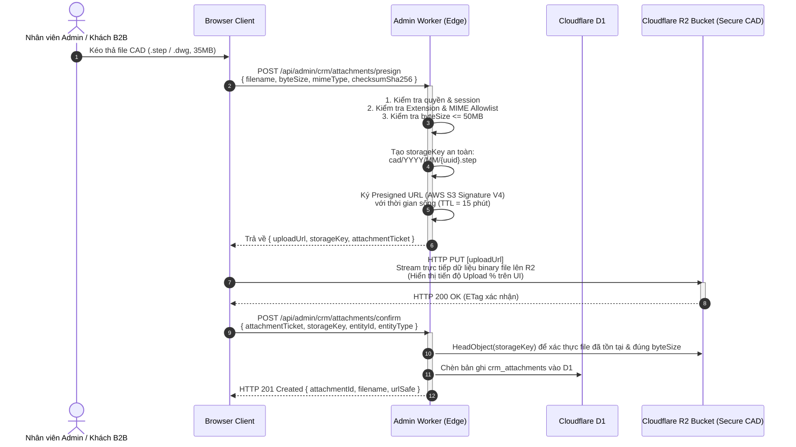
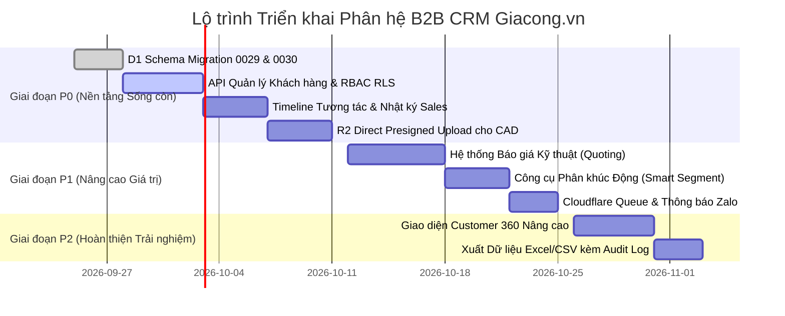

# Kiến Trúc Kỹ Thuật Cloudflare-Native & Danh Mục Backlog Nâng Cấp Phân Hệ B2B CRM Giacong.vn

> **Tài liệu tham chiếu:** Yêu cầu R4 - Đề án Nghiên cứu & Đối chuẩn Haravan Admin vs Giacong.vn Admin  
> **Phiên bản:** 1.0.0 (Production-Ready Architecture Blueprint)  
> **Tác giả:** Admin Architect & Cloudflare Systems Specialist  
> **Trạng thái:** Sẵn sàng thẩm định & Triển khai kỹ thuật (Architecture Specification)  
> **Ứng dụng mục tiêu:** `apps/giacong-lean-commerce` (Next.js 15 App Router / OpenNext on Cloudflare Workers)  

---

## MỤC LỤC

1. [TỔNG QUAN KIẾN TRÚC & NGUYÊN TẮC BẤT BIẾN CLOUDFLARE-NATIVE](#1-tổng-quan-kiến-trúc--nguyên-tắc-bất-biến-cloudflare-native)
   - 1.1. Bối cảnh & Mục tiêu Chuyển đổi
   - 1.2. Các Ranh giới Bất biến (Architectural Invariants & Non-Negotiable Boundaries)
   - 1.3. Sơ đồ Tô-pô Hệ thống & Luồng Dữ liệu Toàn trình (System Topology & Data Flow)
2. [HỢP ĐỒNG API VÀ SERVER ACTIONS CHO NEXT.JS 15 APP ROUTER](#2-hợp-đồng-api-và-server-actions-cho-nextjs-15-app-router)
   - 2.1. Khuôn mẫu Chuẩn hóa API Response & Error Envelope
   - 2.2. Đặc tả Chi tiết API REST & TypeScript Interfaces
     - 2.2.1. Quản lý Khách hàng Doanh nghiệp (`/api/admin/crm/customers`)
     - 2.2.2. Chi tiết Khách hàng & Optimistic Locking (`/api/admin/crm/customers/[id]`)
     - 2.2.3. Dòng thời gian Tương tác & Nhật ký (`/api/admin/crm/customers/[id]/timeline`)
     - 2.2.4. Báo giá Kỹ thuật Gia công (`/api/admin/crm/quotes`)
     - 2.2.5. Phân khúc Khách hàng Động (`/api/admin/crm/segments`)
   - 2.3. Kiến trúc Next.js 15 Server Actions cho Trải nghiệm Admin Thời gian thực
3. [KIẾN TRÚC PHÂN QUYỀN (RBAC) & KIỂM SOÁT PHẠM VI DỮ LIỆU KINH DOANH](#3-kiến-trúc-phân-quyền-rbac--kiểm-soát-phạm-vi-dữ-liệu-kinh-doanh)
   - 3.1. Mở rộng Hệ thống Quyền Hạn (`src/lib/admin-permissions.ts`)
   - 3.2. Kiểm soát Truy cập Cấp hàng (Row-Level Security - RLS) cho Nhân viên Kinh doanh
   - 3.3. Sổ cái Kiểm toán An toàn (Audit Logging & Data Tamper Protection)
4. [KIẾN TRÚC LƯU TRỮ VÀ XỬ LÝ FILE ĐÍNH KÈM KỸ THUẬT B2B (CAD/DRAWINGS) TRÊN R2](#4-kiến-trúc-lưu-trữ-và-xử-lý-file-đính-kèm-kỹ-thuật-b2b-caddrawings-trên-r2)
   - 4.1. Thách thức Đặc thù Ngành Gia công Cơ khí & B2B Manufacturing
   - 4.2. Luồng Tải lên Trực tiếp qua R2 Presigned URLs (Direct-to-R2 Workflow)
   - 4.3. Chính sách Kiểm duyệt MIME Type, Dung lượng và An ninh Bản vẽ Kỹ thuật
5. [CHIẾN LƯỢC HIỆU NĂNG VÀ MỞ RỘNG TRÊN CLOUDFLARE D1 (SQLITE)](#5-chiến-lược-hiệu-năng-và-mở-rộng-trên-cloudflare-d1-sqlite)
   - 5.1. Đặc tính Kỹ thuật D1 & Kỷ luật Truy vấn SQLite Edge
   - 5.2. Kỹ thuật Phân trang Con trỏ (Cursor-Based Pagination) vs Phân trang Offset
   - 5.3. Chiến lược Đánh Chỉ mục (Index Strategy) cho Bộ lọc Đa tiêu chí B2B
   - 5.4. Khử Chuẩn hóa Có Kiểm soát & Xử lý Bất đồng bộ qua Cloudflare Queues
6. [BẢN VẼ THÀNH PHẦN GIAO DIỆN (UI COMPONENT BLUEPRINT) & ĐẶC TẢ TRẢI NGHIỆM CRM](#6-bản-vẽ-thành-phần-giao-diện-ui-component-blueprint--đặc-tả-trải-nghiệm-crm)
   - 6.1. Tích hợp Hệ thống Điều hướng `AdminShell` & Workflow IA
   - 6.2. Đặc tả Giao diện Hồ sơ Khách hàng Doanh nghiệp (Customer 360 Workspace)
   - 6.3. Khung Dòng Thời gian Tương tác Đa kênh (Interactive Timeline Component)
   - 6.4. Trải nghiệm Chi tiết Yêu cầu & Soạn Báo giá Chia đôi (RFQ & Quote Detail Split-Screen UX)
   - 6.5. Khung Tác vụ Nhanh & Drawer Trượt Cạnh Phải (`AdminDrawer` Slide-Over Sheet)
   - 6.6. Tiêu chuẩn Thiết kế & Quy ước Trạng thái UI (Design System & Accessibility Standards)
7. [LỘ TRÌNH VÀ DANH MỤC CÔNG VIỆC ƯU TIÊN (PRIORITIZED BACKLOG P0 / P1 / P2)](#7-lộ-trình-và-danh-mục-công-việc-ưu-tiên-prioritized-backlog-p0--p1--p2)
   - 7.1. Phân nhóm Ưu tiên P0: Nền tảng Vận hành Sống còn (Must-Have Foundation)
   - 7.2. Phân nhóm Ưu tiên P1: Nâng cao Giá trị B2B & Chuyên môn hóa (Value-Add Differentiators)
   - 7.3. Phân nhóm Ưu tiên P2: Hoàn thiện Trải nghiệm & Quy mô Doanh nghiệp (Enterprise Polish)

---

## 1. TỔNG QUAN KIẾN TRÚC & NGUYÊN TẮC BẤT BIẾN CLOUDFLARE-NATIVE

### 1.1. Bối cảnh & Mục tiêu Chuyển đổi

Qua quá trình mổ xẻ hệ thống Haravan Admin, chúng ta nhận thấy Haravan là một nền tảng bán lẻ đa kênh (Omnichannel Retail) phục vụ mô hình B2C với đặc thù: giỏ hàng thanh toán ngay, số lượng lớn đơn hàng nhỏ lẻ, tích điểm thành viên (loyalty points), và mạng lưới kênh bán lẻ phân tán (Shopee, Lazada, TikTok, POS).

Ngược lại, **Giacong.vn** (`apps/giacong-lean-commerce`) là nền tảng thương mại và dịch vụ chuyên sâu cho ngành **Gia công Cơ khí, Chế tạo và Sản xuất B2B**. Trong mô hình B2B:
- Khách hàng không mua hàng bằng nút "Thanh toán ngay" qua cổng thẻ tín dụng. Họ gửi **Yêu cầu Báo giá (RFQ - Request for Quotation)** kèm theo hồ sơ kỹ thuật (bản vẽ 2D `.dwg`/`.dxf`, mô hình 3D CAD `.step`/`.stp`, bảng yêu cầu dung sai, vật liệu và chứng chỉ ISO).
- Chu kỳ chốt đơn kéo dài từ vài ngày đến nhiều tuần qua các giai đoạn: Tiếp nhận RFQ $\rightarrow$ Phân tích Kỹ thuật $\rightarrow$ Tính toán Định mức Giá $\rightarrow$ Gửi Báo giá $\rightarrow$ Làm mẫu (Sampling) $\rightarrow$ Đàm phán Hợp đồng $\rightarrow$ Chốt đơn & Sản xuất.
- Đối tượng khách hàng là Doanh nghiệp (B2B Enterprise) với nhiều đầu mối liên hệ (Trưởng phòng Thu mua, Kỹ sư trưởng, Giám đốc Nhà máy), có Mã số thuế (MST) và công nợ (Credit terms).

Mục tiêu kiến trúc là: **Xây dựng phân hệ CRM & Quản lý Báo giá chuyên nghiệp ngay trên nền tảng Cloudflare-native sẵn có của Giacong.vn**, biến trang quản trị tinh gọn hiện tại thành cỗ máy vận hành B2B sắc bén, khắc phục triệt để khoảng cách với Haravan về lưu vết tương tác khách hàng mà không làm phình to chi phí hạ tầng.

---

### 1.2. Các Ranh giới Bất biến (Architectural Invariants & Non-Negotiable Boundaries)

Để bảo toàn nguyên tắc **Lean V1** và không tái phạm sai lầm kiến trúc nguyên khối trong quá khứ, bản thiết kế tuân thủ 5 nguyên tắc bất biến nghiêm ngặt:

1. **Tuyệt đối không tái sinh Bagisto / PHP / MySQL:**
   Toàn bộ logic vận hành, CRM, danh mục và báo giá chạy trên runtime Next.js 15 App Router biên dịch qua OpenNext (`@opennextjs/cloudflare`) trên Cloudflare Workers. Không sử dụng VPS, Apache/Nginx origin, PHP runtime hay cơ sở dữ liệu MySQL cồng kềnh.
2. **Cloudflare D1 là nguồn chân lý duy nhất (Single Source of Truth):**
   Mọi thực thể khách hàng, đầu mối liên hệ, dòng thời gian tương tác, nhãn (tags), phân khúc và báo giá đều được lưu trữ trực tiếp trên Cloudflare D1 (SQLite engine at the edge). Không lưu trữ trạng thái giao dịch trong bộ nhớ tạm thời hoặc local storage của client.
3. **Tuyệt đối không cấp quyền Binding D1/R2 trực tiếp cho Browser:**
   Trình duyệt của nhân viên admin tuyệt đối không sở hữu credentials D1 hoặc R2. Mọi thao tác đọc/ghi phải đi qua ranh giới Server Component, Server Action hoặc REST Route Handler được kiểm soát bởi Cloudflare Access JWT verification (`Cf-Access-Jwt-Assertion`) và bảng phân quyền `admin_members`.
4. **Không phụ thuộc vào SaaS bên thứ ba đắt đỏ:**
   Không tích hợp các giải pháp CRM thuê bao hàng tháng tính phí theo đầu user (như HubSpot $50/user/tháng hay Salesforce). Tận dụng tối đa hệ sinh thái Cloudflare (D1, R2, Queues, Workers) với chi phí vận hành gần như bằng 0 ở quy mô ban đầu.
5. **Kỷ luật Concurrency & Idempotency bằng `revision`:**
   D1 là SQLite phân tán đơn luồng ghi (Single-Writer). Mọi lệnh cập nhật (Mutation) đều phải sử dụng khóa lạc quan (Optimistic Concurrency Control) dựa trên số nguyên `revision` (không dựa vào `updated_at` có độ phân giải giây). Mọi request ghi phải kèm `requestId` (UUIDv4) và mã băm `payload_sha256` để bảo đảm tính bất biến (idempotency), ngăn ngừa ghi đè dữ liệu chéo giữa các nhân viên kinh doanh.

---

### 1.3. Sơ đồ Tô-pô Hệ thống & Luồng Dữ liệu Toàn trình (System Topology & Data Flow)

Hệ thống được thiết kế theo mô hình điện toán biên phân tán (Edge Distributed Computing), chia tách rõ ràng giữa lớp Tiếp nhận (Ingress), Lớp Ứng dụng Biên (Edge Compute), Lớp Dữ liệu (Edge Persistence), và Lớp Xử lý Hậu trường (Async Pipeline).

```mermaid
flowchart TB
    subgraph ClientLayer ["Client & Network Boundary"]
        BrowserStorefront["Storefront Guest (Khách hàng B2B)\n[kienhieu.id.vn]"]
        BrowserAdmin["Admin Operator / Sales Rep\n[admin.kienhieu.id.vn]"]
        CFAccess["Cloudflare Access (Zero Trust)\nEdge Identity & JWKS Verification"]
    end

    subgraph EdgeComputeLayer ["Cloudflare Edge Compute (OpenNext on Workers)"]
        EdgeStorefrontWorker["Storefront Worker\n- Guest RFQ Intake\n- Rate Limit: 5 req/min"]
        EdgeAdminWorker["Admin Worker (Next.js 15)\n- Server Components & Actions\n- Route Handlers (/api/admin/crm/*)\n- RBAC & Scope Enforcement"]
    end

    subgraph DataStorageLayer ["Cloudflare Persistence Layer"]
        D1DB[("Cloudflare D1 (SQLite)\n- leads & lead_items\n- crm_customers & contacts\n- crm_timeline_events\n- crm_quotes & quote_items\n- crm_tags & segments\n- admin_crm_audit")]
        R2ProductMedia[("Cloudflare R2 Bucket\n[giacong-vn-product-media]\nProduct & Service Media")]
        R2CADStorage[("Cloudflare R2 Bucket\n[giacong-vn-cad-attachments]\nSecure B2B Engineering Files\n(.step, .dwg, .dxf, spec.pdf)")]
    end

    subgraph AsyncPipelineLayer ["Asynchronous Queue & Workers"]
        CFQueue["Cloudflare Queue\n[giacong-vn-leads]\nDead Letter Queue: dlq"]
        QueueConsumerWorker["Queue Consumer Worker\n(Background Processing)"]
        GoogleSheetSink["Secondary Sink: Google Sheets\n(Operational Backup via Apps Script)"]
        ZaloNotificationSink["Zalo ZNS / Telegram Bot\n(Instant Sales Alert Notification)"]
        EmailNotificationSink["Cloudflare Email Routing / Resend\n(Customer RFQ Confirmation)"]
    end

    %% Client to Ingress
    BrowserStorefront -->|POST /api/contact (Public RFQ)| EdgeStorefrontWorker
    BrowserAdmin -->|Secure HTTPS Request| CFAccess
    CFAccess -->|Valid Access JWT + Same Origin| EdgeAdminWorker

    %% Compute to Storage
    EdgeStorefrontWorker -->|Atomic Batch Insert Lead| D1DB
    EdgeStorefrontWorker -->|Enqueue Async Job| CFQueue
    EdgeAdminWorker -->|Prepared SQL Statements + Batch| D1DB
    
    %% Direct R2 Presigned Upload
    BrowserAdmin -.->|1. Request Presigned Upload Ticket| EdgeAdminWorker
    EdgeAdminWorker -.->|2. Sign PUT URL with 15m Expiration| BrowserAdmin
    BrowserAdmin ==>|3. Direct Stream CAD / Spec File (up to 50MB)| R2CADStorage
    BrowserAdmin -.->|4. Confirm Upload & Metadata| EdgeAdminWorker

    %% Async Queue Flow
    CFQueue --> QueueConsumerWorker
    QueueConsumerWorker --> GoogleSheetSink
    QueueConsumerWorker --> ZaloNotificationSink
    QueueConsumerWorker --> EmailNotificationSink

    classDef client fill:#E0F2FE,stroke:#0284C7,stroke-width:2px;
    classDef edge fill:#FEF3C7,stroke:#D97706,stroke-width:2px;
    classDef storage fill:#DCFCE7,stroke:#16A34A,stroke-width:2px;
    classDef async fill:#F3E8FF,stroke:#9333EA,stroke-width:2px;

    class BrowserStorefront,BrowserAdmin,CFAccess client;
    class EdgeStorefrontWorker,EdgeAdminWorker edge;
    class D1DB,R2ProductMedia,R2CADStorage storage;
    class CFQueue,QueueConsumerWorker,GoogleSheetSink,ZaloNotificationSink,EmailNotificationSink async;
```

---

## 2. HỢP ĐỒNG API VÀ SERVER ACTIONS CHO NEXT.JS 15 APP ROUTER

### 2.1. Khuôn mẫu Chuẩn hóa API Response & Error Envelope

Kế thừa và mở rộng chuẩn từ `CLOUDFLARE_ADMIN_WRITE_CONTRACT.md` và `src/lib/admin-api.ts`, mọi endpoint API của phân hệ CRM phải phản hồi qua cấu trúc chuẩn duy nhất (Standardized API Envelope), kèm các HTTP Headers an ninh chống rò rỉ dữ liệu.

#### Headers Phản hồi Bắt buộc:
```http
Cache-Control: no-store
Content-Security-Policy: default-src 'none'; base-uri 'none'; frame-ancestors 'none'
Referrer-Policy: no-referrer
X-Content-Type-Options: nosniff
```

#### Cấu trúc Thành công (HTTP 200 / 201):
```typescript
export interface AdminApiSuccessEnvelope<T> {
  ok: true;
  requestId: string; // UUIDv4 tương ứng với phiên thao tác
  data: T;
}
```

#### Cấu trúc Thất bại (HTTP 400 / 401 / 403 / 404 / 409 / 413 / 422 / 500):
```typescript
export type AdminCrmErrorCode =
  | "INVALID_REQUEST"        // JSON sai cú pháp hoặc vượt quá giới hạn byte
  | "VALIDATION_ERROR"       // Dữ liệu vi phạm Zod schema hoặc luật kinh doanh
  | "NOT_FOUND"               // Không tìm thấy thực thể
  | "UNIQUE_CONFLICT"        // Trùng mã số thuế, email hoặc mã báo giá
  | "STALE_WRITE"            // Xung đột phiên ghi (revision lệch so với DB)
  | "IDEMPOTENCY_CONFLICT"   // Trùng lặp requestId nhưng payload khác nhau
  | "FORBIDDEN"              // Vi phạm quyền hạn hoặc phạm vi truy cập dữ liệu
  | "FILE_TOO_LARGE"         // Vượt quá dung lượng file cho phép (ví dụ: >50MB)
  | "UNSUPPORTED_MEDIA"      // Định dạng file kỹ thuật không nằm trong allowlist
  | "INTERNAL_ERROR";        // Lỗi hệ thống nội bộ đã được che giấu

export interface AdminApiFailureEnvelope {
  ok: false;
  requestId: string;
  code: AdminCrmErrorCode;
  message: string;           // Thông điệp an toàn bằng tiếng Việt hiển thị cho operator
  fieldErrors?: Record<string, string>; // Chi tiết lỗi theo từng input field (nếu có)
}
```

---

### 2.2. Đặc tả Chi tiết API REST & TypeScript Interfaces

#### 2.2.1. Quản lý Khách hàng Doanh nghiệp (`/api/admin/crm/customers`)

Phân hệ quản lý danh sách và khởi tạo Khách hàng Doanh nghiệp B2B (tách biệt hoàn toàn với tài khoản thành viên bán lẻ).

##### TypeScript Interface & Zod Schema:
```typescript
import { z } from "zod";

export const CreateCustomerSchema = z.object({
  requestId: z.string().uuid("Request ID phải là UUID v4 hợp lệ"),
  companyName: z.string().min(2, "Tên công ty phải có ít nhất 2 ký tự").max(200),
  shortName: z.string().max(50).optional(),
  taxCode: z.string().regex(/^[0-9]{10}(-[0-9]{3})?$/, "Mã số thuế không hợp lệ (10 hoặc 13 số)").optional().nullable(),
  industry: z.enum([
    "machining_cnc",       // Gia công cơ khí chính xác CNC
    "sheet_metal",         // Cơ khí đột dập, kim loại tấm
    "plastic_injection",   // Ép nhựa kỹ thuật
    "electronics_assembly",// Lắp ráp cơ điện tử
    "packaging_mfg",       // Bao bì & chế tạo phụ trợ
    "general_b2b"          // Khách hàng B2B tổng hợp
  ]).default("general_b2b"),
  tier: z.enum(["lead", "bronze", "silver", "gold", "key_account"]).default("lead"),
  assignedTo: z.string().min(1, "Phải chỉ định nhân viên phụ trách").nullable().optional(),
  primaryContact: z.object({
    fullName: z.string().min(2, "Tên người đại diện không được để trống"),
    email: z.string().email("Email không hợp lệ").optional().nullable(),
    phone: z.string().regex(/^(\+84|0)[0-9]{9,10}$/, "Số điện thoại không hợp lệ"),
    position: z.string().max(100).optional().nullable(), // Trưởng phòng Thu mua, Kỹ sư,...
  }),
  address: z.string().max(255).optional().nullable(),
  city: z.string().max(100).optional().nullable(),
  tags: z.array(z.string().max(50)).default([]),
  note: z.string().max(2000).optional().nullable(),
});

export type CreateCustomerInput = z.infer<typeof CreateCustomerSchema>;
```

##### Endpoints:
- `GET /api/admin/crm/customers`:
  - **Query Params:** `query` (tìm tên, MST, SĐT), `tier`, `industry`, `assignedTo`, `tag`, `cursor` (chuỗi base64 mã hóa `created_at` và `id`), `limit` (mặc định 20, tối đa 100).
  - **Phân quyền:** Yêu cầu capability `crm.read`. Nhân viên kinh doanh thông thường chỉ thấy khách hàng được phân công cho mình (trừ khi có quyền quản lý toàn bộ).
- `POST /api/admin/crm/customers`:
  - **Yêu cầu:** Body JSON theo `CreateCustomerSchema`, kích thước tối đa 64 KiB.
  - **Phân quyền:** Yêu cầu capability `crm.write`.
  - **Cơ chế ghi D1:** Thực hiện trong một `batch` gồm:
    1. Kiểm tra tính trùng lặp của Mã số thuế (`tax_code`) nếu có.
    2. Chèn bản ghi `crm_customers` với `revision = 1`.
    3. Chèn bản ghi `crm_contacts` cho người đại diện chính.
    4. Gán các nhãn liên quan trong `crm_customer_tags`.
    5. Ghi nhật ký khởi tạo vào `crm_timeline_events` và `admin_crm_audit`.

---

#### 2.2.2. Chi tiết Khách hàng & Optimistic Locking (`/api/admin/crm/customers/[id]`)

Màn hình Customer 360 View tập trung dữ liệu toàn diện về khách hàng.

##### TypeScript Interface & Zod Schema:
```typescript
export const UpdateCustomerSchema = z.object({
  requestId: z.string().uuid(),
  expectedRevision: z.number().int().positive("Revision phải là số nguyên dương"),
  companyName: z.string().min(2).max(200).optional(),
  shortName: z.string().max(50).optional().nullable(),
  taxCode: z.string().regex(/^[0-9]{10}(-[0-9]{3})?$/).optional().nullable(),
  tier: z.enum(["lead", "bronze", "silver", "gold", "key_account"]).optional(),
  status: z.enum(["active", "inactive", "blacklisted"]).optional(),
  assignedTo: z.string().nullable().optional(),
  creditLimitVnd: z.number().nonnegative().optional().nullable(),
  paymentTermsDays: z.number().int().nonnegative().optional().nullable(), // Net 15, Net 30, Net 60
  address: z.string().max(255).optional().nullable(),
  city: z.string().max(100).optional().nullable(),
  tags: z.array(z.string().max(50)).optional(),
});

export type UpdateCustomerInput = z.infer<typeof UpdateCustomerSchema>;
```

##### Endpoints:
- `GET /api/admin/crm/customers/[id]`:
  - Trả về thông tin khách hàng, danh sách đầu mối liên hệ, tổng giá trị đơn hàng/báo giá, số lượng RFQ đang mở, và `revision` hiện hành.
- `PATCH /api/admin/crm/customers/[id]`:
  - **Kiểm tra Concurrency:** Thực thi truy vấn D1 với mệnh đề `WHERE id = ? AND revision = ?`.
  - Nếu số bản ghi bị ảnh hưởng = 0: Truy vấn lại ID. Nếu ID tồn tại $\rightarrow$ trả về `409 STALE_WRITE` ("Dữ liệu khách hàng đã được đồng nghiệp cập nhật. Vui lòng tải lại trang."); nếu ID không tồn tại $\rightarrow$ trả về `404 NOT_FOUND`.
  - Khi cập nhật thành công: Tăng `revision = expectedRevision + 1` và tự động ghi sự kiện thay đổi vào bảng audit trong cùng một D1 atomic transaction.

---

#### 2.2.3. Dòng thời gian Tương tác & Nhật ký (`/api/admin/crm/customers/[id]/timeline`)

Lưu vết toàn bộ tương tác giữa đội ngũ bán hàng/kỹ thuật và khách hàng B2B (tính năng sống còn mà Haravan thực hiện rất tốt qua Timeline, nhưng Giacong cần chuyên biệt hóa cho sản xuất).

##### TypeScript Interface & Zod Schema:
```typescript
export const CreateTimelineEventSchema = z.object({
  requestId: z.string().uuid(),
  eventType: z.enum([
    "call_log",        // Nhật ký cuộc gọi trao đổi yêu cầu
    "meeting_note",    // Biên bản họp / gặp trực tiếp tại nhà máy
    "email_sent",      // Gửi email trao đổi kỹ thuật
    "cad_review",      // Đánh giá khả thi bản vẽ DFM (Design for Manufacturing)
    "sample_feedback", // Phản hồi đánh giá mẫu thử
    "internal_note",   // Ghi chú nội bộ giữa sales và kỹ sư dự toán
    "quote_negotiation"// Đàm phán giá & điều khoản thanh toán
  ]),
  title: z.string().min(2, "Tiêu đề tương tác không được để trống").max(200),
  content: z.string().min(5, "Nội dung ghi chú tối thiểu 5 ký tự").max(10000),
  isPinned: z.boolean().default(false), // Ghim lên đầu dòng thời gian
  visibility: z.enum(["team_internal", "restricted"]).default("team_internal"),
  nextFollowUpDate: z.string().datetime().optional().nullable(), // Lịch hẹn chăm sóc tiếp theo
  attachmentIds: z.array(z.string().uuid()).default([]), // Danh sách file đính kèm từ R2
});

export type CreateTimelineEventInput = z.infer<typeof CreateTimelineEventSchema>;
```

##### Endpoints:
- `GET /api/admin/crm/customers/[id]/timeline`:
  - Trả về danh sách tương tác sắp xếp theo `is_pinned DESC, created_at DESC`.
  - Hỗ trợ bộ lọc theo `eventType` và phân trang con trỏ (Cursor Pagination).
- `POST /api/admin/crm/customers/[id]/timeline`:
  - Lưu tương tác vào bảng `crm_timeline_events`.
  - Nếu có `nextFollowUpDate`, tự động tạo một lời nhắc công việc (Task/Reminder) cho nhân viên phụ trách trong bảng `crm_reminders`.

---

#### 2.2.4. Báo giá Kỹ thuật Gia công (`/api/admin/crm/quotes`)

Đặc thù cốt lõi của B2B Manufacturing: Chuyển đổi từ RFQ sang Báo giá chính thức (Quotation) có cấu trúc định mức chi phí rõ ràng.

##### TypeScript Interface & Zod Schema:
```typescript
export const CreateQuoteItemSchema = z.object({
  partName: z.string().min(2, "Tên chi tiết/sản phẩm không được để trống"),
  partNumber: z.string().max(50).optional().nullable(), // Mã bản vẽ / Part No.
  material: z.string().min(2, "Vật liệu gia công (ví dụ: Nhôm 6061, Thép SS400, Inox 304)"),
  surfaceTreatment: z.string().max(100).optional().nullable(), // Anode, Sơn tĩnh điện, Mạ niken...
  cadAttachmentId: z.string().uuid().optional().nullable(),
  quantity: z.number().int().positive("Số lượng phải lớn hơn 0"),
  unit: z.string().default("cái"),
  materialCostVnd: z.number().nonnegative("Định mức vật tư không được âm"),
  machiningCostVnd: z.number().nonnegative("Chi phí gia công/giờ máy không được âm"),
  toolingCostVnd: z.number().nonnegative("Chi phí dao cụ/khuôn gá không được âm").default(0),
  finishingCostVnd: z.number().nonnegative("Chi phí xử lý bề mặt không được âm").default(0),
  profitMarginPct: z.number().min(0).max(100, "Tỷ lệ lợi nhuận định mức từ 0-100%").default(20),
  leadTimeDays: z.number().int().positive("Thời gian sản xuất (ngày)"),
});

export const CreateQuoteSchema = z.object({
  requestId: z.string().uuid(),
  leadId: z.string().uuid().optional().nullable(), // Liên kết tới RFQ ban đầu (nếu có)
  customerId: z.string().uuid("Phải chọn khách hàng doanh nghiệp"),
  quoteCode: z.string().regex(/^BG-[0-9]{4}-[0-9]{4}$/, "Mã báo giá phải theo định dạng BG-YYYY-XXXX").optional(),
  validUntil: z.string().datetime("Ngày hết hạn báo giá không hợp lệ"),
  paymentTerms: z.string().min(2, "Điều khoản thanh toán (ví dụ: Tạm ứng 40%, 60% khi giao hàng)"),
  deliveryTerms: z.string().default("Giao tại nhà xưởng khách hàng (FCA/DDP)"),
  currency: z.literal("VND").default("VND"),
  vatPercent: z.number().min(0).max(10).default(8), // Thuế suất VAT (8% hoặc 10%)
  notes: z.string().max(3000).optional().nullable(),
  items: z.array(CreateQuoteItemSchema).min(1, "Báo giá phải có ít nhất một hạng mục gia công"),
});

export type CreateQuoteInput = z.infer<typeof CreateQuoteSchema>;
```

##### Endpoints:
- `GET /api/admin/crm/quotes`:
  - Danh sách báo giá kèm trạng thái: `draft` (dự thảo), `pending_approval` (chờ duyệt giá), `sent` (đã gửi khách), `accepted` (khách chốt), `rejected` (khách từ chối), `expired` (quá hạn).
- `POST /api/admin/crm/quotes`:
  - **Logic Server:** Tính toán tự động tổng tiền vật tư, tiền công, thuế VAT và tổng thanh toán:
    $$\text{UnitPrice} = (\text{Material} + \text{Machining} + \text{Tooling} + \text{Finishing}) \times (1 + \frac{\text{Margin}}{100})$$
    $$\text{LineTotal} = \text{UnitPrice} \times \text{Quantity}$$
    $$\text{SubTotal} = \sum \text{LineTotal}$$
    $$\text{TotalVnd} = \text{SubTotal} \times (1 + \frac{\text{VatPercent}}{100})$$
  - Ghi bản ghi cha `crm_quotes` và các dòng con `crm_quote_items` vào Cloudflare D1 trong một transaction nguyên tử duy nhất.

---

#### 2.2.5. Phân khúc Khách hàng Động (`/api/admin/crm/segments`)

Mô phỏng và chuyên môn hóa khả năng Smart Segmentation của Haravan cho dữ liệu gia công công nghiệp.

##### TypeScript Interface & Zod Schema:
```typescript
export const SegmentFilterRuleSchema = z.object({
  field: z.enum([
    "tier", 
    "industry", 
    "city", 
    "tags", 
    "total_quotes_count", 
    "total_won_amount_vnd", 
    "last_interaction_days_ago",
    "assigned_to"
  ]),
  operator: z.enum(["eq", "neq", "in", "gt", "gte", "lt", "lte", "contains"]),
  value: z.union([z.string(), z.number(), z.array(z.string()), z.array(z.number())]),
});

export const CreateSegmentSchema = z.object({
  requestId: z.string().uuid(),
  name: z.string().min(2).max(100),
  description: z.string().max(500).optional().nullable(),
  matchType: z.enum(["ALL", "ANY"]).default("ALL"), // AND vs OR giữa các điều kiện
  rules: z.array(SegmentFilterRuleSchema).min(1, "Phân khúc phải chứa ít nhất một điều kiện lọc"),
});

export type CreateSegmentInput = z.infer<typeof CreateSegmentSchema>;
```

##### Endpoints:
- `POST /api/admin/crm/segments/evaluate`:
  - Nhận vào danh sách `rules` và biên dịch (compile) an toàn thành câu lệnh SQLite D1 có tham số hóa (Parameterized SQL), ngăn chặn tuyệt đối SQL Injection.
  - Trả về số lượng khách hàng thỏa mãn và 5 bản ghi mẫu trước khi lưu thành nhóm thông minh.

---

### 2.3. Kiến trúc Next.js 15 Server Actions cho Trải nghiệm Admin Thời gian thực

Để tối ưu độ trễ và tận dụng khả năng xử lý biểu mẫu hiện đại của Next.js 15 App Router trên Cloudflare Workers, các tương tác cập nhật nhanh của nhân viên được triển khai qua Server Actions, kết hợp với Optimistic UI trên Client:

```typescript
// apps/giacong-lean-commerce/src/app/admin/crm/customers/[id]/actions.ts
"use server";

import { revalidatePath } from "next/cache";
import { getAdminDatabase } from "@/lib/admin-data";
import { UpdateCustomerSchema } from "@/lib/admin-crm-schemas";
import { executeAtomicCustomerUpdate } from "@/lib/admin-crm-customer-write";

export interface ActionResult<T> {
  success: boolean;
  data?: T;
  error?: string;
  fieldErrors?: Record<string, string>;
}

export async function updateCustomerStatusAction(
  customerId: string,
  formData: FormData
): Promise<ActionResult<{ newRevision: number }>> {
  const rawInput = {
    requestId: crypto.randomUUID(),
    expectedRevision: Number(formData.get("revision")),
    status: formData.get("status"),
    tier: formData.get("tier"),
  };

  const validation = UpdateCustomerSchema.safeParse(rawInput);
  if (!validation.success) {
    const fieldErrors: Record<string, string> = {};
    for (const issue of validation.error.issues) {
      if (issue.path[0]) fieldErrors[String(issue.path[0])] = issue.message;
    }
    return { success: false, error: "Dữ liệu không hợp lệ", fieldErrors };
  }

  try {
    const db = getAdminDatabase();
    const result = await executeAtomicCustomerUpdate(db, customerId, validation.data);
    
    // Tự động làm mới dữ liệu trang detail và trang danh sách
    revalidatePath(`/admin/crm/customers/${customerId}`);
    revalidatePath("/admin/crm/customers");

    return { success: true, data: { newRevision: result.newRevision } };
  } catch (err: unknown) {
    const msg = err instanceof Error ? err.message : "Lỗi hệ thống khi cập nhật";
    return { success: false, error: msg };
  }
}
```

---

## 3. KIẾN TRÚC PHÂN QUYỀN (RBAC) & KIỂM SOÁT PHẠM VI DỮ LIỆU KINH DOANH

### 3.1. Mở rộng Hệ thống Quyền Hạn (`src/lib/admin-permissions.ts`)

Hệ thống quyền hạn hiện tại của Giacong.vn đang gói gọn trong 22 capabilities tập trung vào nội dung web và xử lý lead cơ bản. Để đáp ứng chuẩn vận hành CRM Doanh nghiệp mà không phá vỡ mô hình hiện có, bảng quyền được mở rộng bổ sung 6 capabilities chuyên biệt:

```typescript
// apps/giacong-lean-commerce/src/lib/admin-permissions.ts (Đề xuất mở rộng)

export const ADMIN_CAPABILITIES = [
  "dashboard.read",
  "catalog.read",
  "catalog.write",
  "content.read",
  "content.write",
  "content.publish",
  "navigation.read",
  "navigation.write",
  "navigation.publish",
  "pages.read",
  "pages.write",
  "pages.publish",
  "members.read",
  "members.write",
  "media.read",
  "media.write",
  "news.read",
  "news.write",
  "services.read",
  "services.write",
  "leads.read",
  "leads.write",
  // --- MỞ RỘNG NĂNG LỰC CRM B2B ---
  "crm.read",       // Đọc danh sách và chi tiết khách hàng doanh nghiệp, danh bạ
  "crm.write",      // Tạo mới, cập nhật hồ sơ khách hàng, ghi chú dòng thời gian
  "crm.assign",     // Quyền phân bổ/chuyển giao khách hàng và RFQ giữa các sales rep
  "crm.export",     // Quyền xuất danh sách khách hàng và dữ liệu doanh số ra file Excel/CSV
  "quotes.manage",  // Tạo, sửa, phê duyệt và ban hành báo giá kỹ thuật
  "segments.manage" // Tạo và quản lý quy tắc phân khúc khách hàng động
] as const;

export type AdminCapability = (typeof ADMIN_CAPABILITIES)[number];

// Định nghĩa các vai trò mở rộng cho phân hệ thương mại B2B
export type AdminRole = 
  | "owner"           // Quản trị viên tối cao (toàn quyền)
  | "sales_manager"   // Trưởng phòng Kinh doanh (quản lý toàn bộ khách, phân bổ lead, duyệt giá)
  | "sales_rep"       // Nhân viên Kinh doanh (chỉ xem và xử lý khách được phân công)
  | "technical_estimator" // Kỹ sư dự toán (xem bản vẽ CAD, nhập định mức chi phí báo giá)
  | "content_manager" // Quản lý nội dung website
  | "catalog_manager" // Quản lý danh mục & sản phẩm
  | "viewer";         // Người xem chỉ đọc
```

---

### 3.2. Kiểm soát Truy cập Cấp hàng (Row-Level Security - RLS) cho Nhân viên Kinh doanh

Trong kinh doanh B2B sản xuất, thông tin giá cả, chiết khấu và danh sách khách hàng là **tài sản chiến lược**. Do đó, kiến trúc bảo mật phải ngăn chặn triệt để tình trạng một nhân viên kinh doanh có thể xem trộm hoặc sao chép khách hàng của đồng nghiệp khác.

#### Cơ chế Thực thi Phạm vi Truy cập (Scope Enforcement Layer):
Tại tầng Server Guard (`admin-guard.ts`), hàm `resolveDataAccessScope` xác định phạm vi truy cập của nhân sự:

```typescript
export interface DataAccessScope {
  scope: "GLOBAL" | "ASSIGNED_ONLY";
  memberId: string;
}

export function resolveCrmAccessScope(member: { id: string; role: AdminRole }): DataAccessScope {
  if (member.role === "owner" || member.role === "sales_manager") {
    return { scope: "GLOBAL", memberId: member.id };
  }
  return { scope: "ASSIGNED_ONLY", memberId: member.id };
}
```

#### Áp dụng vào Truy vấn SQLite D1:
Mọi truy vấn danh sách hoặc chi tiết khách hàng đều được áp dụng điều kiện ràng buộc:

```sql
-- D1 Prepared Statement với Row-Level Security
SELECT c.id, c.company_name, c.tier, c.assigned_to, c.created_at
FROM crm_customers c
WHERE c.status = 'active'
  AND (
    ? = 'GLOBAL'              -- Biến 1: Nếu là Quản lý, bypass điều kiện
    OR c.assigned_to = ?      -- Biến 2: Nếu là Sales rep, chỉ lấy khách được phân công
  )
ORDER BY c.created_at DESC
LIMIT ?;
```

---

### 3.3. Sổ cái Kiểm toán An toàn (Audit Logging & Data Tamper Protection)

Mọi thao tác nhạy cảm (Đổi trạng thái báo giá, Chuyển quyền phụ trách khách hàng, Cập nhật hạn mức công nợ, Xuất dữ liệu) bắt buộc phải ghi vết đồng bộ vào bảng `admin_crm_audit` trong cùng D1 batch transaction với thao tác chính:

```sql
CREATE TABLE IF NOT EXISTS admin_crm_audit (
  id INTEGER PRIMARY KEY AUTOINCREMENT,
  request_id TEXT NOT NULL UNIQUE CHECK (length(request_id) = 36),
  created_at TEXT NOT NULL DEFAULT (strftime('%Y-%m-%dT%H:%M:%fZ', 'now')),
  actor_subject TEXT NOT NULL CHECK (length(actor_subject) BETWEEN 1 AND 255),
  action TEXT NOT NULL CHECK (action IN ('create', 'update', 'delete', 'assign', 'export', 'quote_approve')),
  entity_type TEXT NOT NULL CHECK (entity_type IN ('customer', 'contact', 'quote', 'timeline_event')),
  entity_key TEXT NOT NULL CHECK (length(entity_key) = 36),
  previous_revision INTEGER,
  resulting_revision INTEGER NOT NULL,
  payload_sha256 TEXT NOT NULL CHECK (length(payload_sha256) = 64),
  change_summary TEXT NOT NULL
);

CREATE INDEX IF NOT EXISTS idx_admin_crm_audit_entity ON admin_crm_audit(entity_type, entity_key, id DESC);
CREATE INDEX IF NOT EXISTS idx_admin_crm_audit_actor ON admin_crm_audit(actor_subject, id DESC);
```

---

## 4. KIẾN TRÚC LƯU TRỮ VÀ XỬ LÝ FILE ĐÍNH KÈM KỸ THUẬT B2B (CAD/DRAWINGS) TRÊN R2

### 4.1. Thách thức Đặc thù Ngành Gia công Cơ khí & B2B Manufacturing

Trong nền tảng thương mại điện tử bán lẻ như Haravan, file đính kèm chủ yếu là ảnh sản phẩm `.jpg`/`.png` dung lượng vài trăm KiB. Nhưng trong **Giacong.vn**:
- Khách hàng tải lên các file thiết kế 3D CAD định dạng STEP (`.step`, `.stp`), IGES (`.iges`), SolidWorks (`.sldprt`) hoặc bản vẽ 2D AutoCAD (`.dwg`, `.dxf`).
- Kích thước file kỹ thuật dao động từ **5 MB đến 50 MB**, cá biệt lên tới **100 MB** cho các cụm chi tiết lắp ráp.
- Cloudflare Workers có giới hạn bộ nhớ RAM (128 MB) và giới hạn thời gian CPU cho mỗi request. Nếu truyền dữ liệu file lớn dạng multipart qua Worker, Worker sẽ bị sập vì quá tải bộ nhớ (`Worker exceeded memory limit`).
- Bản vẽ gia công là tài sản trí tuệ tối mật của khách hàng doanh nghiệp; không được lưu công khai trên URL public không có xác thực.

---

### 4.2. Luồng Tải lên Trực tiếp qua R2 Presigned URLs (Direct-to-R2 Workflow)

Để xử lý triệt để bài toán file dung lượng lớn và bảo mật tuyệt đối, kiến trúc sử dụng giải pháp **Tải lên Trực tiếp S3-compatible Presigned URL trên Cloudflare R2**:



---

### 4.3. Chính sách Kiểm duyệt MIME Type, Dung lượng và An ninh Bản vẽ Kỹ thuật

Bảng quy định kiểm duyệt định dạng file đính kèm nghiêm ngặt (Whitelist Policy):

| Nhóm Tài liệu | Định dạng Mở rộng | MIME Type Cho phép | Dung lượng Tối đa | Chính sách Bảo mật R2 |
|---|---|---|---|---|
| **Mô hình 3D CAD** | `.step`, `.stp` | `application/step`, `model/step`, `application/octet-stream` | 50 MB | Bucket riêng tư; Không bật Public Access; Chỉ xem/tải qua Presigned GET URL (TTL 10 phút) |
| **Bản vẽ 2D Kỹ thuật** | `.dwg`, `.dxf` | `image/vnd.dwg`, `image/vnd.dxf`, `application/acad` | 30 MB | Kèm header `Content-Disposition: attachment` chống thực thi trên trình duyệt |
| **Đặc tả & Báo giá** | `.pdf` | `application/pdf` | 20 MB | Kiểm tra Content-Type thực tế qua file signature bytes |
| **Bảng kê BOM** | `.xlsx`, `.csv` | `application/vnd.openxmlformats-officedocument.spreadsheetml.sheet`, `text/csv` | 10 MB | Ngăn chặn macro mã độc |
| **Ảnh Mẫu Gia công** | `.jpg`, `.png`, `.webp` | `image/jpeg`, `image/png`, `image/webp` | 15 MB | Nén và tạo thumbnail phục vụ xem nhanh |

**Quy tắc An ninh Bất biến:** Cấm tuyệt đối các định dạng có thể thực thi (`.exe`, `.sh`, `.bat`, `.cmd`, `.js`, `.vbs`, `.php`, `.py`). Nếu phát hiện sai lệch giữa MIME type khai báo và magic numbers của file, hệ thống tự động hủy vé tải lên và xóa object mồ côi trên R2.

---

## 5. CHIẾN LƯỢC HIỆU NĂNG VÀ MỞ RỘNG TRÊN CLOUDFLARE D1 (SQLITE)

### 5.1. Đặc tính Kỹ thuật D1 & Kỷ luật Truy vấn SQLite Edge

Cloudflare D1 cung cấp cơ sở dữ liệu SQLite phân tán toàn cầu:
- **Ưu điểm vượt trội:** Đọc dữ liệu với độ trễ siêu thấp (< 15ms) ngay tại Edge Worker nhờ phân tán bản sao dữ liệu.
- **Ràng buộc kiến trúc:** Toàn bộ thao tác ghi (Write) được chuyển hướng về vùng chính (Primary Region) của D1 để bảo đảm tính nhất quán (Strong Consistency). SQLite vận hành theo cơ chế **Single-Writer**, do đó các truy vấn ghi phải cực kỳ tinh gọn, không được giữ transaction quá 100ms.

---

### 5.2. Kỹ thuật Phân trang Con trỏ (Cursor-Based Pagination) vs Phân trang Offset

Trong Haravan hoặc các hệ thống eCommerce truyền thống, phân trang `OFFSET / LIMIT` thường được áp dụng (`SELECT * FROM customers LIMIT 20 OFFSET 10000`). Tuy nhiên, trên SQLite D1:
1. `OFFSET` buộc cơ sở dữ liệu phải duyệt tuần tự qua $N$ bản ghi trước đó $\rightarrow$ Hiệu năng suy giảm tuyến tính $O(N)$, gây nghẽn CPU Worker khi dữ liệu đạt hàng vạn khách hàng.
2. Nếu có dữ liệu mới được thêm vào trang đầu, phân trang Offset sẽ gây ra hiện tượng **trượt dòng (Page Drift)**: Người dùng chuyển trang 2 sẽ bị lặp lại bản ghi đã xem ở trang 1.

#### Giải pháp Chuẩn hóa: Pure Cursor-Based Pagination
Hệ thống sử dụng con trỏ tổng hợp gồm `(created_at, id)` được mã hóa Base64:

```sql
-- Truy vấn trang tiếp theo tối ưu tuyệt đối O(log N) bằng B-Tree Index
SELECT id, company_name, tier, assigned_to, created_at
FROM crm_customers
WHERE status = 'active'
  AND (
    created_at < ? 
    OR (created_at = ? AND id < ?)
  )
ORDER BY created_at DESC, id DESC
LIMIT 20;
```

---

### 5.3. Chiến lược Đánh Chỉ mục (Index Strategy) cho Bộ lọc Đa tiêu chí B2B

Bảng chỉ mục tối ưu trên SQLite D1 phục vụ các kịch bản tra cứu thường xuyên của nhân viên kinh doanh:

```sql
-- 1. Index phục vụ trang chủ CRM: Lọc theo người phụ trách, xếp theo thời gian tạo
CREATE INDEX IF NOT EXISTS idx_crm_customers_assigned_created 
  ON crm_customers(assigned_to, status, created_at DESC);

-- 2. Index phục vụ phân khúc theo cấp bậc khách hàng và ngành nghề
CREATE INDEX IF NOT EXISTS idx_crm_customers_tier_industry 
  ON crm_customers(tier, industry, status);

-- 3. Unique Index chống trùng mã số thuế (bỏ qua bản ghi NULL)
CREATE UNIQUE INDEX IF NOT EXISTS idx_crm_customers_tax_code 
  ON crm_customers(tax_code) 
  WHERE tax_code IS NOT NULL;

-- 4. Composite Index tối ưu cho việc hiển thị dòng thời gian khách hàng
CREATE INDEX IF NOT EXISTS idx_crm_timeline_customer_feed 
  ON crm_timeline_events(customer_id, is_pinned DESC, created_at DESC);

-- 5. Index phục vụ quản lý báo giá kỹ thuật
CREATE INDEX IF NOT EXISTS idx_crm_quotes_customer_status 
  ON crm_quotes(customer_id, status, created_at DESC);
CREATE INDEX IF NOT EXISTS idx_crm_quotes_code 
  ON crm_quotes(quote_code);
```

---

### 5.4. Khử Chuẩn hóa Có Kiểm soát & Xử lý Bất đồng bộ qua Cloudflare Queues

Để màn hình danh sách khách hàng hiển thị tức thì các chỉ số quan trọng (Tổng số báo giá, Tổng doanh thu đã chốt, Ngày tương tác gần nhất) mà không cần thực hiện các phép `LEFT JOIN` lồng nhau gây chậm D1:
- Thêm các cột thống kê trực tiếp trên bảng `crm_customers`: `total_quotes_count`, `total_won_amount_vnd`, `last_interaction_at`.
- Khi có sự kiện phát sinh (tạo tương tác mới, chốt báo giá), thay vì thực hiện cập nhật chuỗi đồng bộ trên giao diện, Worker gửi sự kiện vào **Cloudflare Queue (`giacong-vn-leads`)**.
- Consumer Worker xử lý nền các tác vụ:
  1. Cập nhật lại chỉ số lũy kế vào D1.
  2. Bắn thông báo Zalo ZNS / Telegram Bot cho Trưởng phòng Kinh doanh khi có báo giá > 100 triệu VND.
  3. Đồng bộ dữ liệu dự phòng sang Google Sheets phục vụ báo cáo nội bộ mà không làm chậm trải nghiệm của người dùng trên web.

---

## 6. BẢN VẼ THÀNH PHẦN GIAO DIỆN (UI COMPONENT BLUEPRINT) & ĐẶC TẢ TRẢI NGHIỆM CRM

Bản đặc tả thiết kế giao diện người dùng (UI/UX Specifications) dưới đây được xây dựng chuyên biệt cho hệ sinh thái quản trị B2B của Giacong.vn. Thiết kế tuân thủ 100% các tiêu chuẩn thiết kế hiện hành (`apps/giacong-lean-commerce/src/styles/admin.css`, `AdminShell.tsx`, `AdminPrimitives.tsx`, `AdminDialog.tsx`), đảm bảo tính nhất quán về Design Tokens, khả năng truy cập (Accessibility WCAG 2.1 AA), và phản hồi dưới 50ms trên nền tảng Cloudflare-native.

---

### 6.1. Tích hợp Hệ thống Điều hướng `AdminShell` & Workflow IA

Mở rộng cấu trúc menu tại `apps/giacong-lean-commerce/src/components/admin/AdminShell.tsx` theo luồng công việc tự nhiên của doanh nghiệp B2B (Business Workflow Information Architecture), phân tách rành mạch giữa nghiệp vụ kinh doanh/khách hàng và nghiệp vụ quản lý danh mục/nội dung:

```typescript
// Cập nhật cấu trúc navGroups trong src/components/admin/AdminShell.tsx
import { 
  Building2, 
  ClipboardList, 
  FileSpreadsheet, 
  Filter, 
  History, 
  LayoutDashboard, 
  LayoutTemplate, 
  Newspaper, 
  Package, 
  PanelTop, 
  PenLine, 
  Settings2, 
  UsersRound 
} from "lucide-react";

export const b2bAdminNavGroups: ReadonlyArray<AdminNavGroup> = [
  {
    label: "Bán hàng & Khách hàng",
    items: [
      { 
        href: "/admin", 
        label: "Tổng quan kinh doanh", 
        icon: LayoutDashboard, 
        readCapability: "dashboard.read" 
      },
      { 
        href: "/admin/yeu-cau", 
        label: "Hộp thư RFQ", 
        icon: ClipboardList, 
        readCapability: "leads.read" 
      },
      { 
        href: "/admin/crm/bao-gia", 
        label: "Báo giá kỹ thuật", 
        icon: FileSpreadsheet, 
        readCapability: "quotes.manage" 
      },
      { 
        href: "/admin/crm/khach-hang", 
        label: "Khách hàng B2B", 
        icon: Building2, 
        readCapability: "crm.read" 
      },
      { 
        href: "/admin/crm/phan-khuc", 
        label: "Phân khúc & Nhóm", 
        icon: Filter, 
        readCapability: "segments.manage" 
      },
    ],
  },
  {
    label: "Danh mục gia công",
    items: [
      { 
        href: "/admin/dich-vu", 
        label: "Dịch vụ gia công", 
        icon: Settings2, 
        readCapability: "services.read" 
      },
      { 
        href: "/admin/san-pham", 
        label: "Sản phẩm & Phôi mẫu", 
        icon: Package, 
        readCapability: "catalog.read" 
      },
    ],
  },
  {
    label: "Nội dung & Thương hiệu",
    items: [
      { 
        href: "/admin/noi-dung", 
        label: "Nội dung & Thương hiệu", 
        icon: PenLine, 
        readCapability: "content.read" 
      },
      { 
        href: "/admin/tin-tuc", 
        label: "Tin tức", 
        icon: Newspaper, 
        readCapability: "news.read" 
      },
      { 
        href: "/admin/thiet-ke", 
        label: "Thiết kế trang", 
        icon: LayoutTemplate, 
        readCapability: "pages.read" 
      },
      { 
        href: "/admin/dieu-huong", 
        label: "Menu điều hướng", 
        icon: PanelTop, 
        readCapability: "navigation.read" 
      },
    ],
  },
  {
    label: "Tài khoản & Hệ thống",
    items: [
      { 
        href: "/admin/thanh-vien", 
        label: "Tài khoản quản trị", 
        icon: UsersRound, 
        readCapability: "members.read" 
      },
      { 
        href: "/admin/audit", 
        label: "Lịch sử thay đổi", 
        icon: History, 
        readCapability: "members.read", 
        ownerOnly: true 
      },
    ],
  },
];
```

#### Quy chuẩn Breadcrumb Thông minh (Smart Breadcrumb Navigation)
Tại Topbar (`.admin-crumb`), hỗ trợ cấu trúc phân cấp linh hoạt:
- Cấp danh sách: `Giacong.vn / Bán hàng / Khách hàng B2B`
- Cấp chi tiết: `Giacong.vn / Khách hàng / Công ty Cơ khí An Phát (CUST-2026-0042)`
- Tích hợp phím tắt toàn cục: Nhấn `Cmd + K` hoặc `Ctrl + K` kích hoạt thanh tìm kiếm nhanh khách hàng/báo giá dạng Spotlight overlay mà không cần rời màn hình hiện tại.

---

### 6.2. Đặc tả Giao diện Hồ sơ Khách hàng Doanh nghiệp (Customer 360 Workspace)

Màn hình Hồ sơ Khách hàng Doanh nghiệp (`/admin/crm/khach-hang/[id]`) là trung tâm tác nghiệp chính của nhân viên kinh doanh và kỹ sư dự toán. Giao diện được thiết kế theo bố cục bất đối xứng **65% (Cột chính bên trái) / 35% (Cột phụ bên phải)**, tối ưu cho màn hình Desktop từ 1280px trở lên và tự động chuyển đổi sang dạng Single Column có Drawer trên Mobile.

#### 6.2.1 Sơ đồ Bố cục Giao diện (Layout Wireframe)

```
+---------------------------------------------------------------------------------------------------------------+
| TOPBAR: Giacong.vn / Khách hàng B2B / CÔNG TY CỔ PHẦN CƠ KHÍ CHÍNH XÁC TÂN PHÁT [KH-2026-0108]               |
+---------------------------------------------------------------------------------------------------------------+
| [DẢI CHỈ SỐ KPI KHÁCH HÀNG (CUSTOMER METRICS STRIP - 5 CARDS)]                                                |
| ┌───────────────────┐ ┌───────────────────┐ ┌───────────────────┐ ┌───────────────────┐ ┌───────────────────┐ |
| │ LTV (DOANH THU)   │ │ TỔNG SỐ RFQ / BG  │ │ GIAI ĐOẠN HIỆN TẠI│ │ PHỤ TRÁCH CHÍNH   │ │ HẠN MỨC & CÔNG NỢ │ |
| │ 1.480.000.000 đ   │ │ 12 RFQ · 8 Đã gửi │ │ 🟡 Đàm phán HĐ    │ │ Lê Văn Nam (Sales)│ │ 300.000.000 đ     │ |
| │ 5 đơn hoàn tất    │ │ Tỷ lệ chốt: 62.5% │ │ BG-2026-0089      │ │ [Chuyển giao]     │ │ Net 30 · VIP Gold │ |
| └───────────────────┘ └───────────────────┘ └───────────────────┘ └───────────────────┘ └───────────────────┘ |
+-------------------------------------------------------------------+-------------------------------------------+
| CỘT CHÍNH (65% CHIỀU RỘNG) - BÁO GIÁ, ĐƠN HÀNG & KỸ THUẬT         | CỘT PHỤ (35%) - HỒ SƠ & DÒNG THỜI GIAN    |
+-------------------------------------------------------------------+-------------------------------------------+
| [TABS ĐIỀU HƯỚNG NỘI DUNG CHÍNH]                                  | [THÔNG TIN DOANH NGHIỆP & PHÁP LÝ]        |
| [⭐ Báo giá & Đơn hàng (6)] [👥 Danh bạ (3)] [📐 Hồ sơ kỹ thuật]   | Tên pháp lý: CTCP Cơ Khí CX Tân Phát      |
|                                                                   | MST: 0314567890 · Thành lập: 2018         |
| ┌───────────────────────────────────────────────────────────────┐ | Trụ sở: 142 Nguyễn Thị Thập, Q.7, TP.HCM  |
| │ BẢNG BÁO GIÁ & TIẾN ĐỘ GIA CÔNG (QUOTATIONS TABLE)            │ | Nhà xưởng: Lô B2, KCN Hiệp Phước, Nhà Bè |
| │ Mã BG        | Ngày lập   | Giá trị        | Trạng thái       │ | Website: tanphat-precision.vn             |
| │ BG-2026-0089 | 20/09/2026 | 285.000.000 đ  | 🔵 Đàm phán      │ | Ngành: Cơ khí chính xác CNC, Đồ gá JIG    |
| │ BG-2026-0054 | 12/08/2026 | 450.000.000 đ  | 🟢 Đã chốt (Won) │ | [Chỉnh sửa thông tin]                   |
| │ BG-2026-0021 | 05/06/2026 | 120.000.000 đ  | 🟢 Hoàn thành    │ |-------------------------------------------|
| └───────────────────────────────────────────────────────────────┘ | [DANH SÁCH ĐẦU MỐI LIÊN HỆ (CONTACTS)]    |
|                                                                   | 1. Nguyễn Văn Tuấn (Trưởng Thu mua) ★     |
| [CHI TIẾT YÊU CẦU & BẢN VẼ MỚI NHẤT]                             |    📞 0912.345.678 (Zalo) · ✉️ tuan.nv@...  |
| Dự án: Gia công chi tiết trục máy & vỏ hộp giảm tốc nhôm 6061-T6  | 2. Trần Đình Trọng (Kỹ sư Trưởng DFM)     |
| - Quy cách: Phay CNC 4 trục, Anodizing màu đen nhám               |    📞 0988.776.655 · ✉️ trong.td@...       |
| - Dung sai tiêu chuẩn: ISO 2768-m (±0.02 mm)                      | [+ Thêm người liên hệ]                    |
| - Tệp đính kèm:                                                   |-------------------------------------------|
|   📄 Ban_ve_truc_may_rev2.step (24.5 MB) [Tải R2] [Xem 3D]        | [DÒNG THỜI GIAN TƯƠNG TÁC (TIMELINE FEED)]|
|   📑 Quy_chuan_anodizing_quan_doi.pdf (1.8 MB) [Xem trực tiếp]    | [Lọc: Tất cả v] [Ghi chú mới]             |
|                                                                   | 📌 [PINNED] 21/09: Khách duyệt mẫu thử    |
| [HỘP SOẠN THẢO BÁO GIÁ NHANH / TẠO DỰ TOÁN MỚI]                   |    Mẫu trục đạt kiểm tra CMM dung sai.    |
| [+ Tạo Báo giá mới cho khách hàng này] [Xuất file PDF lịch sử]    | 📞 20/09: Trao đổi kỹ thuật với K/s Trọng |
|                                                                   | ✉️ 18/09: Gửi báo giá v2 qua email       |
+-------------------------------------------------------------------+-------------------------------------------+
```

#### 6.2.2 Quy cách Các Khối Chức năng
1. **Dải Chỉ số KPI Khách hàng (Customer Metrics Strip):**
   - 5 thẻ compact sử dụng class `.admin-metric` với border-top màu semantic:
     * *LTV (Tổng tiền Won):* Border xanh lá (`--admin-green`), số to font Geist Mono.
     * *Tổng số RFQ:* Border xanh dương (`--admin-blue`), hiển thị tỷ lệ chốt đơn (Win rate).
     * *Giai đoạn hiện tại:* Border vàng hổ phách (`--admin-amber`), hiển thị mã báo giá đang xử lý.
     * *Nhân viên phụ trách:* Border tím (`#7c5295`), hiển thị tên và nút reassign nhanh.
     * *Hạn mức nợ & Cấp bậc:* Border xám bạc (`--admin-ink-soft`), hiển thị số ngày nợ (Net 30/60).
2. **Tab Danh bạ Đa đầu mối (Contacts by Department):**
   - Phân loại rõ ràng persona: Thu mua (Procurement), Kỹ thuật (Engineering/DFM), Kế toán (Accounting), Ban giám đốc (Executive).
   - Đầu mối chính được đánh dấu sao (`is_primary = true`), hiển thị nút gọi điện trực tiếp (`tel:`) và icon mở Zalo chat nhanh.
3. **Trạng thái Giao diện Chuẩn (UI States Compliance):**
   - *Loading State:* Sử dụng skeleton loader mô phỏng đúng cấu trúc 2 cột (`.admin-skeleton` với animation shiver mượt).
   - *Empty State:* Khi khách hàng chưa có báo giá hay liên hệ, hiển thị component `AdminEmptyState` với icon Lucide `Inbox` và hướng dẫn cụ thể.
   - *Error State:* Sử dụng `AdminErrorState` kèm mã lỗi và nút "Thử tải lại".

---

### 6.3. Khung Dòng Thời gian Tương tác Đa kênh (Interactive Timeline Component)

Dòng thời gian tương tác (Timeline Component) giải quyết triệt để vấn đề "mất trí nhớ doanh nghiệp", lưu trữ tuần tự mọi điểm chạm trong mối quan hệ giữa nhà xưởng và khách hàng.

#### 6.3.1 Cấu trúc Component & Phân loại Sự kiện (Event Types)

| Loại Sự kiện (`event_type`) | Icon Lucide | Màu Semantic | Viền & Nền Card | Ý nghĩa Nghiệp vụ |
| :--- | :--- | :--- | :--- | :--- |
| `call_log` | `PhoneCall` | Xanh dương (`--admin-blue`) | Border `#cbdde6`, Nền `#f4f8fa` | Cuộc gọi tư vấn kỹ thuật, báo giá, tiến độ giao hàng |
| `meeting_onsite` | `Users` | Tím (`#7c5295`) | Border `#ded0e6`, Nền `#faf6fc` | Buổi họp trực tiếp tại văn phòng khách hoặc thăm quan nhà xưởng |
| `internal_note` | `MessageSquare` | Hổ phách (`--admin-amber`) | Border `#e8d6b5`, Nền `#fffaf0` | Ghi chú nội bộ giữa sales và kỹ thuật (không để khách thấy) |
| `quote_sent` | `FileCheck` | Xanh lá (`--admin-green`) | Border `#cbe0b5`, Nền `#f5faf0` | Báo giá chính thức được gửi tới khách hàng kèm mã báo giá |
| `sample_feedback` | `Microscope` | Xanh ngọc (`#2b7a78`) | Border `#b8e0de`, Nền `#f0faf9` | Kết quả đo lường nghiệm thu mẫu thử (Đạt / Không đạt CMM) |
| `status_change` | `GitCommit` | Xám ink (`--admin-ink-muted`) | Border `#dce3dc`, Nền `#f7f8f4` | Hệ thống tự động ghi vết thay đổi trạng thái đường ống |

#### 6.3.2 Hộp Soạn thảo Tương tác Nhanh (Quick Note Composer Specification)
Component đặt cố định ngay trên đỉnh Timeline Feed để nhân viên ghi nhận nhật ký chỉ trong 10 giây:
- **Thanh chọn chế độ (Segmented Control):**
  * `[📞 Ghi cuộc gọi]` `[💬 Ghi chú nội bộ]` `[🤝 Họp kỹ thuật]` `[📎 Đính kèm tệp]`
- **Vùng nhập liệu:**
  * Thẻ `<textarea>` tự động co giãn chiều cao theo nội dung (`min-height: 72px`), placeholder gợi ý: *"Nhập nội dung trao đổi kỹ thuật, phản hồi giá hoặc yêu cầu mẫu của khách..."*
  * Hỗ trợ tag tên đồng nghiệp bằng cú pháp `@ten_nhan_vien` để gửi thông báo tức thì.
- **Thanh điều khiển chân hộp soạn (Composer Action Bar):**
  * Công tắc chuyển đổi: `[✓ Chỉ hiển thị nội bộ (Internal Only)]`
  * Nút chọn file đính kèm: Icon `Paperclip` kết nối trực tiếp với luồng upload R2 Presigned URL.
  * Ô hẹn lịch nhắc việc: Icon `CalendarClock` chọn ngày giờ cần theo dõi tiếp theo (`nextFollowUpDate`).
  * Nút submit: `.admin-button admin-button-primary` với nhãn *"Lưu nhật ký"* (Phím tắt `Ctrl + Enter` hoặc `Cmd + Enter`).

#### 6.3.3 Modal Ghi Nhật Ký Cuộc Gọi Chuyên Sâu (Call Log Sheet)
Khi chọn `[📞 Ghi cuộc gọi]`, cho phép mở rộng thành form nhập liệu có cấu trúc:
- Người thực hiện: Tự động điền tài khoản phiên hiện tại.
- Người nhận cuộc gọi: Dropdown chọn nhanh từ danh bạ khách hàng.
- Thời lượng cuộc gọi: Input số (ví dụ: `15` phút).
- **Kết quả cuộc gọi (Call Outcome Enum - Bắt buộc):**
  1. `Quan tâm - Cần gửi báo giá chính thức`
  2. `Yêu cầu chỉnh sửa bản vẽ / dung sai DFM`
  3. `Chê giá cao - Cần đàm phán chiết khấu số lượng`
  4. `Đồng ý làm mẫu thử nghiệm (Sampling)`
  5. `Hẹn gọi lại sau`
  6. `Không nhấc máy / Thuê bao`
- Lịch hẹn nhắc việc kế tiếp: Date-picker tự động tạo thông báo trên Dashboard khi đến hạn.

---

### 6.4. Trải nghiệm Chi tiết Yêu cầu & Soạn Báo giá Chia đôi (RFQ & Quote Detail Split-Screen UX)

Đối với các đơn hàng gia công sản xuất, quá trình bóc tách chi phí và lập dự toán đòi hỏi kỹ sư/sales phải liên tục nhìn vào bản vẽ kỹ thuật và yêu cầu của khách trong khi gõ đơn giá vật tư và chi phí gia công. Việc chuyển đổi qua lại giữa các tab trình duyệt là nguyên nhân hàng đầu gây sai sót dữ liệu.

Giao diện `/admin/crm/bao-gia/[id]` được thiết kế theo cấu trúc **Split-Screen Workspace (50% Khung Yêu cầu / 50% Khung Soạn Báo giá)** kèm theo **Thanh Tiến trình 6 Chặng (Stepper Header)**:

#### 6.4.1 Thanh Tiến trình 6 Chặng Chuẩn B2B (Stepper Header Component)

```
[1. MỚI TIẾP NHẬN] ──> [2. ĐÃ XÁC THỰC] ──> [3. ĐÃ GỬI BÁO GIÁ] ──> [4. LÀM MẪU THỬ] ──> [5. ĐÀM PHÁN] ──> [6. ĐÃ CHỐT (WON)]
   (21/09 09:30)          (21/09 14:15)          (22/09 10:00)           (Đang xử lý)          (Chờ duyệt)         (Dự kiến 30/09)
```

- **Quy tắc hiển thị trạng thái từng chặng:**
  * *Chặng đã hoàn thành:* Vòng tròn xanh lá có icon `Check`, thanh nối màu xanh đậm (`--admin-green`), hiển thị dấu thời gian hoàn tất.
  * *Chặng hiện tại (Active):* Vòng tròn viền dày màu xanh dương (`--admin-blue`), nền trắng, chữ in đậm.
  * *Chặng tương lai (Pending):* Vòng tròn xám mờ (`--admin-border`), chữ màu xám nhạt (`--admin-ink-muted`).
  * *Chặng thất bại (Lost/Spam):* Trạng thái chuyển sang màu đỏ gạch (`--admin-red`) kèm lý do thua thầu (ví dụ: *"Thua thầu: Giá đối thủ rẻ hơn 15%"*).
- **Cơ chế Chuyển bước An toàn (Gated Stage Transition):**
  * Để chuyển từ *2. Đã xác thực* sang *3. Đã gửi báo giá*: Hệ thống bắt buộc phải có ít nhất một bản báo giá có trạng thái `approved`.
  * Để chuyển từ *3. Đã gửi báo giá* sang *4. Làm mẫu thử*: Hệ thống yêu cầu nhập số lượng mẫu và ngày hẹn giao mẫu đối chứng.
  * Mọi hành động chuyển bước đều kích hoạt dialog xác nhận với tóm tắt thay đổi để chống bấm nhầm.

#### 6.4.2 Bố cục Không gian Làm việc Chia Đôi (Split-Screen Workspace Layout)

```
+---------------------------------------------------------------------------------------------------------------+
| BỘ CÔNG CỤ ĐỈNH: [Mã: BG-2026-0089 · Phiên bản: v2]  [Tình trạng: Đang soạn thảo]  [Lưu nháp] [Xuất PDF]     |
+---------------------------------------------------------------+-----------------------------------------------+
| KHUNG TRÁI (50%): YÊU CẦU & BẢN VẼ KỸ THUẬT CỦA KHÁCH          | KHUNG PHẢI (50%): TRÌNH TÍNH GIÁ & BÁO GIÁ    |
+---------------------------------------------------------------+-----------------------------------------------+
| [THÔNG TIN YÊU CẦU GỐC]                                       | [DANH SÁCH DÒNG BÁO GIÁ & BẬC GIÁ SỐ LƯỢNG]   |
| Khách hàng: CTCP Cơ khí Tân Phát | Dự án: Trục máy in bao bì  | Dòng 1: Trục truyền động chính (SKU: TRUC-01)  |
| Ngày cần hàng: 15/10/2026 | Địa điểm nhận: KCN Hiệp Phước     | - Bậc 1: 500 cái   -> Đơn giá: 185.000 đ      |
|                                                               | - Bậc 2: 2.000 cái -> Đơn giá: 162.000 đ      |
| [DANH SÁCH CHI TIẾT GIA CÔNG KHÁCH GỬI]                       | - Bậc 3: 5.000 cái -> Đơn giá: 145.000 đ      |
| 1. Trục thép hợp kim SCM440 (Số lượng: 2.000 cái)             |                                               |
|    - Tiện CNC 2 đầu, phay rãnh then 8mm                       | [BẢNG BÓC TÁCH CHI PHÍ CẤU THÀNH (DÒNG 1)]    |
|    - Nhiệt luyện tôi cao tần đạt độ cứng 52-55 HRC            | ┌───────────────────────────────────────────┐ |
|    - Mạ crom cứng dày 20 micromet                             | │ 1. Phôi thép SCM440:       62.000 đ / cái │ |
|                                                               | │ 2. Giờ máy tiện/phay CNC:  48.000 đ / cái │ |
| [TỆP BẢN VẼ KỸ THUẬT (R2 ATTACHMENTS)]                        | │ 3. Nhiệt luyện tôi cao tần:22.000 đ / cái │ |
| ┌───────────────────────────────────────────────────────────┐ | │ 4. Mạ crom cứng:          18.000 đ / cái │ |
| │ 📄 Ban_ve_chi_tiet_truc_rev2.step (24.8 MB)               │ | │ 5. Đóng gói & bảo quản:     4.000 đ / cái │ |
| │    Tải lên: 21/09/2026 bởi K/s Trọng · [Tải về] [Xem 3D]  │ | │ --------------------------------------- │ |
| │ 📑 Thong_so_nhiet_luyen_tai_lieu.pdf (3.1 MB) [Mở xem]    │ | │ TỔNG CHI PHÍ SẢN XUẤT:    154.000 đ / cái │ |
| └───────────────────────────────────────────────────────────┘ | │ Biên lợi nhuận đề xuất: 18% -> 181.720 đ │ |
|                                                               | └───────────────────────────────────────────┘ |
| [GHI CHÚ KỸ THUẬT TỪ KHÁCH HÀNG]                              |                                               |
| "Yêu cầu kiểm tra độ đảo trục không quá 0.01mm. Cung cấp      | [CHI PHÍ KHUÔN MẪU / ĐỒ GÁ 1 LẦN (TOOLING)]   |
| chứng chỉ xuất xưởng và kết quả đo CMM cho lô đầu 50 cái."    | - Đồ gá tiện chuyên dụng: 8.500.000 đ (1 lần) |
|                                                               |-----------------------------------------------|
| [LỊCH SỬ THAY ĐỔI YÊU CẦU (REVISION LOG)]                     | [TỔNG HỢP GIÁ TRỊ BÁO GIÁ THƯƠNG MẠI]         |
| - v2 (22/09): Khách đổi vật liệu từ C45 sang SCM440           | Tạm tính hàng hóa:             324.000.000 đ  |
| - v1 (20/09): Yêu cầu ban đầu 1.000 cái                       | Chi phí đồ gá (Tooling):         8.500.000 đ  |
|                                                               | Thuế VAT (8%):                  26.600.000 đ  |
|                                                               | --------------------------------------------- |
|                                                               | TỔNG GIÁ TRỊ BÁO GIÁ:          359.100.000 đ  |
|                                                               | Điều khoản: Tạm ứng 40%, 60% khi giao hàng    |
|                                                               | Hiệu lực báo giá: Đến hết ngày 06/10/2026     |
+---------------------------------------------------------------+-----------------------------------------------+
```

---

### 6.5. Khung Tác vụ Nhanh & Drawer Trượt Cạnh Phải (`AdminDrawer` Slide-Over Sheet Specification)

Nhằm khắc phục triệt để nhược điểm làm mất ngữ cảnh bảng của Modal trung tâm cũ, chúng tôi đặc tả component `AdminDrawer` trượt từ cạnh phải màn hình. Đây là nơi nhân viên xem nhanh chi tiết lead, cập nhật tiến độ hoặc gọi điện mà bảng danh sách phía sau vẫn giữ nguyên vị trí cuộn và trạng thái lọc.

#### 6.5.1 Cấu trúc HTML & CSS Specification

```html
<!-- Cấu trúc DOM chuẩn của AdminDrawer -->
<div class="admin-drawer-overlay admin-app" role="presentation">
  <section 
    aria-labelledby="admin-drawer-title" 
    aria-modal="true" 
    class="admin-drawer" 
    role="dialog"
    tabindex="-1"
  >
    <!-- 1. Header cố định: Điều hướng & Đóng -->
    <header class="admin-drawer-header">
      <div class="admin-drawer-title-wrap">
        <span class="admin-stamp">YC-2026-0892</span>
        <h2 class="admin-drawer-title" id="admin-drawer-title">
          Gia công trục máy cán màng — Công ty An Phát
        </h2>
      </div>
      <div class="admin-drawer-nav-actions">
        <button 
          aria-label="Xem bản ghi trước [phím tắt: [ ]" 
          class="admin-button admin-button-quiet" 
          type="button"
        >
          <ChevronUp size="16" />
        </button>
        <button 
          aria-label="Xem bản ghi tiếp theo [phím tắt: ] ]" 
          class="admin-button admin-button-quiet" 
          type="button"
        >
          <ChevronDown size="16" />
        </button>
        <button 
          aria-label="Đóng bảng chi tiết [phím tắt: Esc]" 
          class="admin-drawer-close" 
          type="button"
        >
          <X size="18" />
        </button>
      </div>
    </header>

    <!-- 2. Body cuộn độc lập -->
    <div class="admin-drawer-body">
      <!-- Tabs nội dung: Chi tiết, Bản vẽ, Timeline, Báo giá -->
      ...
    </div>

    <!-- 3. Footer cố định (Sticky Action Bar) -->
    <footer class="admin-drawer-footer">
      <div class="admin-drawer-status-select">
        <AdminStatusBadge kind="blue" value="Đang làm mẫu" />
      </div>
      <div class="admin-drawer-buttons">
        <button class="admin-button admin-button-quiet" type="button">
          <Phone size="14" /> Gọi điện
        </button>
        <button class="admin-button admin-button-quiet" type="button">
          <UserPlus size="14" /> Gán Sales
        </button>
        <button class="admin-button admin-button-primary" type="button">
          <FileSpreadsheet size="14" /> Soạn báo giá
        </button>
      </div>
    </footer>
  </section>
</div>
```

#### 6.5.2 Thông số Kỹ thuật CSS (`src/styles/admin.css` additions)

```css
/* --- Admin Slide-over Drawer Specifications --- */
.admin-drawer-overlay {
  align-items: stretch;
  background: rgba(24, 34, 29, 0.44);
  backdrop-filter: blur(1.5px);
  display: flex;
  inset: 0;
  justify-content: flex-end;
  position: fixed;
  z-index: 85;
}

.admin-drawer {
  background: var(--admin-surface);
  border-left: 1px solid var(--admin-border);
  box-shadow: -12px 0 36px rgba(24, 34, 29, 0.22);
  display: flex;
  flex-direction: column;
  height: 100dvh;
  max-width: 100vw;
  outline: none;
  width: min(640px, 100vw);
  animation: adminDrawerSlideIn 0.22s cubic-bezier(0.16, 1, 0.3, 1) forwards;
}

@keyframes adminDrawerSlideIn {
  from {
    transform: translateX(100%);
  }
  to {
    transform: translateX(0);
  }
}

.admin-drawer-header {
  align-items: center;
  background: #fbfcf9;
  border-bottom: 1px solid var(--admin-border);
  display: flex;
  flex: 0 0 auto;
  gap: 12px;
  justify-content: space-between;
  padding: 16px 20px;
}

.admin-drawer-title-wrap {
  min-width: 0;
}

.admin-drawer-title {
  font-size: 15px;
  font-weight: 700;
  line-height: 1.35;
  margin: 4px 0 0;
  overflow: hidden;
  text-overflow: ellipsis;
  white-space: nowrap;
}

.admin-drawer-nav-actions {
  align-items: center;
  display: flex;
  flex: 0 0 auto;
  gap: 6px;
}

.admin-drawer-close {
  align-items: center;
  background: none;
  border: 1px solid transparent;
  border-radius: 6px;
  color: var(--admin-ink-muted);
  cursor: pointer;
  display: flex;
  height: 32px;
  justify-content: center;
  transition: all 0.18s ease;
  width: 32px;
}

.admin-drawer-close:hover {
  background: #edf2eb;
  color: var(--admin-ink);
}

.admin-drawer-body {
  flex: 1 1 auto;
  overflow-y: auto;
  padding: 20px;
}

.admin-drawer-footer {
  align-items: center;
  background: #fbfcf9;
  border-top: 1px solid var(--admin-border);
  display: flex;
  flex: 0 0 auto;
  gap: 12px;
  justify-content: space-between;
  padding: 14px 20px;
}
```

#### 6.5.3 Quy tắc Bàn phím & Khả năng Tiếp cận (Keyboard Ergonomics & A11y)
- **Đóng Drawer:** Nhấn phím `Esc` đóng tức thì drawer và trả lại tiêu điểm bàn phím (focus) cho dòng vừa chọn trên bảng.
- **Duyệt liên tục bản ghi (Record Stepping):** Nhấn phím `[` để chuyển sang bản ghi phía trước; nhấn `]` để chuyển sang bản ghi tiếp theo mà không cần đóng mở lại drawer.
- **Bẫy tiêu điểm (Focus Trap):** Khi drawer mở, phím `Tab` chỉ tuần hoàn bên trong các phần tử tương tác của drawer, không nhảy ra ngoài nền bảng phía sau.

---

### 6.6. Tiêu chuẩn Thiết kế & Quy ước Trạng thái UI (Design System & Accessibility Standards)

Để giữ gìn bản sắc thẩm mỹ và sự tôn nghiêm của một nền tảng kỹ thuật công nghiệp B2B, toàn bộ các thành phần mới phải tuân thủ nghiêm ngặt bảng quy ước sau:

#### 6.6.1 Bảng Mã Màu Semantic & Design Tokens

```css
/* Design Tokens trích xuất từ src/styles/admin.css */
--admin-ink:        #1e2a27;   /* Màu chữ chính: Đen than than chì công nghiệp */
--admin-ink-soft:   #55635d;   /* Màu chữ phụ / Nhãn trường dữ liệu */
--admin-ink-muted:  #637168;   /* Màu chú thích / Metadata */
--admin-paper:      #f7f8f4;   /* Nền trang: Màu giấy ngà dịu mắt */
--admin-surface:    #fffefa;   /* Nền thẻ panel / Bảng dữ liệu */
--admin-border:     #dce3dc;   /* Đường viền chuẩn: Xám lục nhẹ */

/* Nhóm Màu Trạng Thái Nghiệp Vụ */
--admin-green:      #4d770f;   /* Đã chốt (Won), Đạt chuẩn, Thành công */
--admin-green-deep: #31590a;   /* Nút bấm hành động chính (Primary Button) */
--admin-green-wash: #edf4e5;   /* Nền huy hiệu xanh lá */

--admin-blue:       #3b6175;   /* Đang báo giá, Đàm phán, Bản vẽ DFM */
--admin-blue-wash:  #edf5f7;   /* Nền huy hiệu xanh dương */

--admin-amber:      #a46613;   /* Chờ xử lý, Sắp hết hạn, Cảnh báo */
--admin-amber-wash: #fff5df;   /* Nền huy hiệu vàng hổ phách */

--admin-red:        #a34035;   /* Thua thầu (Lost), Quá hạn SLA, Lỗi kết nối */
--admin-red-wash:   #fff0ed;   /* Nền thông báo lỗi / Nguy hiểm */
```

#### 6.6.2 Quy tắc Biểu tượng (Iconography Rules)
1. **Chỉ sử dụng thư viện Lucide React (`lucide-react`):** Kích thước chuẩn hóa: 14px (cho nút bấm inline), 16px (cho menu điều hướng), 18px (cho tiêu đề thẻ).
2. **TUYỆT ĐỐI KHÔNG DÙNG EMOJI LÀM NÚT ĐIỀU KHIỂN UI:** Các ký tự emoji (như 🚀, ❌, ⚠️, 📞) không được chấp nhận làm icon trên nút bấm, tiêu đề cột hay nhãn menu vì gây mất tính đồng bộ trên các hệ điều hành khác nhau (Windows, macOS, Linux) và làm giảm tính chuyên nghiệp của nền tảng B2B. Mọi biểu tượng phải là SVG Lucide chính quy.

#### 6.6.3 Kiểm định Trợ năng (Accessibility & Usability Checklist)
- **Tỷ lệ tương phản màu (Contrast Ratio):** Mọi văn bản hiển thị trên giao diện phải đạt tỷ lệ tương phản tối thiểu **4.5:1** so với màu nền (đạt chuẩn WCAG 2.1 AA). Tuyệt đối không dùng chữ xám mờ trên nền trắng.
- **Trạng thái Tiêu điểm Rõ ràng (Focus Visible Ring):** Mọi nút bấm, ô input, dropdown và link khi nhận focus từ bàn phím bắt buộc hiển thị viền kép: `outline: 3px solid #7ea947; outline-offset: 3px;`.
- **Hỗ trợ Chuyển động Giảm thiểu (`prefers-reduced-motion`):** Khi người dùng kích hoạt tùy chọn giảm chuyển động trên hệ điều hành, toàn bộ hiệu ứng trượt của `AdminDrawer` và hiệu ứng lướt skeleton phải chuyển về chế độ hiển thị tức thì không chuyển động.


## 7. LỘ TRÌNH VÀ DANH MỤC CÔNG VIỆC ƯU TIÊN (PRIORITIZED BACKLOG P0 / P1 / P2)

Bản kế hoạch hành động được phân rã thành các gói công việc cụ thể, có định danh User Story và Tiêu chí nghiệm thu (Acceptance Criteria) rõ ràng, phục vụ quá trình triển khai tuần tự:



---

### 7.1. Phân nhóm Ưu tiên P0: Nền tảng Vận hành Sống còn (Must-Have Foundation)

#### Epic P0-1: Quản trị Khách hàng Doanh nghiệp & Ràng buộc Concurrency
- **Story ID:** `STORY-CRM-P01`
- **Mô tả:** Là Quản trị viên hoặc Nhân viên Kinh doanh, tôi muốn xem danh sách và tạo mới hồ sơ Khách hàng Doanh nghiệp (Tên công ty, MST, Người đại diện, Hạn mức nợ) để tập trung hóa dữ liệu khách hàng thay vì phân tán trên Google Sheet.
- **Tiêu chí Nghiệm thu (Acceptance Criteria):**
  1. Áp dụng migration D1 tạo bảng `crm_customers`, `crm_contacts`, `crm_customer_tags`.
  2. Endpoint `GET /api/admin/crm/customers` hỗ trợ tìm kiếm theo tên, MST, SĐT với phân trang Cursor.
  3. Cập nhật khách hàng kiểm tra chặt chẽ `expectedRevision`; trả về lỗi `409 STALE_WRITE` nếu có người khác sửa trước.
  4. Xác thực dữ liệu đầu vào qua Zod Schema; từ chối MST sai quy cách.

#### Epic P0-2: Dòng Thời gian Tương tác Khách hàng (Interaction Timeline)
- **Story ID:** `STORY-CRM-P02`
- **Mô tả:** Là Nhân viên Kinh doanh hoặc Kỹ sư Dự toán, tôi muốn ghi lại nhật ký cuộc gọi, biên bản làm việc và ghi chú nội bộ vào hồ sơ khách hàng để cả đội ngũ nắm được tiến trình xử lý.
- **Tiêu chí Nghiệm thu:**
  1. Endpoint `POST /api/admin/crm/customers/[id]/timeline` cho phép lưu các loại tương tác (`call_log`, `meeting_note`, `internal_note`, `cad_review`).
  2. Cho phép ghim tương tác quan trọng lên đầu feed (`is_pinned = true`).
  3. Hỗ trợ trường `nextFollowUpDate` để tạo lịch nhắc tự động cho nhân viên phụ trách.

#### Epic P0-3: Tải lên Trực tiếp Bản vẽ Kỹ thuật CAD vào Cloudflare R2
- **Story ID:** `STORY-CRM-P03`
- **Mô tả:** Là Kỹ sư hoặc Sales, tôi muốn đính kèm bản vẽ `.step`, `.dwg`, `.pdf` dung lượng lên tới 50MB vào hồ sơ RFQ/Khách hàng một cách an toàn mà không làm sập server.
- **Tiêu chí Nghiệm thu:**
  1. Endpoint `/api/admin/crm/attachments/presign` tạo S3 Presigned PUT URL có thời hạn 15 phút.
  2. Kiểm tra Extension và MIME Type trong danh sách cho phép; từ chối file thực thi.
  3. Trình duyệt tải thẳng file lên R2; sau đó gọi `/confirm` để lưu metadata vào D1.
  4. Link tải về là Presigned GET URL tạm thời (TTL 10 phút), không để lộ file công khai trên Internet.

#### Epic P0-4: Phân quyền Truy cập Dữ liệu Bán hàng (Row-Level RBAC)
- **Story ID:** `STORY-CRM-P04`
- **Mô tả:** Là Quản trị viên, tôi muốn phân công phụ trách khách hàng và đảm bảo nhân viên kinh doanh chỉ nhìn thấy khách hàng của chính họ, trong khi Trưởng phòng thấy toàn bộ.
- **Tiêu chí Nghiệm thu:**
  1. Mở rộng capabilities trong `src/lib/admin-permissions.ts`.
  2. Mọi câu query đọc danh sách khách hàng tự động tiêm điều kiện `WHERE assigned_to = member.id` đối với vai trò `sales_rep`.
  3. Mọi hành động chuyển giao nhân viên phụ trách phải được ghi log vào `admin_crm_audit`.

---

### 7.2. Phân nhóm Ưu tiên P1: Nâng cao Giá trị B2B & Chuyên môn hóa (Value-Add Differentiators)

#### Epic P1-1: Phân hệ Báo giá Kỹ thuật B2B (Manufacturing Quoting Engine)
- **Story ID:** `STORY-CRM-P11`
- **Mô tả:** Là Kỹ sư Dự toán / Sales, tôi muốn bóc tách chi phí (Vật tư, Giờ máy, Dao cụ, Xử lý bề mặt) để lập báo giá chi tiết và xuất bản file báo giá PDF gửi khách hàng.
- **Tiêu chí Nghiệm thu:**
  1. Bảng D1 `crm_quotes` và `crm_quote_items` lưu đầy đủ định mức chi phí cho từng chi tiết.
  2. Tự động tính toán tổng tiền, VAT và biên lợi nhuận trên server.
  3. Vòng đời báo giá rõ ràng: `draft` $\rightarrow$ `pending_approval` $\rightarrow$ `sent` $\rightarrow$ `accepted` $\rightarrow$ `rejected`.
  4. Sinh mã báo giá chuẩn hóa theo quy tắc `BG-YYYY-XXXX`.

#### Epic P1-2: Bộ lọc Động & Phân khúc Khách hàng Thông minh (Smart Segmentation)
- **Story ID:** `STORY-CRM-P12`
- **Mô tả:** Là Trưởng phòng Marketing / Sales, tôi muốn tạo nhóm khách hàng theo điều kiện (Ví dụ: "Khách ngành CNC đã có báo giá > 100tr chưa liên hệ lại trong 14 ngày") để thực hiện chiến dịch chăm sóc lại.
- **Tiêu chí Nghiệm thu:**
  1. Giao diện trực quan cho phép thêm nhiều điều kiện lọc kết hợp (AND / OR).
  2. Endpoint `/evaluate` dịch các rule JSON thành câu truy vấn SQLite có tham số an toàn.
  3. Lưu cấu hình phân khúc vào bảng `crm_segments` để xem nhanh tại màn hình danh sách.

#### Epic P1-3: Xử lý Hậu trường qua Cloudflare Queues & Cảnh báo Tức thì
- **Story ID:** `STORY-CRM-P13`
- **Mô tả:** Là Quản lý Vận hành, tôi muốn các tác vụ thông báo (Email xác nhận, Zalo cho Sales, sao lưu Google Sheet) được xử lý ngầm trong hàng đợi để trang admin phản hồi tức thì dưới 100ms.
- **Tiêu chí Nghiệm thu:**
  1. Tích hợp binding `GIACONG_VN_LEAD_QUEUE` cho các sự kiện CRM.
  2. Consumer Worker hỗ trợ Dead Letter Queue (`giacong-vn-leads-dlq`) và tự động thử lại tối đa 3 lần khi lỗi mạng.
  3. Không để lộ secret / webhook URL trong client log.

---

### 7.3. Phân nhóm Ưu tiên P2: Hoàn thiện Trải nghiệm & Quy mô Doanh nghiệp (Enterprise Polish)

#### Epic P2-1: Giao diện Customer 360 Tích hợp Đa nhiệm (Unified Workstation)
- **Story ID:** `STORY-CRM-P21`
- **Mô tả:** Nâng cấp giao diện trang chi tiết khách hàng thành trạm làm việc tích hợp (Unified Workspace), cho phép vừa xem hồ sơ kỹ thuật, vừa gọi điện, vừa ghi chú và kéo thả file báo giá trên cùng một màn hình mà không cần chuyển tab.
- **Tiêu chí Nghiệm thu:** Tích hợp đầy đủ `AdminUnsavedGuard`, phím tắt thao tác nhanh (`Ctrl+Enter` để gửi note), hiển thị huy hiệu trạng thái theo chuẩn màu `AdminPrimitives`.

#### Epic P2-2: Công cụ Xuất Báo cáo & Kiểm toán Toàn vẹn Dữ liệu (Export & Compliance Engine)
- **Story ID:** `STORY-CRM-P22`
- **Mô tả:** Cho phép xuất danh sách khách hàng và dữ liệu doanh số ra file CSV/Excel phục vụ họp ban giám đốc, đồng thời ghi lại vết kiểm toán ai đã xuất dữ liệu lúc nào.
- **Tiêu chí Nghiệm thu:**
  1. Chỉ người dùng có capability `crm.export` mới nhìn thấy nút xuất file.
  2. Ghi bản ghi audit vào `admin_crm_audit` với action `export`, kèm số dòng đã xuất và IP/Actor.
  3. Stream dữ liệu trực tiếp dưới dạng UTF-8 CSV với BOM để Excel hiển thị đúng tiếng Việt không bị lỗi font.

---

## TỔNG KẾT & BƯỚC TIẾP THEO

Bản đặc tả kiến trúc kỹ thuật này cung cấp nền tảng toàn diện và vững chắc để chuyển đổi trang quản trị Giacong.vn từ một hệ thống quản lý nội dung đơn thuần thành **Hệ điều hành Thương mại & CRM B2B chuyên biệt cho ngành Gia công Sản xuất**.

Toàn bộ thiết kế được xây dựng trên triết lý **Cloudflare-Native tuyệt đối**:
- Không tốn thêm chi phí máy chủ (Zero Server Maintenance).
- Không rước nợ kỹ thuật từ Bagisto hay Magento.
- Khắc phục trọn vẹn điểm yếu lớn nhất của Giacong so với Haravan (Dòng thời gian tương tác, phân loại thông minh, hồ sơ khách hàng 360).
- Phát huy tối đa thế mạnh độc thù của Giacong trong xử lý hồ sơ kỹ thuật CAD nặng và chu trình báo giá B2B phức tạp.

Các thông số kỹ thuật, schema D1, và hợp đồng API trong tài liệu này được đồng bộ trực tiếp với các tài liệu bổ trợ của nhóm nghiên cứu (`01_FEATURE_BENCHMARK_MATRIX.md`, `02_CRM_WORKFLOWS_AND_DATA_MODELS.md`, `03_GAP_ANALYSIS_AND_TRADEOFFS.md`, và `schema.sql`) để sẵn sàng cho giai đoạn Review & Triển khai thực tế.
